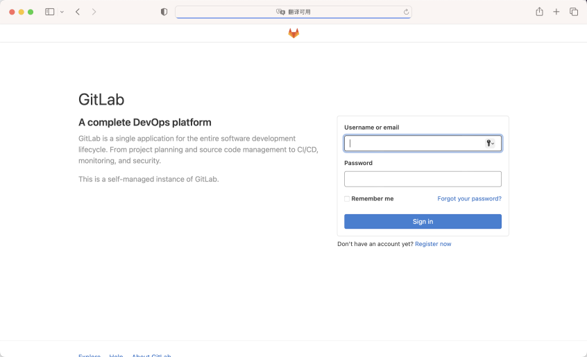
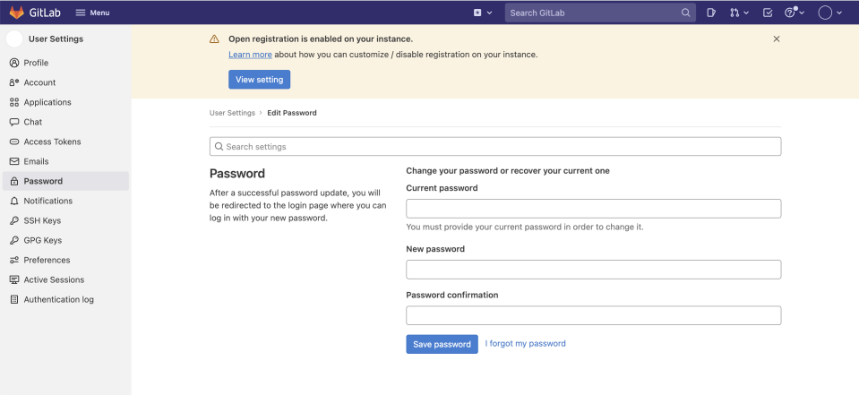
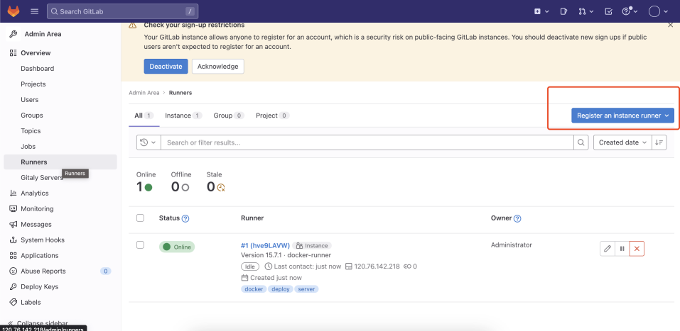
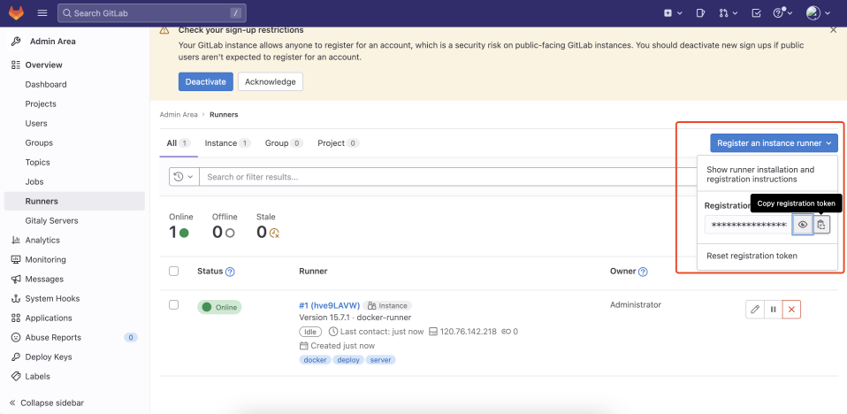
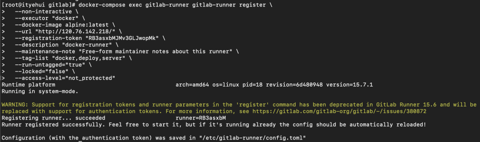

本案例使用`docker-compose`进行安装，如需安装`docker`环境，参考一下文章。

- [Docker环境安装](https://www.yuque.com/yangleduo-cg2ct/fgrxr9)
# GitLab-ce

- [官方安装教程推荐](https://docs.gitlab.cn/ee/install/docker.html)
## 编写docker-compose
```yaml
version: '3'
services:
  gitlab-ce:
   image: 'gitlab/gitlab-ce:latest'
   container_name: 'gitlab-ce'
   privileged: true
   hostname: 'gitlab'
   environment:
     TZ: 'Asia/Shanghai'
     GITLAB_OMNIBUS_CONFIG: |
       external_url 'http://120.76.142.218'
       gitlab_rails['time_zone'] = 'Asia/Shanghai'
       gitlab_rails['smtp_enable'] = true
       gitlab_rails['gitlab_shell_ssh_port'] = 1022
   ports:
     - '80:80'
     - '443:443'
     - '1022:22'
   volumes:
     - ./config:/etc/gitlab
     - ./data:/var/opt/gitlab
     - ./logs:/var/log/gitlab
   shm_size: '256m'
```
## 使用指定版本的GitLab
[GitLab-ce历史版本](https://hub.docker.com/r/gitlab/gitlab-ce/tags)
要使用特定的标记版本，请将 gitlab/gitlab-ce:latest 替换为您要运行的GitLab 版本。
例如: gitlab/gitlab-ce:15.6.0-ce.0
## 启动
进入`docker-compose.yml`文件的目录下。执行启动命令
```yaml
docker-compose up -d
```
## 查看日志
```yaml
docker-componse logs -f
```

## 访问

## 查询密码
### 方式一
```yaml
docker exec -it $(docker ps | grep gitlab | awk '{print $1}') grep 'Password:' /etc/gitlab/initial_root_password
```
### 方式二
进入挂在配置文件的目录找到`initial_root_password`文件
```yaml
grep 'Password:' ./initial_root_password
```

## 登录
使用用户名：`root` ，和查询到的密码进行登录。
## 修改密码
登录后点击头像选择`Edit profile` 进入信息编辑界面，选择左侧的`Password`页面修改密码。

# GitLab-runner
## 介绍
[官方介绍](https://docs.gitlab.cn/runner/)
## 文档

- [官方安装runner教程](https://docs.gitlab.cn/runner/install/docker.html)
- [官方注册runner教程](https://docs.gitlab.cn/runner/register/index.html#docker)
- [官方配置runner教程](https://docs.gitlab.cn/runner/configuration/advanced-configuration.html)
- [官方.gitlab-ci.yml说明](https://docs.gitlab.cn/ee/ci/yaml/index.html)
## 编写docker-compose
```yaml
version: '3'
services:
  gitlab-ce:
   image: 'gitlab/gitlab-ce'
   container_name: 'gitlab-ce'
   privileged: true
   hostname: 'gitlab'
   environment:
     TZ: 'Asia/Shanghai'
     GITLAB_OMNIBUS_CONFIG: |
       external_url 'http://120.76.142.218'
       gitlab_rails['time_zone'] = 'Asia/Shanghai'
       gitlab_rails['smtp_enable'] = true
       gitlab_rails['gitlab_shell_ssh_port'] = 1022
   ports:
     - '80:80'
     - '443:443'
     - '1022:22'
   volumes:
     - ./config:/etc/gitlab
     - ./data:/var/opt/gitlab
     - ./logs:/var/log/gitlab
   shm_size: '256m'
  gitlab-runner:
    image: gitlab/gitlab-runner:latest
    container_name: gitlab-runner
    restart: always
    ulimits:
      memlock:
        soft: -1
        hard: -1
    volumes:
      - ./gitlab-runner-conf/:/etc/gitlab-runner/
      - /var/run/docker.sock:/var/run/docker.sock 
```
## 使用指定版本的GitLab-runner
[GitLab-runner历史版本](https://hub.docker.com/r/gitlab/gitlab-runner/tags)
要使用特定的标记版本，请将 gitlab/gitlab-runner:latest 替换为您要运行的GitLab-runner 版本。
例如: gitlab/gitlab-latest:v15.6.0
## 执行注册runner到gitlab
[官方注册文档](https://docs.gitlab.cn/15.5/runner/register/index.html)
这里我们使用最常见的选项，使用单行命令注册 Runner
```yaml
docker-compose exec <compose-service-name> gitlab-runner register \
--non-interactive \
--executor "docker" \
--docker-image alpine:latest \
--url "<url>" \
--registration-token "<token>" \
--description "docker-runner" \
--maintenance-note "Free-form maintainer notes about this runner" \
--tag-list "docker,deploy,server" \
--run-untagged="true" \
--locked="false" \
--access-level="not_protected"
```
## 查询token



## 注册

## 查看注册结果

