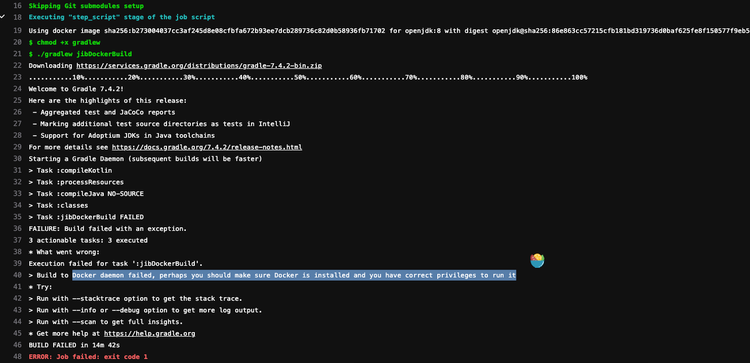
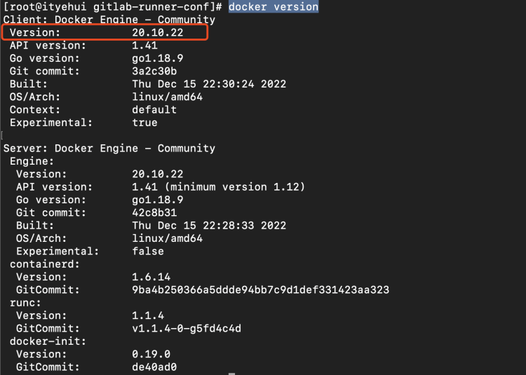
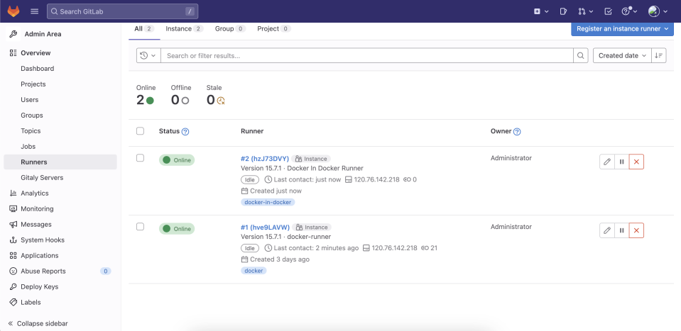
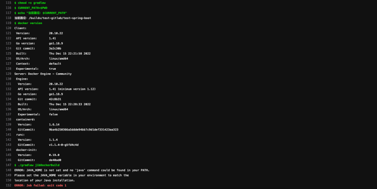
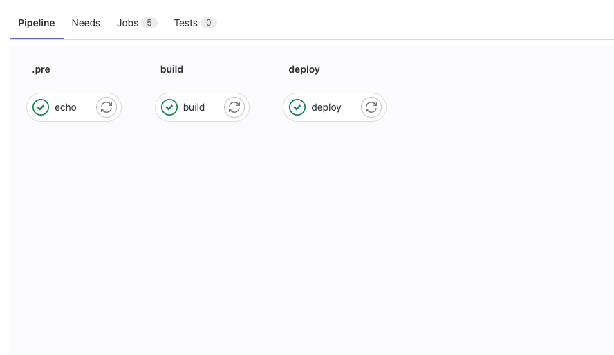
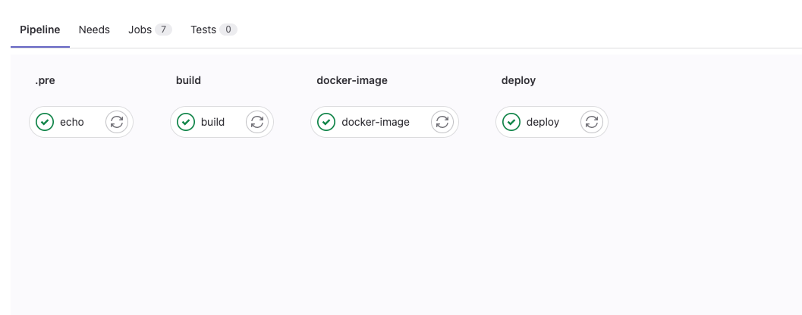
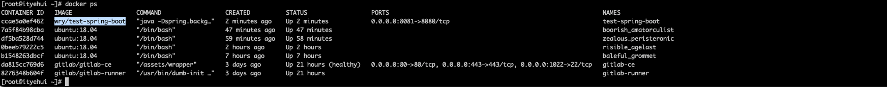

# GitLab-CI介绍
[官方介绍](https://docs.gitlab.cn/ee/ci/index.html)
# .gitlab-ci.yml语法介绍
[官方.gitlab-ci.yml说明](https://docs.gitlab.cn/ee/ci/yaml/index.html)
# 创建SpringBoot项目


# 使用Google的Jib插件构建docker镜像
[官方文档](https://github.com/GoogleContainerTools/jib/tree/v2.0.0-gradle/jib-gradle-plugin#quickstart)
```kotlin
import org.jetbrains.kotlin.gradle.tasks.KotlinCompile

plugins {
    // 引入Google的Jib插件
    id("com.google.cloud.tools.jib") version "3.3.1"
    
    id("org.springframework.boot") version "2.6.8"
    id("io.spring.dependency-management") version "1.0.11.RELEASE"
    kotlin("jvm") version "1.6.21"
    kotlin("plugin.spring") version "1.6.21"
    java
}
apply<JavaPlugin>()
apply<JavaLibraryPlugin>()

group = "com.wry"
version = "0.0.1-SNAPSHOT"
java.sourceCompatibility = JavaVersion.VERSION_1_8

repositories {
    // 阿里云
    maven("https://maven.aliyun.com/repository/public/")
    mavenCentral()
}

dependencies {
    implementation("org.springframework.boot:spring-boot-starter-web")
    implementation("com.fasterxml.jackson.module:jackson-module-kotlin")
    implementation("org.jetbrains.kotlin:kotlin-reflect")
    implementation("org.jetbrains.kotlin:kotlin-stdlib-jdk8")
    testImplementation("org.springframework.boot:spring-boot-starter-test")
}

// 配置构建镜像的基本信息
configure<com.google.cloud.tools.jib.gradle.JibExtension>{
    setAllowInsecureRegistries(true)
    from {
        image = "openjdk:8"
    }
    to {
        image = "wry/${project.name}"
        tags = mutableSetOf("latest")
    }
    container {
        appRoot = "/app"
        workingDirectory = "/app"
        jvmFlags = mutableListOf(
            "-Dspring.backgroundpreinitializer.ignore=true", // spring优化线程
            "-Duser.timezone=Asia/Shanghai",
            "-Dproject.name=${project.name}"
        )
        ports = mutableListOf("8080")
    }
}

tasks.withType<KotlinCompile> {
    kotlinOptions {
        freeCompilerArgs = listOf("-Xjsr305=strict")
        jvmTarget = "1.8"
    }
}

tasks.withType<Test> {
    useJUnitPlatform()
}

```
# 编写.gitlab-ci.yml
```yaml
default:
  image: openjdk:8

# 自定义阶段
stages:
  - build
  - deploy

# 项目构建docker image压缩文件阶段
build:
  stage: build
  image: openjdk:8
  script:
    - chmod +x gradlew
    - CURRENT_PATH=$PWD
    - echo "当前路径：$CURRENT_PATH"
    - ./gradlew jibDockerBuild


# 部署阶段
deploy:
  stage: deploy
  script:
    - echo "部署项目"
    - docker stop test-spring-boot
    - docker rm test-spring-boot
    - docker run -itd --restart=always -p 8081:8080 --name test-spring-boot wry/test-spring-boot
```
# 使用常见的`Docker-runner`执行器运行CI
## 执行CI过程中出现错误

## 错误原因
`GitLab-CI `执行器是`docker`,跑任务的时候会启动一个`docker`容器， 容器内部没有`docker`环境，所以找不到docker 守护进程**

## 解决办法
翻阅GitLab官方文档,看到GitLab-runner有一个Docker-In-Docker模式，可以在容器中使用docker环境
[官方链接](https://docs.gitlab.cn/jh/ci/docker/using_docker_build.html)
# 注册Docker-In-Docker模式的GitLab-runner
## 查看docker版本信息
查看宿主机`docker`版本信息
```shell
docker version
```


## 注册GitLab-Runner
```yaml
docker-compose exec <compose-service-name> gitlab-runner register -n \
  --url "<url>" \
  --registration-token "<token>" \
  --executor docker \
  --description "Docker In Docker Runner" \
  --docker-image "docker:20.10.22" \
  --docker-privileged \
  --tag-list "docker-in-docker" 
  
  # 例子
  # 
  # docker-compose exec gitlab-runner gitlab-runner register -n \
  # --url "http://120.76.142.218" \
  # --registration-token "RB3asxbMJMv3GXXX" \
  # --executor docker \
  # --description "Docker In Docker Runner" \
  # --docker-image "docker:20.10.22" \
  # --docker-privileged \
  # --tag-list "docker-in-docker" 
```
## 查看结果
http://IP:PORT/admin/runners



# 修改`.gitlab-ci.yml`文件
```yaml
default:
  image: docker:20.10.22
  tags:
    - docker-in-docker
variables:
  DOCKER_HOST: tcp://120.76.142.218:2375

services:
  - docker:20.10.22-dind

stages:
  - build
  - deploy

build:
  stage: build
  script:
    - chmod +x gradlew
    - CURRENT_PATH=$PWD
    - echo "当前路径：$CURRENT_PATH"
    - docker version
    - ./gradlew jibDockerBuild

deploy:
  stage: deploy
  script:
    - echo "部署项目"
    - docker stop test-spring-boot
    - docker rm test-spring-boot
    - docker run -itd --restart=always -p 8081:8080 --name test-spring-boot wry/test-spring-boot
```
# docker环境无java环境错误
注册新的`GitLab-runner`后，发现在`docker`环境下无法使用`gradlew`进行docker镜像构建，
缺少`JAVA`环境


## 解决办法
### 把java环境和docker环境分开 （模式一)

- 在java环境下把项目构建成docker镜像压缩包
- 在docker环境下还原docker镜像压缩包

### 先安装JAVA环境再安装docker环境（模式二)

- 在java环境下安装docker使其连接宿主机docker环境

[https://stackoverflow.com/questions/71109409/gitlab-ci-docker-inside-java-image](https://stackoverflow.com/questions/71109409/gitlab-ci-docker-inside-java-image)
# 修改`.gitlab-ci.yml`文件
`docker-in-docker`模式`.gitlab-ci.yml`
[官方推荐写法](https://docs.gitlab.cn/jh/ci/docker/using_docker_build.html#%E4%BD%BF%E7%94%A8-docker-in-docker)
## 模式一
**把java环境和docker环境分开**
```yaml
# 官方定义写法
default:
  image: docker:20.10.22
  tags:
    - docker-in-docker
variables:
  DOCKER_HOST: tcp://120.76.142.218:2375
services:
  - docker:20.10.22-dind

# 自定义阶段
stages:
  - build
  - docker-image
  - deploy

# 使用缓存，避免每次执行Job都下载依赖
cache:
  paths:
    - build  
    - .gradle/wrapper
    - .gradle/caches

# 前置阶段，输出docker信息
echo:
  stage: .pre
  script:
    - docker info

# 项目构建docker image压缩文件阶段
build:
  stage: build
  image: openjdk:8
  script:
    - chmod +x gradlew
    - CURRENT_PATH=$PWD
    - echo "当前路径：$CURRENT_PATH"
    - ./gradlew jibBuildTar

# docker 还原image压缩文件阶段
docker-image:
  stage: docker-image
  script:
    - CURRENT_PATH=$PWD
    - echo "当前路径：$CURRENT_PATH"
    - docker load --input build/jib-image.tar

# 部署阶段
deploy:
  stage: deploy
  script:
    - echo "部署项目"
    - docker stop test-spring-boot
    - docker rm test-spring-boot
    - docker run -itd --restart=always -p 8081:8080 --name test-spring-boot wry/test-spring-boot
```
## 模式二
**先安装JAVA环境再安装docker环境**
```yaml
default:
  image: docker:20.10.22
  tags:
    - docker-in-docker
variables:
  DOCKER_HOST: tcp://120.76.142.218:2375

services:
  - docker:20.10.22-dind

stages:
  - build
  - deploy


echo:
  stage: .pre
  script:
    - docker info

build:
  stage: build
  image: gradle:jdk8  
  services:
    - docker:20.10.22-dind
  variables:
    DOCKER_HOST: tcp://120.76.142.218:2375
  before_script:
    - apt update && apt install --no-install-recommends -y docker.io 
  script:
    - chmod +x gradlew
    - CURRENT_PATH=$PWD
    - echo "当前路径：$CURRENT_PATH"
    - docker version
    - ./gradlew jibDockerBuild


deploy:
  stage: deploy
  script:
    - echo "部署项目"
    - docker stop test-spring-boot
    - docker rm test-spring-boot
    - docker run -itd --restart=always -p 8081:8080 --name test-spring-boot wry/test-spring-boot
```
# 运行CI



# 查看运行的docker容器


# 测试

