## JVM 体系结构模型

灰色线程私有，亮色线程共享！

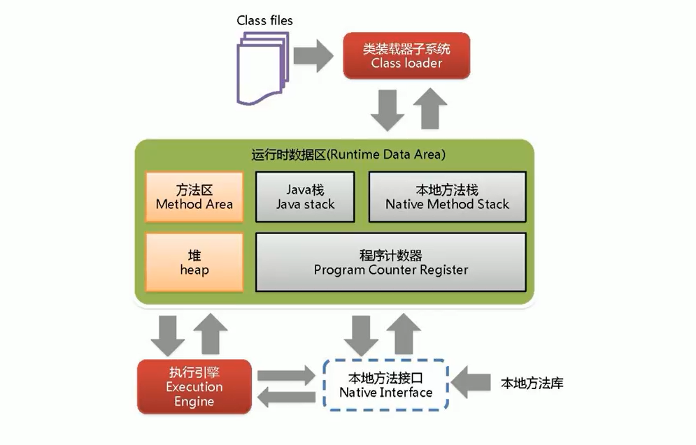

## ClassLoad(类加载器)

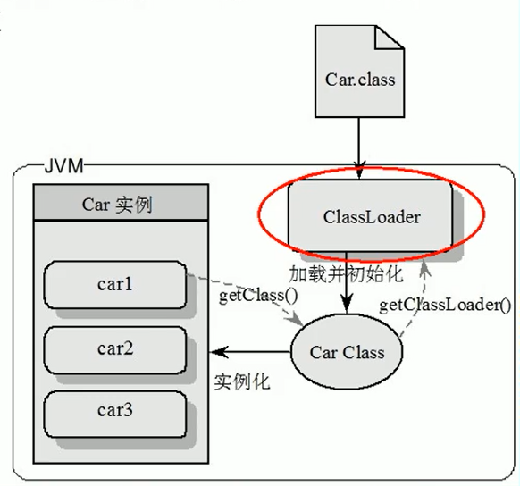

> 负责加载class文件，class 文件在文件开头有特定的文件标示，将class文件字节码内容加载到内存中，并将这些内容转换成方法区中的运行时数据结构并且ClassLoader只负责class文件的加载，至于它是否可以运行，则由Execution Engine决定。

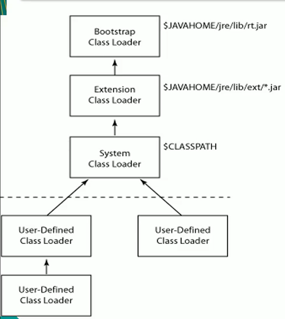

### 虚拟机自带的加载器

1. 启动类加载器（Bootstrap） C++

   java自带的类使用BootstrapClassLoader，由`c++`编写，加载`java`核心库 `java.*`,构造`ExtClassLoader`和`AppClassLoader`。由于引导类加载器涉及到虚拟机本地实现细节，开发者无法直接获取到启动类加载器的引用，所以不允许直接通过引用进行操作。

2. 扩展类加载器（Extension） Java

   jdk扩展的类使用ExtensionClassLoader，由`java`编写，加载扩展库，如`classpath`中的`jre` ，`javax.*`或者`java.ext.dir` 指定位置中的类，开发者可以直接使用标准扩展类加载器。

3. 应用程序类加载器（AppClassLoader）

   我们自己编写的类使用AppClassLoader，由`java`编写，加载程序所在的目录，如`user.dir`所在的位置的`class` 。

4. CustomClassLoader（用户自定义类加载器）

   `java`编写,用户自定义的类加载器,可加载指定路径的`class`文件


``` java
public class MyObject {
    public static void main(String[] args) {
        Object object = new Object();
        System.out.println(object.getClass().getName() + " 的加载器： " + object.getClass().getClassLoader());

        MyObject myObject = new MyObject();
        System.out.println(myObject.getClass().getName() + " 的加载器： " + myObject.getClass().getClassLoader());
        System.out.println(myObject.getClass().getName() + " 上一代的加载器： " + myObject.getClass().getClassLoader().getParent());
        System.out.println(myObject.getClass().getName() + " 上一代的上一代的加载器： " + myObject.getClass().getClassLoader().getParent().getParent());

    }
}
```

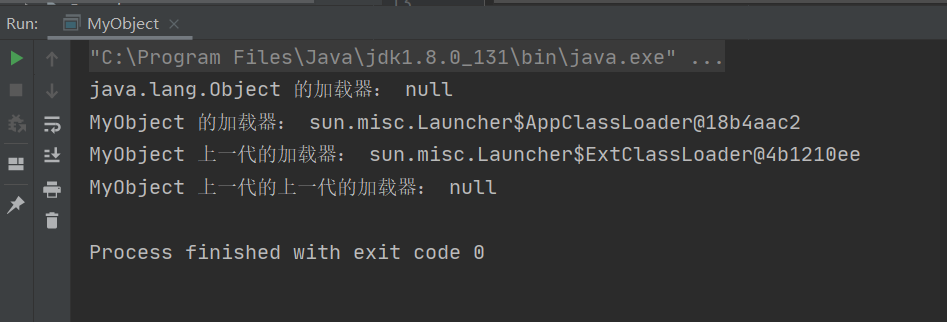

因为BootStropClassLoader 不是java 编写的 所以打印出来是null 


JAVA 也叫系统类加载器，加载当前应用的classpath的所有类


### 用户自定义加载器

 继承 java.lang.ClassLoader

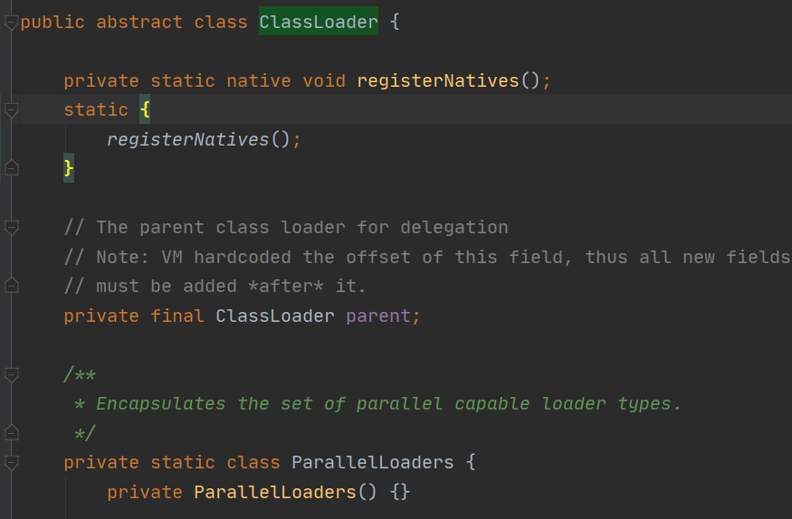


### ClassLoad的双亲委派机制

当某个类加载器需要加载某个`.class`文件时，它首先把这个任务委托给他的上级类加载器，递归这个操作，如果上级的类加载器没有加载，自己才会去加载这个类。

####  源码分析

``` java
protected Class<?> loadClass(String name, boolean resolve)
            throws ClassNotFoundException
    {
        synchronized (getClassLoadingLock(name)) {
            // 首先检查这个classsh是否已经加载过了
            Class<?> c = findLoadedClass(name);
            if (c == null) {
                long t0 = System.nanoTime();
                try {
                    // c==null表示没有加载，如果有父类的加载器则让父类加载器加载
                    if (parent != null) {
                        c = parent.loadClass(name, false);
                    } else {
                        //如果父类的加载器为空 则说明递归到bootStrapClassloader了
                        //bootStrapClassloader比较特殊无法通过get获取
                        c = findBootstrapClassOrNull(name);
                    }
                } catch (ClassNotFoundException e) {}
                if (c == null) {
                    //如果bootstrapClassLoader 仍然没有加载过，则递归回来，尝试自己去加载class
                    long t1 = System.nanoTime();
                    c = findClass(name);
                    sun.misc.PerfCounter.getParentDelegationTime().addTime(t1 - t0);
                    sun.misc.PerfCounter.getFindClassTime().addElapsedTimeFrom(t1);
                    sun.misc.PerfCounter.getFindClasses().increment();
                }
            }
            if (resolve) {
                resolveClass(c);
            }
            return c;
        }
    }
```

#### 委派机制的流程图

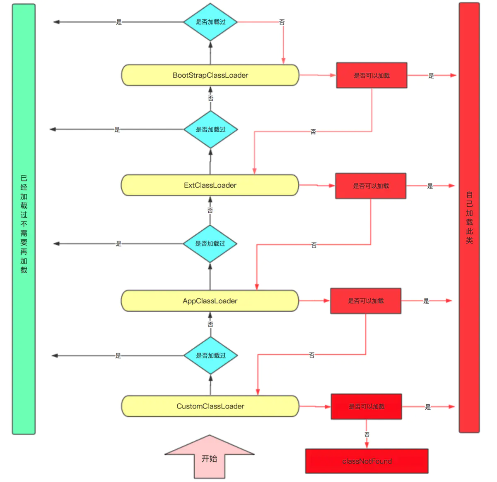

####  双亲委派机制的作用
1.  防止重复加载同一个`.class`。通过委托去向上面问一问，加载过了，就不用再加载一遍。保证数据安全。
2. 保证核心`.class`不能被篡改。通过委托方式，不会去篡改核心`.class`，即使篡改也不会去加载，即使加载也不会是同一个`.class`对象了。不同的加载器加载同一个`.class`也不是同一个`Class`对象。这样保证了`Class`执行安全。

## Execution Engine 执行引擎

- 执行引擎是Java虚拟机的核心组成部分之一
- 虚拟机是一个相对于“物理机”的概念，这两种机器都有代码执行能力，其区别是物理机的执行引擎是直接建立在处理器、缓存、指令集和操作系统层面上的，而虚拟机的执行引擎则是由软件自行实现的，因此可以不受物理条件制约地定制指令集与执行引擎的结构体系，能够执行那些不被硬件直接支持的指令集格式
- JVM的主要任务是负责装载字节码到其内部，但字节码并不能够直接运行在操作系统之上，因为字节码指令并非等价于本地机器指令，它内部包含的仅仅只是一些能够被JVM锁识别的字节码指令、符号表和其他辅助信息
- 那么，如果想让一个Java程序运行起来、执行引擎的任务就是将字节码指令解释/编译为对应平台上的本地机器指令才可以。简单来说，JVM中的执行引擎充当了将高级语言翻译为机器语言的译者
- 从外观上来看，所有的Java虚拟机的执行引擎输入、输出都是一致的：输入的是字节码二进制流，处理过程是字节码解析执行的等效过程，输出的是执行结果
- 执行引擎在执行的过程中究竟需要执行什么样的字节码指令完全依赖于PC寄存器
- 每当执行完一项指令操作后，PC寄存器就会更新下一条需要被执行的指令地址
- 当然方法在执行的过程中，执行引擎有可能会通过存储在局部变量表中的对象引用准确定位到存储在Java堆区中的对象实例信息，以及通过对象头中的元数据指针定位到目标对象的类型信息

## Native Interface本地接口

`native`是一个计算机函数，一个Native Method就是一个Java调用非[Java](https://baike.baidu.com/item/Java/85979)代码的接口。方法的实现由非Java语言实现，比如C或C++。

本地接口的作用是融合不同的编程语言为Java所用，它的初衷是融合C/C++程序， Java诞生的时候是C/C++横行的时候，要想立足，必须有调用C/C++程序， 于是就在内存中专门开辟了一块区域处理标记为native的代码，它的具体做法是Native Method Stack中登记native方法，在Execution Engine执行时加载native libraies。
目前该方法使用的越来越少了，除非是与硬件有关的应用，比如通过Java程序驱动打印机或者Java系统管理生产设备，在企业级应用中已经比较少见。因为现在的异构领域间的通信很发达，比如可以使用Socket通信，也可以使用Web Service等等，不多做介绍。


[标识符](https://baike.baidu.com/item/标识符)native可以与所有其它的[java标识符](https://baike.baidu.com/item/java标识符)连用，但是abstract除外。这是合理的，因为native暗示这些方法是有实现体的，只不过这些实现体是非java的，但是abstract却显然的指明这些方法无实现体。native与其它java标识符连用时，其意义同非Native Method并无差别，比如native static表明这个方法可以在不产生类的实例时直接调用，这非常方便，比如当你想用一个native method去调用一个C的类库时。上面的第三个方法用到了native synchronized，JVM在进入这个方法的实现体之前会执行[同步锁](https://baike.baidu.com/item/同步锁)机制（就像java的多线程。）

###  线程案例

#### 案例代码

``` java
public class MyObject {  
    public static void main(String[] args) {
        Thread thread = new Thread();
        thread.start();
    }
}

```

####  源码分析

进入strat()方法查看，实际调用了start0()方法

``` java
   /**
     * Causes this thread to begin execution; the Java Virtual Machine
     * calls the <code>run</code> method of this thread.
     * <p>
     * The result is that two threads are running concurrently: the
     * current thread (which returns from the call to the
     * <code>start</code> method) and the other thread (which executes its
     * <code>run</code> method).
     * <p>
     * It is never legal to start a thread more than once.
     * In particular, a thread may not be restarted once it has completed
     * execution.
     *
     * @exception  IllegalThreadStateException  if the thread was already
     *               started.
     * @see        #run()
     * @see        #stop()
     */
    public synchronized void start() {
        /**
         * This method is not invoked for the main method thread or "system"
         * group threads created/set up by the VM. Any new functionality added
         * to this method in the future may have to also be added to the VM.
         *
         * A zero status value corresponds to state "NEW".
         */
        if (threadStatus != 0)
            throw new IllegalThreadStateException();

        /* Notify the group that this thread is about to be started
         * so that it can be added to the group's list of threads
         * and the group's unstarted count can be decremented. */
        group.add(this);

        boolean started = false;
        try {
            start0();
            started = true;
        } finally {
            try {
                if (!started) {
                    group.threadStartFailed(this);
                }
            } catch (Throwable ignore) {
                /* do nothing. If start0 threw a Throwable then
                  it will be passed up the call stack */
            }
        }
    }

    private native void start0();
```

##  Native Method Stack
它的具体做法是Native Method Stack中登记`native`方法，在Execution
`Engine`执行时加载本地方法库。


## Program Counter Register PC寄存器

- PC寄存器就是一个指针，用来存储指向下一条指令的地址，也即将要执行的指令代码。由执行引擎读取下一条指令。

- 它是一块很小的内存空间，几乎可以忽略不记。也是运行速度最快的存储区域。

- 在JVM规范中，每个线程都有它自己的程序计数器，是线程私有的，生命周期与线程的生命周期保持一致。

- 任何时间一个线程都只有一个方法在执行，也就是所谓的当前方法。程序计数器会存储当前线程正在执行的java方法的JVM指令地址：或者，如果是在执行native方法，则是未指定值（undefined）

- 它是程序控制流的指示器，分支、循环、跳转、异常处理、线程恢复等基础功能都需要依赖这个计数器来完成。

- 字节码解释器工作时就是通过改变这个计数器的值来选取下一个条需要执行的字节码指令。

- 它是唯一一个在Java虚拟机规范中没有规定任何OOM情况的区域。

### 举例说明

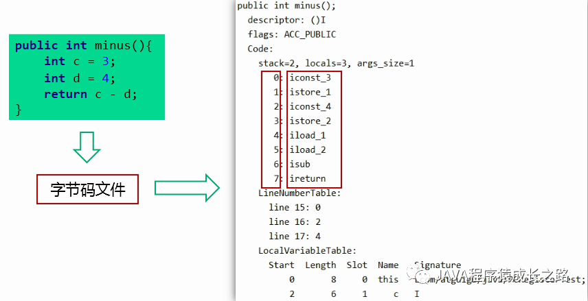
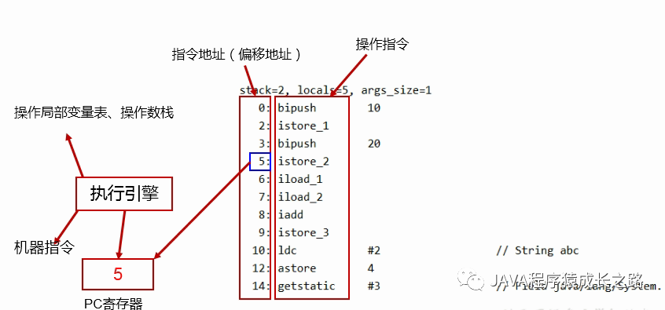


###  两个常见问题
#### 使用PC寄存器存储字节码指令地址有什么用？

因为CPU需要不停的切换各个线程，这时候切换回来以后，就的知道接着从哪开始执行。

#### 为什么使用PC寄存器记录当前线程的执行地址呢？

JVM的字节码解释器就是通过改变pc寄存器的值来确定下一条应该执行什么样的字节码指令。

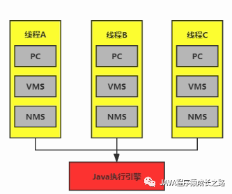

### PC寄存器为什么会被设定为线程私有?

我们都知道所谓多线程在一个特定的时间段内只会执行其中某一个线程的方法，CPU会不停的做任务切换，这样必然导致经常终端或回复，如果保证分毫不差呢？为了能够准确地记录各个线程正在执行的当前字节码指令地址，最好的办法自然是为每一个线程分配一个pc寄存器，这样一来各个线程之间便可以进行独立计算，从而不会出现相互干扰的情况。

由于cpu时间片轮询限制，众多线程在并发执行过程中，任何一个确定的时间，一个处理器或者多核处理器中的一个内核，只会执行某个线程中的一条指令。

这样必然会导致经常终端或恢复，如何保证分毫不差呢？每个线程在创建后，都会产生自己的程序计数器和栈帧，程序计数器在各个线程之间互不影响。


## Method Area 方法区

供各线程共享的运行时内存区域。它**存储了每一个类的结构信息**，例如运行时常量池( Runtime Constant Pool)、字段和方法数据、构造函数和普通方法的字节码内容。**方法区是规范**，在不同虚拟机里头实现是不一样的，最典型的就是永久代(PermGen space) 和元空间(Metaspace)。

jdk 1.7 是永久代，jdk1.8 是元空间。

实例变量存在堆内存中,和方法区无关

特性：    

 - 存放类的描述信息，类的模板。
 - 是线程共享，整个虚拟机只有一个方法区。
 - 永久代，方法区中的信息一般需要长期存在,而且它又是堆的逻辑分区,因此用堆的划分方法,我们把方法区称之为老年代。
 - 内存回收效率低，方法区中的信息一般需要长期存在,回收一遍内存之后可能只有少量信息无效.对方法区的内存回收的主要目标是:对常量池的回收和对类型的卸载。  


##  Stackd 栈

**栈管运行，堆管存储**

> 理想：程序= 算法+ 数据结构

> 现实：程序= 框架+业务逻辑

### 队列 （FIFO） 先进先出

就想食堂打饭，先到先得

### 栈  （FILO） 先进后出

就行弹匣，先进后出


栈也叫栈内存，主管Java程序的运行，是在线程创建时创建，它的生命期是跟随线程的生命期，线程结束栈内存也就释放，对于栈来说不存在垃圾回收问题，只要线程--结束该栈就Over，生命周期和线程一致，是线程私有的。**8种基本类型的变量+对象的引用变量+实例方法都是**
**在函数的栈内存中分配。**

### 栈存储什么?

栈帧=java 方法；

栈帧中主要保存3类数据:

-  本地变量(Local Variables) :输入参数和输出参数以及方法内的变量;
-  栈操作(Operand Stack) :记录出栈、入栈的操作;
-  栈帧数据(Frame Data) :包括类文件、方法等等。


###  栈运行原理:
栈中的数据都是以栈帧(Stack Frame) 的格式存在，栈帧是一个内存区
块，是一个数据集，是一个有关方法(Method)和运行期数据的数据集，
当一个方法A被调用时就产生了一个栈帧F1， 并被压入到栈中，
A方法又调用了B方法， 于是产生栈帧F2也被压入栈，
B方法又调用了C方法，于是产生栈帧F3也被压入栈，
执行完毕后，先弹出F3栈帧，再弹出F2栈帧，再弹出F1栈帧.....

遵循“先进后出”/“后进先出”原则。

**每个方法执行的同时都会创建一个栈帧，用于存储局部变量表、操作数**
**栈、动态链接、方法出口等信息**，每一个方法从调用直至执行完毕的过
程，就对应着一个栈帧在虚拟机中入栈到出栈的过程。栈的大小和具体
JVM的实现有关，通常在256K" ~756K之间，约等于1Mb左右。


图示在一个栈中有两个栈帧:栈帧2是最先被调用的方法，先入栈,然后方法2又调用了方法1，栈帧1处于栈顶的位置，栈帧2处于栈底，执行完毕后，依次弹出栈帧1和栈帧2,线程结束，栈释放。

每执行一个方法都会产生一个栈帧，保存到栈(后进先出)的顶部,顶部栈就是当前的方法，该访法执行完毕后会自动将此栈帧出栈。


###  栈溢出 （SOF）

**Exception in thread "main" java.lang.StackOverflowError**  

堆栈溢出是错误还是异常？

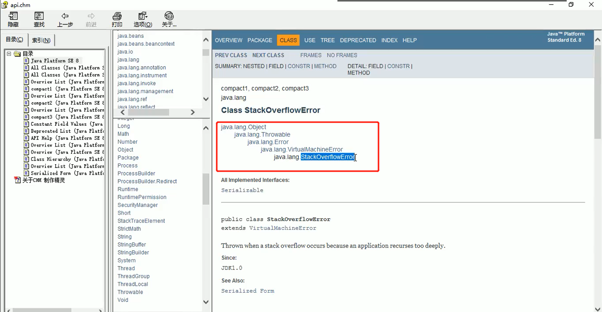


### 栈+堆+方法区的交互关系

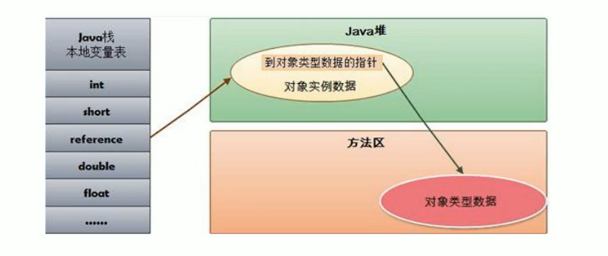

**HotSpot是使用指针的方式来访问对象:Java堆中会存放访问`类元数据`的地址，reference存储的就直接是对象的地址。**

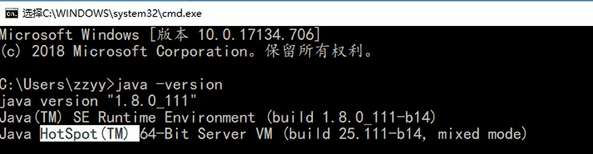


## Heap 堆


一个JVM实例只存在一个堆内存，堆内存的大小是可以调节的。类加载器读取了类文件后，需要把类、方法、常变量放到堆内存中，保存所有引用类型的真实信息，以方便执行器执行，堆内存分为三部分:

- Young Generation Space	新生区		Young/New
- Tenure generation space	养老区		Old/ Tenure
- Permanent Space				  永久区		Perm


### JAVA7 之前

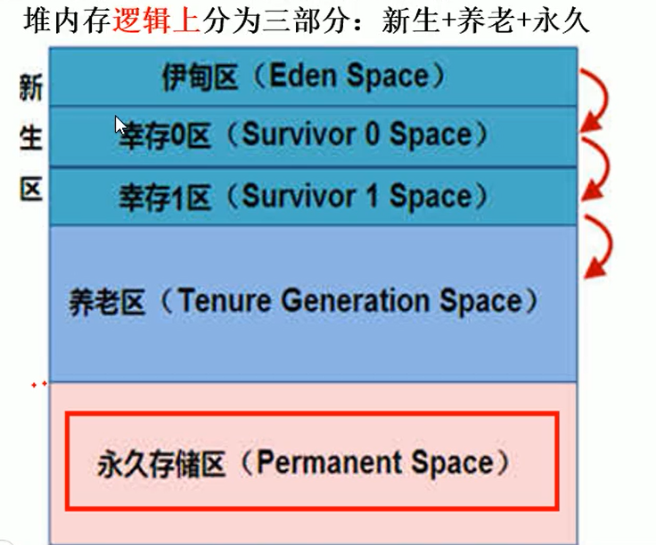


### JAVA8 之后

永久代变成了元空间。


**堆内存`逻辑`分为`三部分`：新生+养老+永久**

**堆内存`物理`分为`两部分`：新生+养老**


新生区(如下是首次讲解，简单版，先入门大致理解)

新生区是类的诞生、成长、消亡的区域，一个类在这里产生，应用，最后被垃圾回收器收集，结束生命。

> 新生区又分为两部分:伊甸区(Eden space) 和幸存者区(Survivorpacee)，所有的类都是在伊甸区被new出来的。幸存区有两个: 0区 (Survivor 0 pace) 和1区(Survivor 1 space) 。当伊甸园的空间用完时，程序又需要创建对象，JVM的垃圾回收器将对伊甸园区进行垃圾回收(MinorGC)，将伊甸园区中的不再被其他对象所引用的对象进行销毁。然后将伊甸园中的剩余对象移动到幸存0区。若幸存0区也满了，再对该区进行垃圾回收，然后移动到1区。那如果1区也满了呢?再移动到养老区。若养老区也满了,那么这个时候将产生Ma jorGC (Fu11GC) ，进行养老区的内存清理。若养老区执行了Ful1 GC之后发现依然无法进行对象的保存，就会产生00M异常“QutOfMemoryError"。

如果出现java.lang.OutOfMemoryError: Java heap space异常，说明Java虚拟机的堆内存不够，原因有二：

1. Java虚拟机的堆内存设置不够，可以通过参数-Xms、-Xmx来调 整。
2. 代码中创建了大量大对象，并且长时间不能被垃圾收集器收集(存
   在被引用)。


##  对象的生命周期和GC

Java堆从GC的角度还可以细分为:新生代( Eden区、From Survivor区)和To Survivor区和老年代。

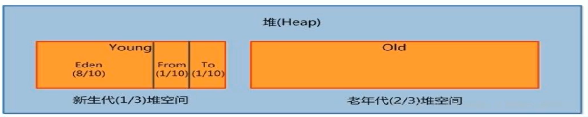


###  MinorGC的过程(复制->清空->互换)

1. Eden、 SurvivorFrom 复制到SurvivorTo，年龄+1首先，当Eden区满的时候会触发第一 次GC,把还活着的对象拷贝到SurvivorFrom区， 当Eden区再次触发GC的时候会扫描Eden区和From区域,对这两个区域进行垃圾回收，经过这次回收后还存活的对象,则直接复制到To区域(如果有对象的年龄已经达到了老年的标准，则赋值到老年代区)，同时把这些对象的年龄+1
2. 清空Eden、 SurvivorFrom然后，清空Eden和SurvivorFrom中的对象， 也即复制之后有交换，谁空谁是to
3. SurvivorTo和 SurvivorFrom互换最后，SurvivorTo和SurvivorFrom互换，原SurvivorTo成为 下一次GC时的SurvivorFrom区。部分对象会在From和To区域中复制来复制去，如此交换15次(由JVM参数MaxTenuringThreshold决定，这个参数默认是15),最终如果还是存活,就存入到老年代。

**HotSpot内存管理**

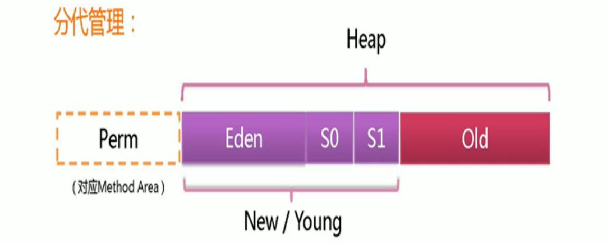


### 永久区(java7之前有)
永久存储区是一个常驻内存区域，用于存放JDK自身所携带的Class, Interface的元数据，也就是说它存储的是运行环境必须的类信息，被装载进此区域的数据是**不会被垃圾回收器回收掉的，关闭JVM才会释放此区域所占用的内存。**


## 堆参数调整

**JAVA7**

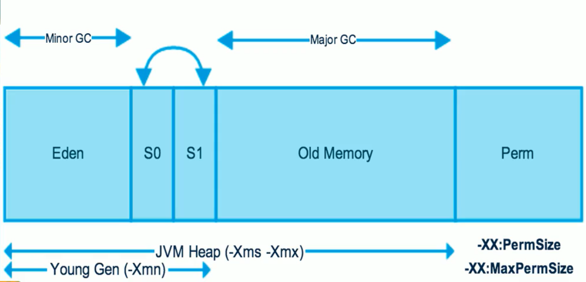


**JAVA8**

JDK 1.8之后将最初的永久代取消了，由元空间取代。

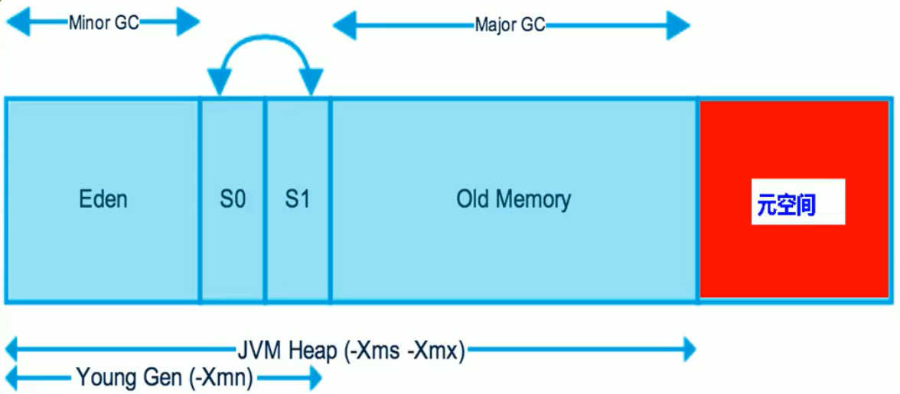


在Java8中， 永久代已经被移除，被一个称为元空间的区域所取代。元空间的本质和永久代类似。


元空间与永久代之间最大的区别在于：**永久带使用的JVM的堆内存，但是java8以后的元空间并不在虚拟机中而是使用本机物理内存。**


因此，默认情况下，元空间的大小仅受本地内存限制。类的元数据放入native memory,字符串池和类的静态变量放入java堆中，这样可以加载多少类的元数据就不再由MaxPermSize控制,而由系统的实际可用空间来控制。

### JVM调优第一步，了解JVM常用命令行参数

* JVM的命令行参数参考：https://docs.oracle.com/javase/8/docs/technotes/tools/unix/java.html

* HotSpot参数分类

  > 标准： - 开头，所有的HotSpot都支持
  >
  > 非标准：-X 开头，特定版本HotSpot支持特定命令
  >
  > 不稳定：-XX 开头，下个版本可能取消

  java -version

  java -X

  java -XX:+PrintFlagsWithComments //只有debug版本能用

### 堆内存调优

|        命令         | 描述                                     |
| :-----------------: | ---------------------------------------- |
|        -Xms         | 设置初始分配大小，默认为物理内存的"1/64" |
|        -Xmx         | 最大分配内存，默认为物理内存的"1/4"      |
| -XX:+PrintGCDetails | 输出详细的GC处理日志                     |

``` java
public class T1 {
    public static void main(String[] args) {

        int availableProcessors = Runtime.getRuntime().availableProcessors();
        System.out.println("逻辑处理器：" + availableProcessors);

        //最大分配内存，默认为物理内存的"1/4"
        long maxMemory = Runtime.getRuntime().maxMemory();
        System.out.println("-Xmx (MAX_MEMORY) = " + maxMemory + "字节，" + maxMemory / 1024 / 1024 + "M");

        //设置初始分配大小，默认为物理内存的"1/64"
        long totalMemory = Runtime.getRuntime().totalMemory();
        System.out.println("-Xms (TOTAL_MEMORY) = " + totalMemory + "字节，" + totalMemory / 1024 / 1024 + "M");
    }
}
```

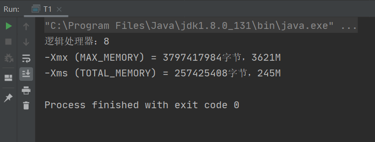

调整JVM的参数

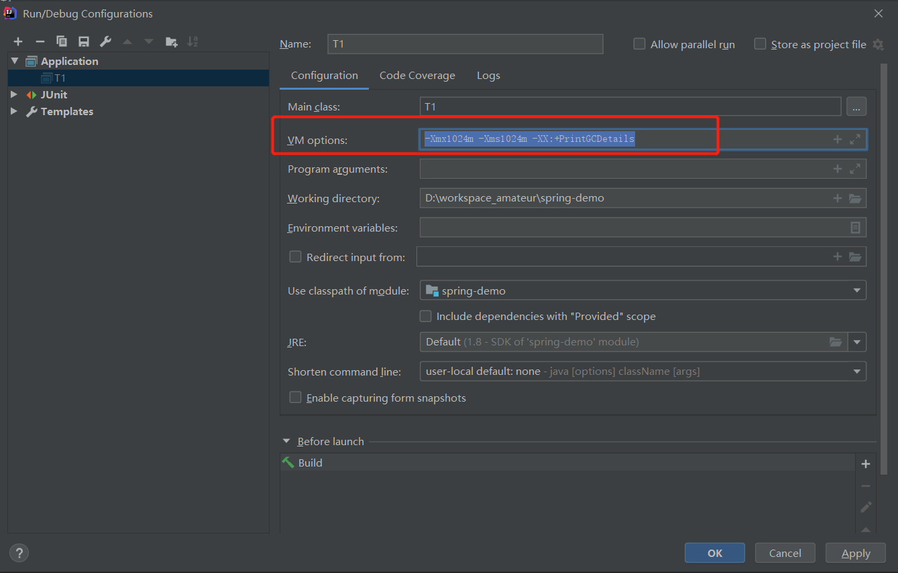

JAVA8

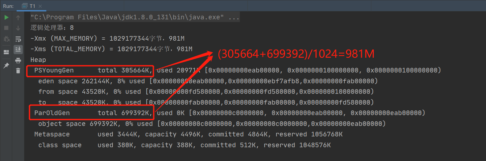

JAVA7

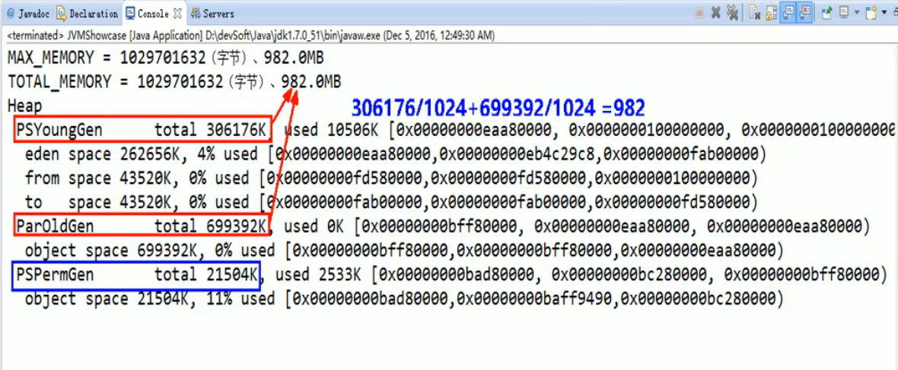

### 堆溢出 （OOM）

``` java
import java.util.Random;

public class T2 {
    public static void main(String[] args) {
        while (true) {
            String str = "Mr.Wang";
            str += new Random().nextInt(88888888) + new Random().nextInt(99999999);
        }
    }
}
```

配置堆内存参数：

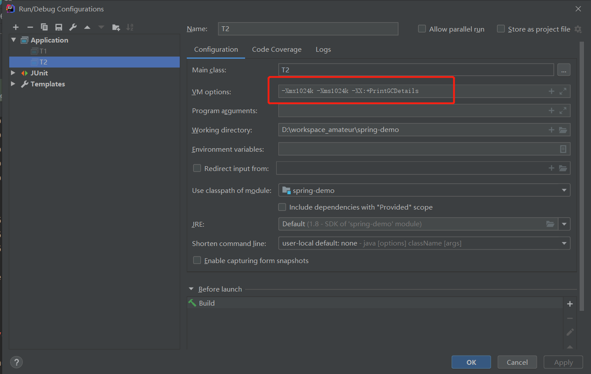

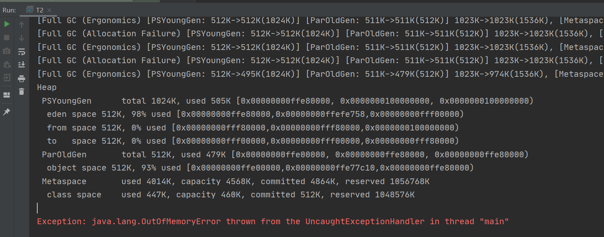

**Exception: java.lang.OutOfMemoryError** 

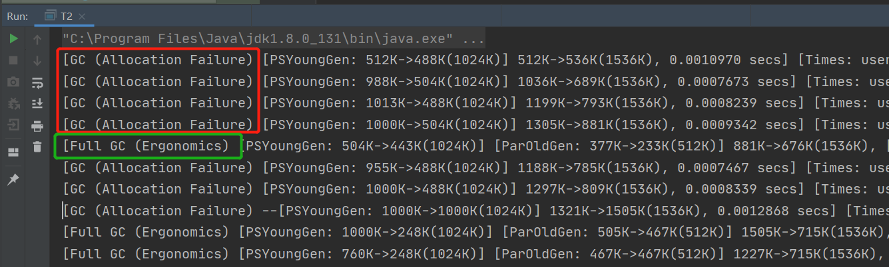

### GC 日志插看

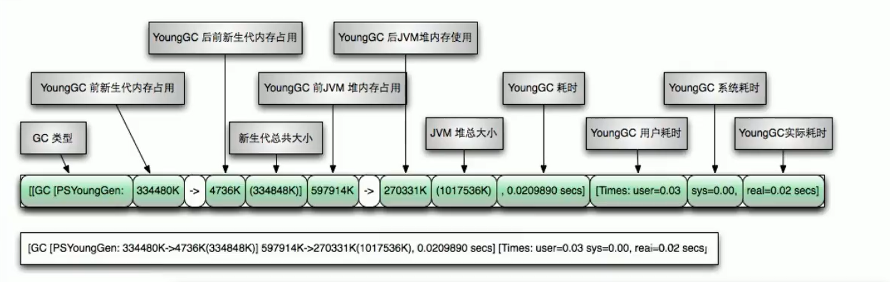

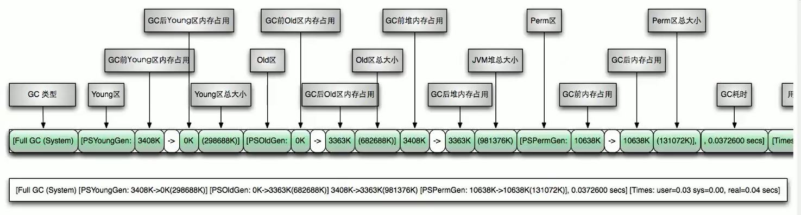


JVM在进行GC时，并非每次都对上面三个内存区域一起回收的， **大部分时候回收的都是指新生代**。因此GC按照回收的区域又分了两种类型，一种是普通GC (minor GC)，一种是全局GC (major GC or FullGC)

**Minor GC Full GC的区别**

- 普通GC (minor GC) :只针对新生代区域的GC,指发生在新生代的垃圾收集动作，因为大多数Java对象存活率都不高，所以Minor GC非常频繁，一般回收速 度也比较快。

- 全局GC (major GC or Full GC) :指发生在老年代的垃圾收集动作，出现了Major GC,经常会伴随至少一次的Minor GC (但并不是绝对的)。 **Major GC的速度一 般要比Minor GC慢上10倍以,原因是因为老年代占2/3，新生代占1/3。**
