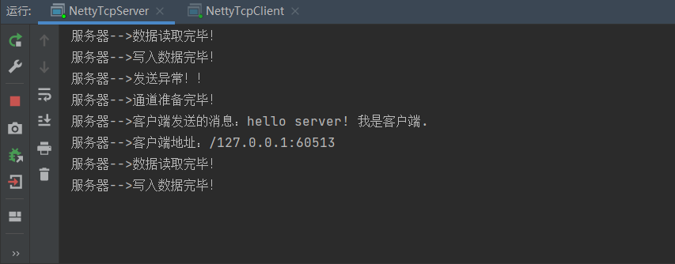
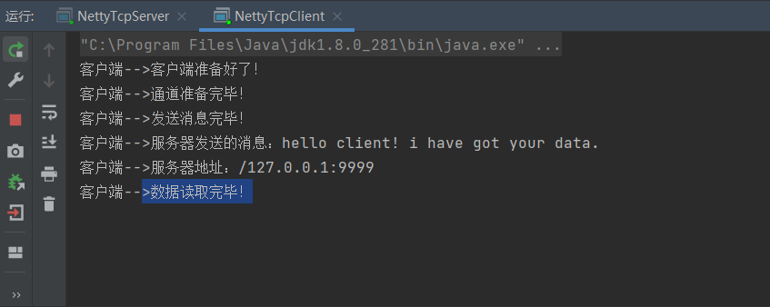

# 基于 Netty 的 TCP Server/Client 案例

## pom

```xml
<dependency>
            <groupId>io.netty</groupId>
            <artifactId>netty-all</artifactId>
            <version>4.1.72.Final</version>
</dependency>
```


## 服务端

### Server

```java
package com.wry.netty.server;

import io.netty.bootstrap.ServerBootstrap;
import io.netty.channel.ChannelFuture;
import io.netty.channel.ChannelInitializer;
import io.netty.channel.ChannelOption;
import io.netty.channel.ChannelPipeline;
import io.netty.channel.nio.NioEventLoopGroup;
import io.netty.channel.socket.SocketChannel;
import io.netty.channel.socket.nio.NioServerSocketChannel;

/**
 * @author 王瑞玉
 * @since 2021/12/23 16:46
 */
public class NettyTcpServer {
    public static void main(String[] args) throws InterruptedException {
        //创建boosGroup 和workerGroup
        //boosGroup只处理连接请求
        //workerGroup处理与客户端业务
        //两者都是无限循环
        NioEventLoopGroup boosGroup = new NioEventLoopGroup();
        NioEventLoopGroup workerGroup = new NioEventLoopGroup();

        try {
            //创建服务器端启动对象，配置参数
            ServerBootstrap bootstrap = new ServerBootstrap();
            //使用链式编程
            bootstrap
                    //设置连个线程组
                    .group(boosGroup, workerGroup)
                    //设置NioServerSocketChannel作为服务器通道的实现
                    .channel(NioServerSocketChannel.class)
                    //设置线程队列得到的连接个数
                    .option(ChannelOption.SO_BACKLOG, 128)
                    //设置保持连接状态
                    .childOption(ChannelOption.SO_KEEPALIVE, true)
                    //设置workerGroup中的EventLoop对应的管道处理器
                    .childHandler(new ChannelInitializer<SocketChannel>() {
                        //给pipeline增加处理器
                        @Override
                        protected void initChannel(SocketChannel socketChannel) throws Exception {
                            ChannelPipeline channelPipeline = socketChannel.pipeline();
                            channelPipeline.addLast(new NettyServerInHandler());
                            // 可以继续调用 socketChannel.pipeline().addLast()
                            // 添加更多 Handler
                        }
                        
                    });
            System.out.println("服务器-->服务器准备好了！");

            //绑定一个端口，并且同步，生成一个ChannelFuture对象
            ChannelFuture channelFuture = bootstrap.bind(9999);

            //对关闭通道事件进行监听
            channelFuture
                    .channel()
                    .closeFuture()
                    .sync();
        } catch (Exception e) {
            e.printStackTrace();
        } finally {
            //发送异常时进行优雅的关闭
            boosGroup.shutdownGracefully();
            workerGroup.shutdownGracefully();
        }
    }
}

```

### Handle

```java
package com.wry.netty.server;

import io.netty.buffer.ByteBuf;
import io.netty.buffer.Unpooled;
import io.netty.channel.ChannelHandlerContext;
import io.netty.channel.ChannelInboundHandlerAdapter;
import io.netty.util.CharsetUtil;

/**
 * 自定义一个 Handler，需要继承 Netty 规定好的某个 HandlerAdapter（规范）
 * InboundHandler 用于处理数据流入本端（客户端）的 IO 事件
 * OutboundHandler 用于处理数据流出本端（客户端）的 IO 事件
 *
 * @author 王瑞玉
 * @since 2021/12/23 17:15
 */
public class NettyServerInHandler extends ChannelInboundHandlerAdapter {
    /**
     * 通道就绪时执行
     *
     * @param ctx 上下文对象
     * @throws Exception
     */
    @Override
    public void channelActive(ChannelHandlerContext ctx) throws Exception {
        System.out.println("服务器-->通道准备完毕！");
    }

    /**
     * 读取数据事件（可以读取客户端发送的消息）
     *
     * @param ctx 上下文对象，包含管道（pipeline），通道（channel）,地址(连接地址)
     * @param msg 客户端发送的消息，默认Object类型，需要进行转换
     * @throws Exception
     */
    @Override
    public void channelRead(ChannelHandlerContext ctx, Object msg) throws Exception {
        ByteBuf byteBuf = (ByteBuf) msg;
        System.out.println("服务器-->客户端发送的消息：" + byteBuf.toString(CharsetUtil.UTF_8));
        System.out.println("服务器-->客户端地址：" + ctx.channel().remoteAddress());
    }

    /**
     * 数据读取完毕后执行
     *
     * @param ctx 上下文对象
     * @throws Exception
     */
    @Override
    public void channelReadComplete(ChannelHandlerContext ctx) throws Exception {
        System.out.println("服务器-->数据读取完毕！");
        // 发送响应给客户端
        // Unpooled 类是 Netty 提供的专门操作缓冲区的工具类，copiedBuffer 方法返回的 ByteBuf 对象类似于NIO 中的 ByteBuffer，但性能更高
        ByteBuf byteBuf = Unpooled.copiedBuffer("hello client! i have got your data.", CharsetUtil.UTF_8);
        ctx.writeAndFlush(byteBuf);
        System.out.println("服务器-->写入数据完毕！");
    }


    /**
     * 发送异常时
     *
     * @param ctx   上下文对象
     * @param cause 异常对象
     * @throws Exception
     */
    @Override
    public void exceptionCaught(ChannelHandlerContext ctx, Throwable cause) throws Exception {
        System.out.println("服务器-->发送异常！！");
        ctx.channel().close();
    }
}

```

## 客户端

### Cilent

```java
package com.wry.netty.client;

import io.netty.bootstrap.Bootstrap;
import io.netty.channel.ChannelFuture;
import io.netty.channel.ChannelInitializer;
import io.netty.channel.ChannelPipeline;
import io.netty.channel.nio.NioEventLoopGroup;
import io.netty.channel.socket.SocketChannel;
import io.netty.channel.socket.nio.NioSocketChannel;

/**
 * @author 王瑞玉
 * @since 2021/12/23 16:46
 */
public class NettyTcpClient {
    public static void main(String[] args) throws InterruptedException {
        //workerGroup处理与客户端业务
        NioEventLoopGroup eventLoopGroup  = new NioEventLoopGroup();

        try {
            //创建服务器端启动对象，配置参数
            Bootstrap bootstrap = new Bootstrap();
            //使用链式编程
            bootstrap
                    //设置连个线程组
                    .group(eventLoopGroup )
                    // 说明客户端通道的实现类（便于 Netty 做反射处理）
                    .channel(NioSocketChannel.class)
                    //设置workerGroup中的EventLoop对应的管道处理器
                    .handler(new ChannelInitializer<SocketChannel>() {
                        //给pipeline增加处理器
                        @Override
                        protected void initChannel(SocketChannel socketChannel) throws Exception {
                            ChannelPipeline channelPipeline = socketChannel.pipeline();
                            channelPipeline.addLast(new NettyClientInHandler());
                            // 可以继续调用 socketChannel.pipeline().addLast()
                            // 添加更多 Handler
                        }
                    });
            System.out.println("客户端-->客户端准备好了！");

            //绑定一个端口，并且同步，生成一个ChannelFuture对象
            ChannelFuture channelFuture = bootstrap.connect("127.0.0.1", 9999);

            //对关闭通道事件进行监听
            channelFuture
                    .channel()
                    .closeFuture()
                    .sync();

        } catch (Exception e) {
            e.printStackTrace();
        }finally {
            //发送异常时进行优雅的关闭
            eventLoopGroup .shutdownGracefully();
        }
    }
}

```


### Handler

```java
package com.wry.netty.client;

import io.netty.buffer.ByteBuf;
import io.netty.buffer.Unpooled;
import io.netty.channel.ChannelHandlerContext;
import io.netty.channel.ChannelInboundHandlerAdapter;
import io.netty.util.CharsetUtil;

/**
 * 自定义一个 Handler，需要继承 Netty 规定好的某个 HandlerAdapter（规范）
 * InboundHandler 用于处理数据流入本端（客户端）的 IO 事件
 * OutboundHandler 用于处理数据流出本端（客户端）的 IO 事件
 *
 * @author 王瑞玉
 * @since 2021/12/24 9:10
 */
public class NettyClientInHandler extends ChannelInboundHandlerAdapter  {
    /**
     * 通道就绪时执行
     *
     * @param ctx 上下文对象
     * @throws Exception
     */
    @Override
    public void channelActive(ChannelHandlerContext ctx) throws Exception {
        System.out.println("客户端-->通道准备完毕！");
        // Unpooled 类是 Netty 提供的专门操作缓冲区的工具类，copiedBuffer 方法返回的 ByteBuf 对象类似于NIO 中的 ByteBuffer，但性能更高
        ByteBuf byteBuf = Unpooled.copiedBuffer("hello server! 我是客户端.", CharsetUtil.UTF_8);
        ctx.writeAndFlush(byteBuf);
        System.out.println("客户端-->发送消息完毕！");
    }

    /**
     * 读取数据事件（可以读取客户端发送的消息）
     *
     * @param ctx 上下文对象，包含管道（pipeline），通道（channel）,地址(连接地址)
     * @param msg 客户端发送的消息，默认Object类型，需要进行转换
     * @throws Exception
     */
    @Override
    public void channelRead(ChannelHandlerContext ctx, Object msg) throws Exception {
        ByteBuf byteBuf = (ByteBuf) msg;
        System.out.println("客户端-->服务器发送的消息：" + byteBuf.toString(CharsetUtil.UTF_8));
        System.out.println("客户端-->服务器地址：" + ctx.channel().remoteAddress());
    }

    /**
     * 数据读取完毕后执行
     *
     * @param ctx 上下文对象
     * @throws Exception
     */
    @Override
    public void channelReadComplete(ChannelHandlerContext ctx) throws Exception {
        System.out.println("客户端-->数据读取完毕！");
    }


    /**
     * 发送异常时
     *
     * @param ctx   上下文对象
     * @param cause 异常对象
     * @throws Exception
     */
    @Override
    public void exceptionCaught(ChannelHandlerContext ctx, Throwable cause) throws Exception {
        System.out.println("客户端-->发送异常！！");
        ctx.channel().close();
    }
}

```

## 结果





## 说明

1. Bootstrap 和 ServerBootstrap 分别是客户端和服务器端的引导类，一个 Netty 应用程序通常由一个引导类开始，主要是用来配置整个 Netty 程序、设置业务处理类（Handler）、绑定端口、发起连接等。
2. 客户端创建一个 NioSocketChannel 作为客户端通道，去连接服务器。
3. 服务端首先创建一个 NioServerSocketChannel 作为服务器端通道，每当接收一个客户端连接就产生一个 NioSocketChannel 应对该客户端。
4. 使用 Channel 构建网络 IO 程序的时候，不同的协议、不同的阻塞类型和 Netty 中不同的 Channel 对应，常用的 Channel 有：
   - NioSocketChannel：非阻塞的 TCP 客户端 Channel（本案例的客户端使用的 Channel）。
   - NioServerSocketChannel：非阻塞的 TCP 服务器端 Channel（本案例的服务器端使用的 Channel）
   - NioDatagramChannel：非阻塞的 UDP Channel
   - NioSctpChannel：非阻塞的 SCTP 客户端 Channel
   - NioSctpServerChannel：非阻塞的 SCTP 服务器端 
   - hannel ......
