# 并发编程

## 进程和线程

### 进程

- 程序由指令和数据组成，但这些指令要运行，数据要读写，就必须将指令加载至CPU,数据加载至内存。在指令运行过程中还需要用到磁盘、网络等设备。进程就是用来加载指令、管理内存、管理IO的
- 当一个程序被运行，从磁盘加载这个程序的代码至内存，这时就开启了一个进程。
- 进程就可以视为程序的一个实例。大部分程序可以同时运行多个实例进程(例如记事本、画图、 浏览器等)，也有的程序只能启动一个实例进程(例如网易云音乐、360 安全卫士等)

### 线程

- 一个进程之内可以分为-到多个线程。

- 一个线程就是一个指令流，将指令流中的一条条指令以一定的顺序交给CPU执行。

- Java中，线程作为最小调度单位，进程作为资源分配的最小单位。 在windows中进程是不活动的，只是作为线程的容器。


### 二者对比

- 进程基本上相互独立的，而线程存在于进程内，是进程的一个子集。
- 进程拥有共享的资源，如内存空间等，供其内部的线程共享。
- 进程间通信较为复杂
  - 同一台计算机的进程通信称为IPC (Inter-process communication)。
  - 不同计算机之间的进程通信，需要通过网络，并遵守共同的协议,例如HTTP。
- 线程通信相对简单，因为它们共享进程内的内存，-个例子是多个线程可以访问同-一个共享变量。
- 线程更轻量,线程上下文切换成本-般上要比进程上下文切换低。

## 并发与并行

单核cpu下，线程实际还是`串行执行`的。操作系统中有- -个组件叫做任务调度器，将cpu的时间片(windows'下时间片最小约为15毫秒)分给不同的线程使用，只是由于cpu在线程间(时间片很短)的切换
非常快，人类感觉是`同时运行的`。总结为- -句话就是:`微观串行，宏观并行，`一般会将这种`线程轮流使用`CPU 的做法称为并发，concurrent

| CPU  | 时间片1 | 时间片2 | 时间片3 | 时间片4 |
| :--: | :-----: | :-----: | :-----: | :-----: |
| core |  线程1  |  线程2  |  线程3  |  线程4  |

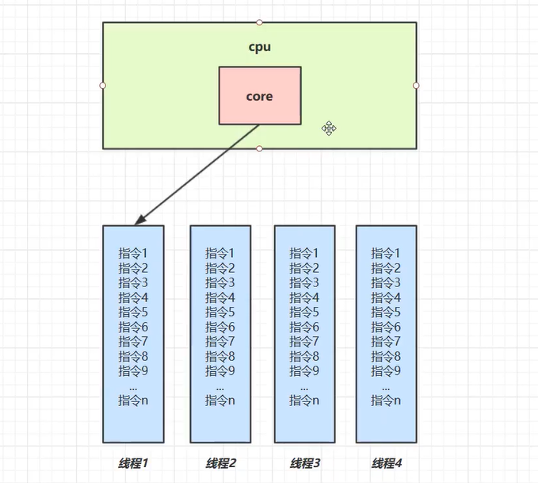

多核CPU下，每个核（core）都可以调度运行线程，这时候线程可以是并行的。

|  CPU  | 时间片1 | 时间片2 | 时间片3 | 时间片4 |
| :---: | :-----: | :-----: | :-----: | :-----: |
| core1 |  线程1  |  线程1  |  线程3  |  线程3  |
| core2 |  线程2  |  线程2  |  线程4  |  线程4  |

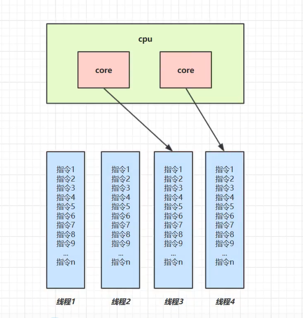

引用Rob Pike的一段描述:

- 并发(concurrent) 是同- -时间应对(dealing with) 多件事情的能力
- 并行(parallel) 是同- -时间动手做(doing) 多件事情的能力

例子

- 家庭主妇做饭、打扫卫生、给孩子喂奶，她-一个人轮流交替做这多件事,这时就是并发
- 家庭主妇雇了个保姆，她们一-起这些事，这时既有并发，也有并行(这时会产生竞争，例如锅只有一口,一个人用锅时，另一个人就得等待)
- 雇了3个保姆，一个专做饭、一个专打扫卫生、一个专喂奶，互不干扰，这时是并行。

## 应用

### 应用之异步调用（案例）

从方法调用的角度来讲，如果需要等待结果返回，才能继续运行就是同步
，不需要等待结果返回，就能继续运行就是异步
**注意:同步在多线程中还有另外一层意思，是让多个线程步调一致**

#### 设计

多线程可以让方法执行变为异步的(即不要巴巴干等着)比如说读取磁盘文件时，假设读取操作花费了5秒
钟，如果没有线程调度机制，这5秒调用者什么都做不了,其代码都得暂停...

``` java
package com.wry.concurrent.util;

import lombok.extern.slf4j.Slf4j;

import java.io.FileNotFoundException;
import java.io.FileReader;

/**
 * <p>
 *
 * </p>
 *
 * @author wangruiyu
 * @since 2020/7/26
 */
@Slf4j
public class FileReaderUtil {
    
    public static void read(String path) {
        log.debug("FileReader start .....");
        try {
            FileReader reader = new java.io.FileReader(path);
        } catch (FileNotFoundException e) {
            e.printStackTrace();
        }
        log.debug("FileReader end .....");
    }
}
```

``` java
package com.wry.concurrent.n2;

import com.wry.concurrent.constans.Constans;
import com.wry.concurrent.util.FileReaderUtil;
import lombok.extern.slf4j.Slf4j;

import java.io.FileNotFoundException;
import java.io.FileReader;

/**
 * <p>
 * 同步等待
 * </p>
 *
 * @author wangruiyu
 * @since 2020/7/26
 */
@Slf4j
public class Sync {

    public static void main(String[] args) {
        //同步执行，必须等待fileReader方法执行完毕，才能进行其他操作
        FileReaderUtil.read(Constans.FILE_PATH);

        log.debug("do other things .....");
    }


}

```

``` java
package com.wry.concurrent.n2;

import com.wry.concurrent.constans.Constans;
import com.wry.concurrent.util.FileReaderUtil;
import lombok.extern.slf4j.Slf4j;

/**
 * <p>
 * 异步不等待
 * </p>
 *
 * @author wangruiyu
 * @since 2020/7/26
 */
@Slf4j
public class Async {

    public static void main(String[] args) {
        //创建一个线程去异步执行，不需要等待执行完毕，就可以执行其他操作
        new Thread(() -> {
            FileReaderUtil.read(Constans.FILE_PATH);
        }).start();

        log.debug("do other things .....");
    }
}

```


#### 结论

- 比如在项目中，视频文件需要转换格式等操作比较费时，这时开一个新线程处理视频转换，避免阻塞主线程。
- tomcat 的异步servlet也是类似的目的,让用户线程处理耗时较长的操作，避免阻塞tomcat的工作线程
- UI程序中，开线程进行其他操作，避免阻塞ui线程

### 应用之提高效率(案例)

充分利用多核cpu的优势，提高运行效率。想象下面的场景,执行3个计算,最后将计算结果汇总。

>计算	1	花费	10ms
>计算	2	花费	11ms
>计算	3	花费	9 ms
>汇总需要	1 ms

- 如果是串行执行，那么总共花费的时间是10 + 11 + 9 + 1= 31ms
- 但如果是四核cpu, 各个核心分别使用线程1执行计算1,线程2执行计算2,线程3执行计算3,那么3个线程是并行的，花费时间只取决于最长的那个线程运行的时间，即11ms最后加上汇总时间只会花费12ms

**注意 : 需要在多核cpu才能提高效率，单核仍然时是轮流执行**

#### 设计

``` java
package com.wry.concurrent.n2.example;

import lombok.extern.slf4j.Slf4j;

import java.util.Arrays;
import java.util.concurrent.ExecutionException;
import java.util.concurrent.FutureTask;

/**
 * <p>
 * 用同步和异步两中方式计算数据所消耗的时间
 * </p>
 *
 * @author wangruiyu
 * @since 2020/7/26
 */
@Slf4j
public class MyBenchmark {

    static int[] ARRAY = new int[4000_000_00];

    static {
        Arrays.fill(ARRAY, 1);
    }

    /**
     * 异步计算 ，创建4个线程去同步计算结果，最后合并计算结果
     */
    public static void async() throws ExecutionException, InterruptedException {
        //开始时间
        Long start = System.currentTimeMillis();
        int[] array = ARRAY;
        FutureTask<Integer> task1 = new FutureTask<Integer>(() -> {
            int sum = 0;
            for (int i = 0; i < 1000_000_00; i++) {
                sum += array[0 + i];
            }
            return sum;
        });
        FutureTask<Integer> task2 = new FutureTask<Integer>(() -> {
            int sum = 0;
            for (int i = 0; i < 1000_000_00; i++) {
                sum += array[1000_000_00 + i];
            }
            return sum;
        });
        FutureTask<Integer> task3 = new FutureTask<Integer>(() -> {
            int sum = 0;
            for (int i = 0; i < 1000_000_00; i++) {
                sum += array[2000_000_00 + i];
            }
            return sum;
        });
        FutureTask<Integer> task4 = new FutureTask<Integer>(() -> {
            int sum = 0;
            for (int i = 0; i < 1000_000_00; i++) {
                sum += array[3000_000_00 + i];
            }
            return sum;
        });

        new Thread(task1).start();
        new Thread(task2).start();
        new Thread(task3).start();
        new Thread(task4).start();
        int i = task1.get() + task2.get() + task3.get() + task4.get();
        //结束时间
        Long end = System.currentTimeMillis();
        System.out.println("异步计算：计算结果：" + i + "\t总计耗时：" + (end - start));
    }

    /**
     * 同步计算
     */
    private static void sync() {
        //开始时间
        Long start = System.currentTimeMillis();
        int[] array = ARRAY;
        int sum = 0;
        for (int i = 0; i < 4000_000_00; i++) {
            sum += array[i];
        }
        //结束时间
        Long end = System.currentTimeMillis();
        System.out.println("同步计算：计算结果：" + sum + "\t总计耗时：" + (end - start));
    }


    public static void main(String[] args) throws ExecutionException, InterruptedException {
        //同步计算
        sync();
        //异步计算
        async();
    }

}

```

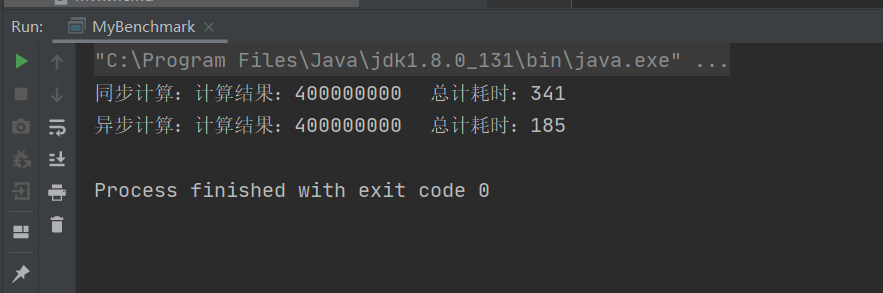

#### 结论

1、单核cpu下，多线程不能实际提高程序运行效率,只是为了能够在不同的任务之间切换，不同线程轮流使用cpu,不至于一 个线程总占用cpu,别的线程没法干活
2、多核cpu可以并行跑多个线程，但能否提高程序运行效率还是要分情况的

    -  有些任务,经过精心设计,将任务拆分，并行执行，当然可以提高程序的运行效率。但不是所有计算任务都能拆分(参考后文的[阿姆达尔定律] )
    -  也不是所有任务都需要拆分，任务的目的如果不同，谈拆分和效率没啥意义

3、 IO操作不占用cpu,只是我们一般拷贝文件使用的是[阻塞IO]，这时相当于线程虽然不用cpu,但需要一直等待IO结束，没能充分利用线程。所以才有后面的[非阻塞IO]和[异步I0]优化。

# JAVA线程

## 创建和运行线程

java程序在启动的时候就会常见一个线程，main函数就是一个线程

### 1.直接使用Thread类

``` java
/**
 * <p>
 * 创建线程的第一种方式 Thread类
 * </p>
 *
 * @author wangruiyu
 * @since 2020/7/27
 */

@Slf4j
public class Thread1 {
    public static void main(String[] args) {
        Thread thread = new Thread() {
            @Override
            public void run() {
                //要执行的任务
                log.debug("runing....");
            }
        };
        //设置线程名字
        thread.setName("t1");
        //启动线程
        thread.start();
        
        log.debug("main....");
    }
}

```

### 2.使用Runnable 配合Thread

把`线程`和`任务` （要执行的代码） 分开

- Thread 代表线程
- Runnable 可运行的任务（线程要执行的代码）

``` java
/**
 * <p>
 * 创建线程的第二种方式
 * </p>
 *
 * @author wangruiyu
 * @since 2020/7/27
 */

@Slf4j
public class Thread2 {
    public static void main(String[] args) {
        Runnable runnable = new Runnable() {
            @Override
            public void run() {
                //要执行的任务
                log.debug("runing....");
            }
        };

        //创建一个线程(参数1：要执行的任务，参数2：线程的名字)
        Thread thread = new Thread(runnable,"t2");
        //启动线程
        thread.start();
        
        log.debug("main....");
    }
}

```

JAVA 8 以后可以使用`lambda`精简代码

``` java
       	//创建任务
        Runnable lombdaRunnable= () -> {
            log.debug("lombda runging......"); 
        };
        //创建线程
        Thread lombdaThead=new Thread(lombdaRunnable,"lombdaThead");
        //启动线程
        lombdaThead.start();
```

可以再次精简

``` java
 new Thread(() -> {
     log.debug("lombda runging......");
 }, "lambdaThread").start();
```

### 3.FutureTask 配合Thread

``` java
/**
 * <p>
 * 创建线程的第三种方式
 * </p>
 *
 * @author wangruiyu
 * @since 2020/7/27
 */

@Slf4j
public class Thread3 {
    public static void main(String[] args) throws ExecutionException, InterruptedException {
        FutureTask<Integer> task=new FutureTask<>(new Callable<Integer>() {
            @Override
            public Integer call() throws Exception {
                log.debug("running.......");
                Thread.sleep(1000);
                return 100;
            }
        });

        //创建一个线程(参数1：要执行的任务，参数2：线程的名字)
        Thread thread = new Thread(task,"t3");
        //启动线程
        thread.start();
        
        //获取task任务的返回值，主线程会等待task任务完成才会继续执行下边的操作
        Integer integer = task.get();
        log.debug("task 的返回值：{}",integer);
    }
}

```


### 原理之Thread与Runnable的关系

#### Runnable源码

创建线程传递Runnable任务，调用重载init方法。

``` java
    /**
     * Allocates a new {@code Thread} object. This constructor has the same
     * effect as {@linkplain #Thread(ThreadGroup,Runnable,String) Thread}
     * {@code (null, target, name)}.
     *
     * @param  target
     *         the object whose {@code run} method is invoked when this thread
     *         is started. If {@code null}, this thread's run method is invoked.
     *
     * @param  name
     *         the name of the new thread
     */
    public Thread(Runnable target, String name) {
        init(null, target, name, 0);
    }

```

调用Init重载方法 

``` java
 /**
     * Initializes a Thread with the current AccessControlContext.
     * @see #init(ThreadGroup,Runnable,String,long,AccessControlContext,boolean)
     */
    private void init(ThreadGroup g, Runnable target, String name,
                      long stackSize) {
        init(g, target, name, stackSize, null, true);
    }
```

找到核心init 方法，把`Runable任务`交给成员对象 `target`

``` java
    /**
     * Initializes a Thread.
     *
     * @param g the Thread group
     * @param target the object whose run() method gets called
     * @param name the name of the new Thread
     * @param stackSize the desired stack size for the new thread, or
     *        zero to indicate that this parameter is to be ignored.
     * @param acc the AccessControlContext to inherit, or
     *            AccessController.getContext() if null
     * @param inheritThreadLocals if {@code true}, inherit initial values for
     *            inheritable thread-locals from the constructing thread
     */
    private void init(ThreadGroup g, Runnable target, String name,
                      long stackSize, AccessControlContext acc,
                      boolean inheritThreadLocals) {
        if (name == null) {
            throw new NullPointerException("name cannot be null");
        }

        this.name = name;

        Thread parent = currentThread();
        SecurityManager security = System.getSecurityManager();
        if (g == null) {
            /* Determine if it's an applet or not */

            /* If there is a security manager, ask the security manager
               what to do. */
            if (security != null) {
                g = security.getThreadGroup();
            }

            /* If the security doesn't have a strong opinion of the matter
               use the parent thread group. */
            if (g == null) {
                g = parent.getThreadGroup();
            }
        }

        /* checkAccess regardless of whether or not threadgroup is
           explicitly passed in. */
        g.checkAccess();

        /*
         * Do we have the required permissions?
         */
        if (security != null) {
            if (isCCLOverridden(getClass())) {
                security.checkPermission(SUBCLASS_IMPLEMENTATION_PERMISSION);
            }
        }

        g.addUnstarted();

        this.group = g;
        this.daemon = parent.isDaemon();
        this.priority = parent.getPriority();
        if (security == null || isCCLOverridden(parent.getClass()))
            this.contextClassLoader = parent.getContextClassLoader();
        else
            this.contextClassLoader = parent.contextClassLoader;
        this.inheritedAccessControlContext =
                acc != null ? acc : AccessController.getContext();
        //把Runable 任务保存在成员变量
        this.target = target;
        setPriority(priority);
        if (inheritThreadLocals && parent.inheritableThreadLocals != null)
            this.inheritableThreadLocals =
                ThreadLocal.createInheritedMap(parent.inheritableThreadLocals);
        /* Stash the specified stack size in case the VM cares */
        this.stackSize = stackSize;

        /* Set thread ID */
        tid = nextThreadID();
    }
```

Thread 运行方法,实际调用的还是Thread的`run方法`

``` java
  /**
     * If this thread was constructed using a separate
     * <code>Runnable</code> run object, then that
     * <code>Runnable</code> object's <code>run</code> method is called;
     * otherwise, this method does nothing and returns.
     * <p>
     * Subclasses of <code>Thread</code> should override this method.
     *
     * @see     #start()
     * @see     #stop()
     * @see     #Thread(ThreadGroup, Runnable, String)
     */
    @Override
    public void run() {
        if (target != null) {
            target.run();
        }
    }

```

#### 小结

- Thread是把线程和任务合并在了一起。Runnable 是把线程和任务分开。
- 用Runnable 更容易与线程池等高级API 配合
- 用Runnable 让任务类脱离了Thread 继承体系，更灵活。

## 多线程同时运行

#### 案例

``` java
/**
 * <p>
 * 演示多个线程并发交替执行
 * </p>
 *
 * @author wangruiyu
 * @since 2020/7/27
 */
@Slf4j
public class MultiThread {
    public static void main(String[] args) {
        new Thread(()->{
            while (true) {
                log.debug("running.....");
            }
        },"t1").start();
        
        new Thread(() -> {
            while (true) {
                log.debug("running.....");
            }
        }, "t2").start();
    }
}

```

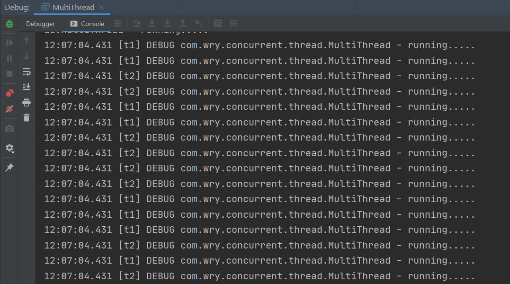

#### 小结

- 多线程交替执行。
- 谁先谁后，不由我们控制，由底层的任务调度器完成。


## 查看进程线程的方法

### windows

- 任务管理器可以查看进程和线程数,也可以用来杀死进程
- tasklist查看进程
- taskkill杀死进程

### linux

- ps -fe查看所有进程
- ps -fT -p <PID>查看某个进程(PID) 的所有线程，
- kill 死进程
- top按大写H切换是否显示线程
- top -H -p <PID>查看某个进程(PID) 的所有线程:

### java

- jps 命令查看所有的JAVA 进程
- jstack <PID> 车看某个Java 进程（PID）的所有线程状态
- jconsole 来查看某个Java 进程中线程的运行情况（图形界面）

### jconsole远程监控配置

需要以如下方式运行你的java类

>java -Djava. rmi. server . hostname=' ip地址' -Dcom. sun. management . jmxremote -Dcom. sun. management . jmxremote. port=i连接端口-Dcom . sun . management . jmxremote.ssl=是否安全连接-Dcom. sun. management .jmxremote .authenticate=是否认证    java类

修改/etc/hosts文件将127.0.0.1 映射至主机名
如果要认证访问，还需要做如下步骤

- 复制jmxremote.password 文件
- 修改jmxremote.password和jmxremote.access文件的权限为600即文件所有者可读写
- 连接时填入controlRole (用户名)，R&D (密码)


## 原理之线程运行

### 栈与栈帧

Java Virtual Machine Stacks （Java 虚拟机栈）

我们都知道 JVM 中由堆、栈、方法区所组成，其中栈内存是给谁用的呢？其实就是线程，每个线程启动后，虚拟

机就会为其分配一块栈内存。

- 每个栈由多个栈帧（Frame）组成，对应着每次方法调用时所占用的内存

- 每个线程只能有一个活动栈帧，对应着当前正在执行的那个方法

#### 案例

##### 单线程

``` java
/**
 * <p>
 * 方法调用查看方法栈和栈帧
 * </p>
 *
 * @author wangruiyu
 * @since 2020/7/27
 */
public class Frames {
    public static void main(String[] args) {
        method1(10);
    }

    private static void method1(int x) {
        int y = x + 1;
        Object o = method2();
        System.out.println(o);
    }

    private static Object method2() {
        Object o = new Object();
        return o;
    }
}

```

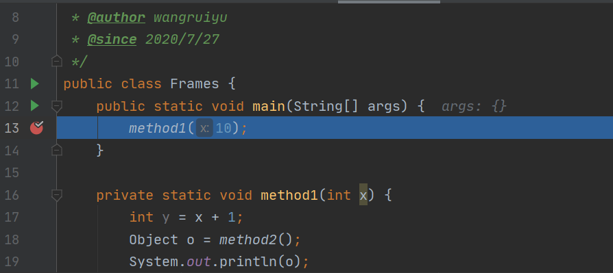

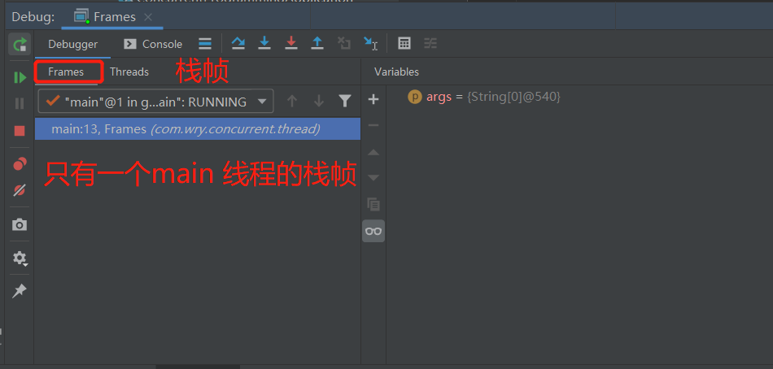

当方法运行到method2时可以看到栈里有三个栈帧
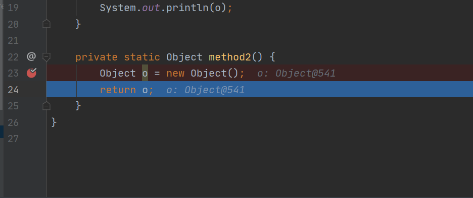

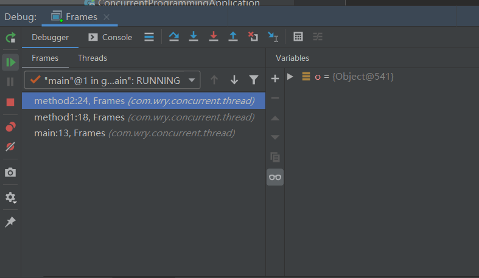

当method2 方法执行完毕后栈中减少method2的栈帧
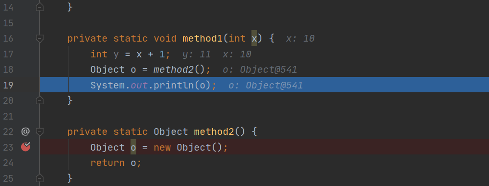

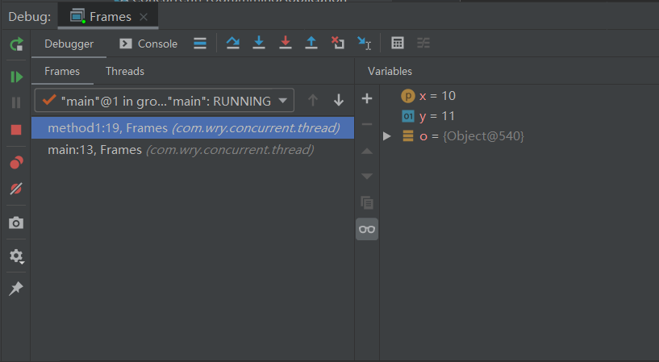

直到所有栈帧运行完毕，程序执行完毕。

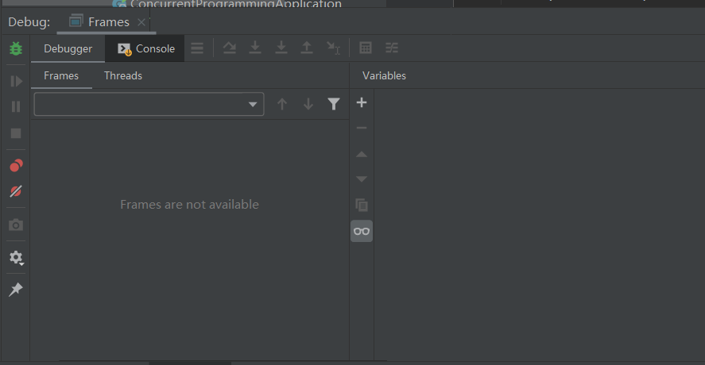

##### 多线程

``` java
package com.wry.concurrent.thread;

/**
 * <p>
 * 多线程情况下 方法调用查看方法栈和栈帧
 * </p>
 *
 * @author wangruiyu
 * @since 2020/7/27
 */
public class Frames2 {
    public static void main(String[] args) {
        new Thread(() -> {
            //t1线程调用
            method1(20);
        }, "t1").start();
        //main线程调用
        method1(10);
    }

    private static void method1(int x) {
        int y = x + 1;
        Object o = method2();
        System.out.println(o);
    }

    private static Object method2() {
        Object o = new Object();
        return o;
    }
}
```

在t1 线程出设置断点，切换断点模式。

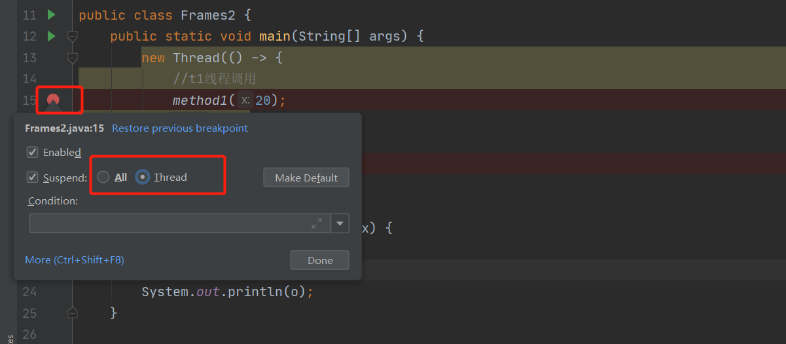

切换不同的线程

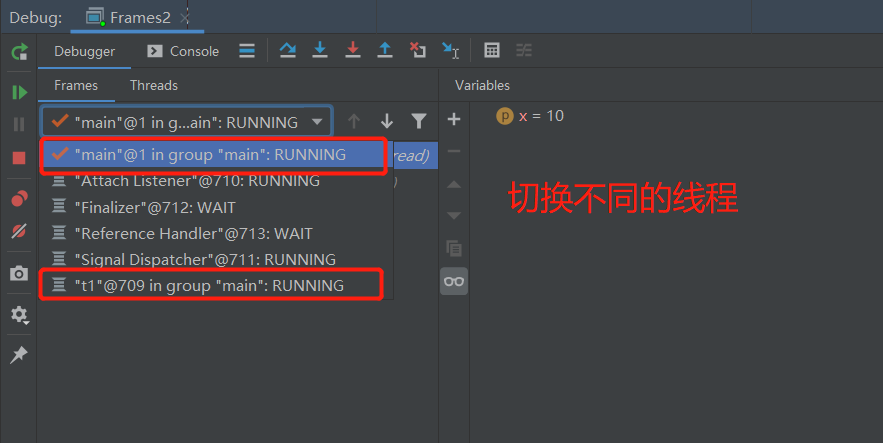

main线程的栈帧

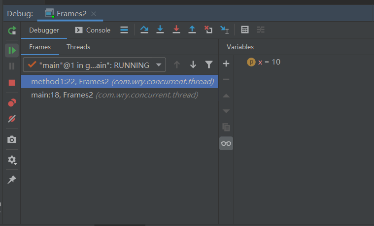
t1线程的栈帧
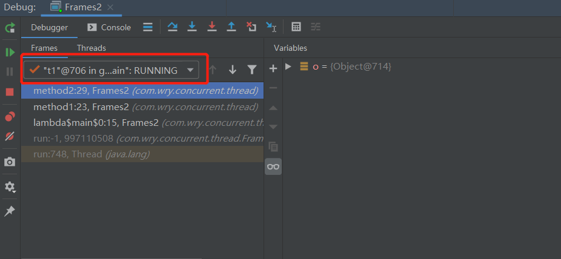

#### 小结

线程的栈内存是相互独立的，每个线程有独立的栈内存，栈内存中有栈帧，每个线程相互独立，互不干扰。


### 线程上下文切换（Thread Context Switch）

因为以下一些原因导致 cpu 不再执行当前的线程，转而执行另一个线程的代码

- 线程的 cpu 时间片用完

- 垃圾回收

- 有更高优先级的线程需要运行

- 线程自己调用了 sleep、yield、wait、join、park、synchronized、lock 等方法

当 Context Switch 发生时，`需要由操作系统保存当前线程的状态，并恢复另一个线程的状态`，Java 中对应的概念就是`程序计数器【寄存器】（Program Counter Register）`，它的作用是记住下一条 jvm 指令的执行地址，是线程私有的。

- 状态包括程序计数器、虚拟机栈中每个栈帧的信息，如局部变量、操作数栈、返回地址等

- Context Switch 频繁发生会影响性能

## 常见方法

| **方法名**       | **static** | **功能说明**                                                 | **注意**                                                     |
| :--------------- | :--------: | :----------------------------------------------------------- | :----------------------------------------------------------- |
| start()          |            | 启动一个新线程，在新的线程运行 run 方法中的代码              | start 方法只是让线程进入就绪，里面代码不一定立刻运行（CPU 的时间片还没分给它）。每个线程对象的start方法只能调用一次，如果调用了多次会出现IllegalThreadStateExceptio |
| run()            |            | 新线程启动后会调用的方法                                     | 如果在构造 Thread 对象时传递了 Runnable 参数，则线程启动后会调用 Runnable 中的 run 方法，否则默认不执行任何操作。但可以创建 Thread 的子类对象，来覆盖默认行为 |
| join()           |            | 等待线程运行结束                                             |                                                              |
| join(long n)     |            | 等待线程运行结束,最多等待n毫秒                               |                                                              |
| getId()          |            | 获取线程长整型的 id                                          | id唯一                                                       |
| getName()        |            | 获取线程名                                                   |                                                              |
| setName(String)  |            | 修改线程名                                                   |                                                              |
| getPriority()    |            | 获取线程优先级                                               |                                                              |
| setPriority(int) |            | 修改线程优先级                                               | java中规定线程优先级是1~10 的整数，较大的优先级能提高该线程被 CPU 调度的机率 |
| getState()       |            | 获取线程状态                                                 | Java 中线程状态是用 6 个 enum 表示，分别为：NEW, RUNNABLE, BLOCKED, WAITING,TIMED_WAITING, TERMINATED |
| isInterrupted()  |            | 判断是否被打断                                               | 不会清除`打断标记`                                           |
| isAlive()        |            | 线程是否存活(还没有运行完毕）                                |                                                              |
| interrupt()      |            | 打断线程                                                     | 如果被打断线程正在 sleep，wait，join 会导致被打断的线程抛出 InterruptedException，并清除`打断标记`；如果打断的正在运行的线程，则会设置`打断标记`；park 的线程被打断，也会设置`打断标记` |
| interrupted()    |   static   | 判断当前线程是否被打断                                       | 会清除`打断标记`                                             |
| currentThread()  |   static   | 获取当前正在执行的线程                                       |                                                              |
| sleep(long n)    |   static   | 让当前执行的线程休眠n毫秒，休眠时让出 cpu 的时间片给其它线程 |                                                              |
| yield()          |   static   | 提示线程调度器让出当前线程对CPU的使用                        | 主要是为了测试和调试                                         |


## start方法详解

### 调用run

``` java
/**
 * <p>
 * 创建线程调用 run 方法
 * </p>
 *
 * @author wangruiyu
 * @since 2020/7/27
 */
@Slf4j
public class RunMethod {
    public static void main(String[] args) {
        Thread t1 = new Thread(() -> {
            log.debug(Thread.currentThread().getName());
            FileReaderUtil.read(Constants.FILE_PATH);
        }, "t1");

        t1.run();
    }
}

```

发现执行的依然是main 线程，创建的线程并没有执行。

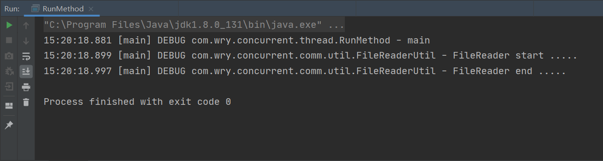

### 调用start

``` java
/**
 * <p>
 * 创建线程调用 run 方法
 * </p>
 *
 * @author wangruiyu
 * @since 2020/7/27
 */
@Slf4j
public class RunMethod {
    public static void main(String[] args) {
        Thread t1 = new Thread(() -> {
            log.debug(Thread.currentThread().getName());
            FileReaderUtil.read(Constants.FILE_PATH);
        }, "t1");
//        //调用run方法
//        t1.run();
        //调用start方法
        t1.start();
    }
}
```

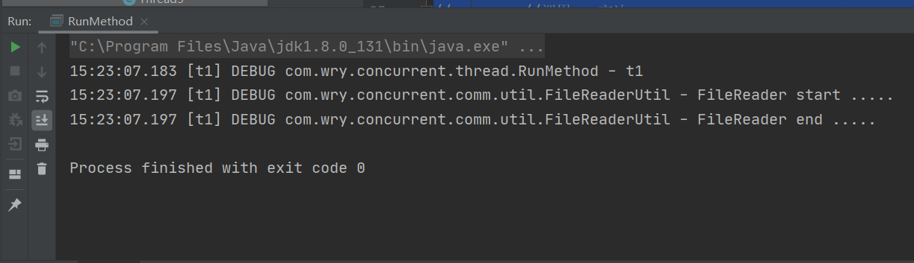

### 源码分析
``` java

    /**
     * If this thread was constructed using a separate
     * <code>Runnable</code> run object, then that
     * <code>Runnable</code> object's <code>run</code> method is called;
     * otherwise, this method does nothing and returns.
     * <p>
     * Subclasses of <code>Thread</code> should override this method.
     *
     * @see     #start()
     * @see     #stop()
     * @see     #Thread(ThreadGroup, Runnable, String)
     */
    @Override
    public void run() {
        if (target != null) {
            target.run();
        }
    }
```
``` java
@FunctionalInterface
public interface Runnable {
    /**
     * When an object implementing interface <code>Runnable</code> is used
     * to create a thread, starting the thread causes the object's
     * <code>run</code> method to be called in that separately executing
     * thread.
     * <p>
     * The general contract of the method <code>run</code> is that it may
     * take any action whatsoever.
     *
     * @see     java.lang.Thread#run()
     */
    public abstract void run();
}
```
run() 方法是抽象方法等待子类去实现。

``` java
   public synchronized void start() {
        /**
         * This method is not invoked for the main method thread or "system"
         * group threads created/set up by the VM. Any new functionality added
         * to this method in the future may have to also be added to the VM.
         *
         * A zero status value corresponds to state "NEW".
         */
        if (threadStatus != 0)
            throw new IllegalThreadStateException();

        /* Notify the group that this thread is about to be started
         * so that it can be added to the group's list of threads
         * and the group's unstarted count can be decremented. */
        group.add(this);

        boolean started = false;
        try {
            start0();
            started = true;
        } finally {
            try {
                if (!started) {
                    group.threadStartFailed(this);
                }
            } catch (Throwable ignore) {
                /* do nothing. If start0 threw a Throwable then
                  it will be passed up the call stack */
            }
        }
    }
    
     private native void start0();

```
在`start()`方法中调用 `start0()`方法正式启动线程。而`start0()`是用`native`修饰得方法，底层调用操作系统的方法实现线程调用。

### 小结

- 直接调用 run 是在主线程中执行了 run，没有启动新的线程

- 使用 start 是启动新的线程，通过新的线程间接执行 run 中的代码

### 查看线程状态

``` java
/**
 * <p>
 * 查看线程运行状态
 * </p>
 *
 * @author wangruiyu
 * @since 2020/7/27
 */
public class ThreadStatus {
    public static void main(String[] args) {
        Thread t1 = new Thread(() -> {
            System.out.println("running.....");
        }, "t1");

        //获取运行前的状态
        System.out.println("运行前的状态:"+t1.getState());
        //调用start方法
        t1.start();
        //获取运行后的状态
        System.out.println("运行后的状态:"+t1.getState());
    }
}
```

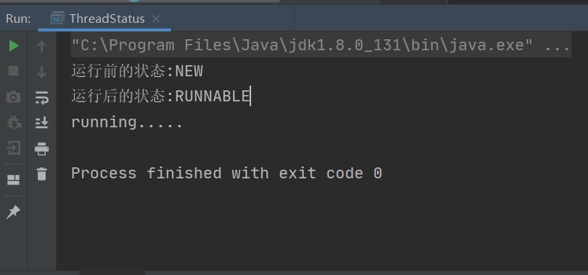

### 多次调用start方法会抛java.lang.IllegalThreadStateException

``` java
//调用start方法
t1.start();
t1.start();
```

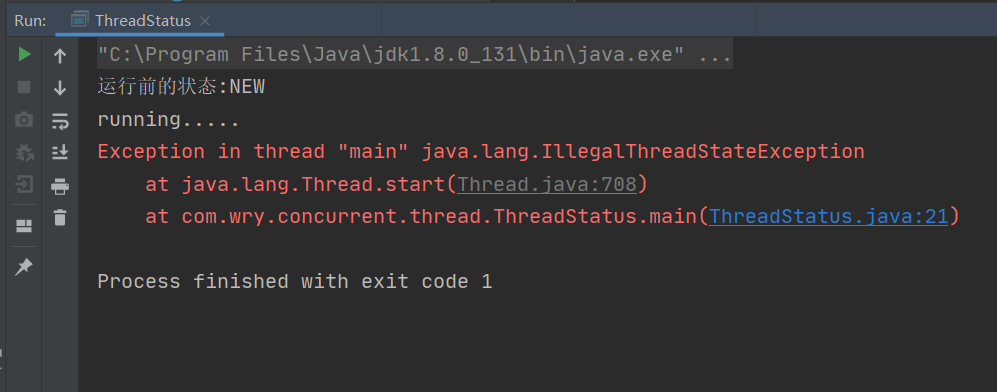


## **sleep** **与** **yield**

### sleep

1. 调用 sleep 会让当前线程从 *Running* 进入 *Timed Waiting* 状态（阻塞）

``` java
/**
 * <p>
 * 测试线程的常用方法  sleep
 * </p>
 *
 * @author wangruiyu
 * @since 2020/7/27
 */
@Slf4j
public class ThreadMethod {
    public static void main(String[] args) {
        Thread t1 = new Thread(() -> {
            try {
                Thread.sleep(2000);
            } catch (InterruptedException e) {
                e.printStackTrace();
            }
        }, "t1");

        t1.start();
        log.debug("t1 线程的状态：{}",t1.getState());

        try {
            Thread.sleep(1000);
        } catch (InterruptedException e) {
            e.printStackTrace();
        }
        log.debug("t1 线程的状态：{}",t1.getState());
    }
}
```

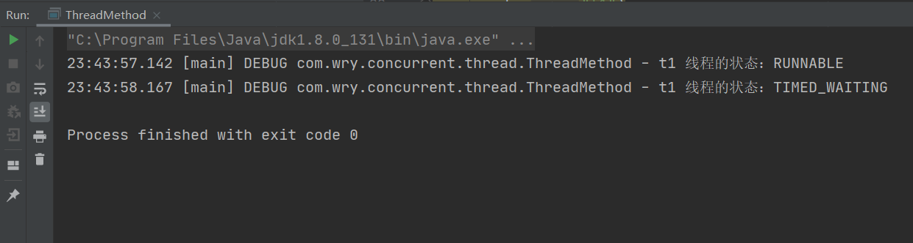

2. 其它线程可以使用 interrupt 方法打断正在睡眠的线程，这时 sleep 方法会抛出 InterruptedException

``` java
/**
 * <p>
 * 测试线程的常用方法 interrupt 打断
 * </p>
 *
 * @author wangruiyu
 * @since 2020/7/27
 */
@Slf4j
public class ThreadMethod2 {
    public static void main(String[] args) {
        Thread t1 = new Thread(() -> {
            try {
                log.debug("enter sleep...... ");
                Thread.sleep(2000);
            } catch (InterruptedException e) {
                e.printStackTrace();
                log.debug("wake up...... ");
            }
        }, "t1");

        t1.start();
        try {
            Thread.sleep(1000);
        } catch (InterruptedException e) {
            e.printStackTrace();
        }
        t1.interrupt();
        log.debug("interrupt...... ");
    }
}
```

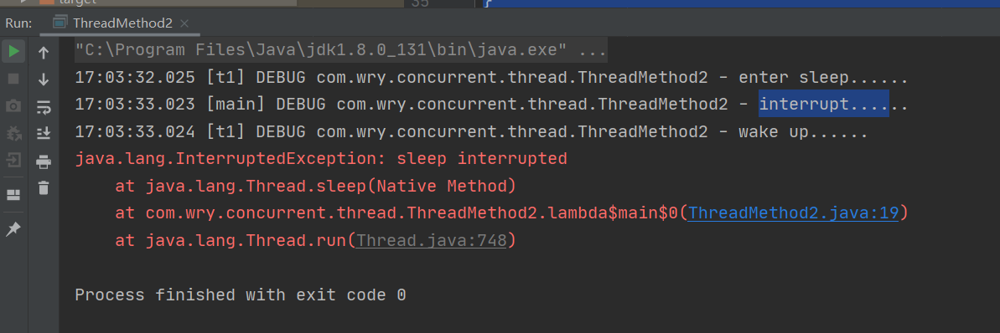

3. 睡眠结束后的线程未必会立刻得到执行

4. 建议用 TimeUnit 的 sleep 代替 Thread 的 sleep 来获得更好的可读性

``` java
/**
 * <p>
 * 测试线程的常用方法 使用TimeUnit
 * </p>
 *
 * @author wangruiyu
 * @since 2020/7/27
 */
@Slf4j
public class ThreadMethod3 {
    public static void main(String[] args) throws InterruptedException {
        log.debug("start ......");
        TimeUnit.SECONDS.sleep(1);
        log.debug("end ......");
    }
}
```

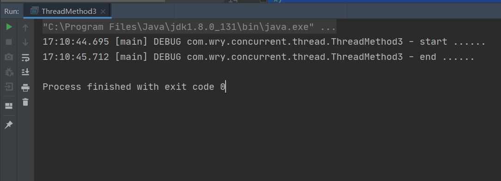


### yield

1. 调用 yield 会让当前线程从 *Running* 进入 *Runnable* 就绪状态，然后调度执行其它线程

2. 具体的实现依赖于操作系统的任务调度器

##  线程优先级

线程优先级会提示（hint）调度器优先调度该线程，但它仅仅是一个提示，调度器可以忽略它

如果 cpu 比较忙，那么优先级高的线程会获得更多的时间片，但 cpu 闲时，优先级几乎没作用

### 未设置优先级和调用yield

``` java
/**
 * <p>
 * 设置线程的线程优先级
 * </p>
 *
 * @author wangruiyu
 * @since 2020/7/27
 */
public class ThreadPriority {
    public static void main(String[] args) {
        Runnable task1 = () -> {
            int count = 0;
            for (; ; ) {
                System.out.println("---->1 " + count++);
            }
        };
        Runnable task2 = () -> {
            int count = 0;
            for (; ; ) {
                // Thread.yield();
                System.out.println("        ---->2 " + count++);
            }
        };
        Thread t1 = new Thread(task1, "t1");
        Thread t2 = new Thread(task2, "t2");
        t1.start();
        t2.start();
    }
}
```

t1线程和t2 线程打印的数值相差不大。

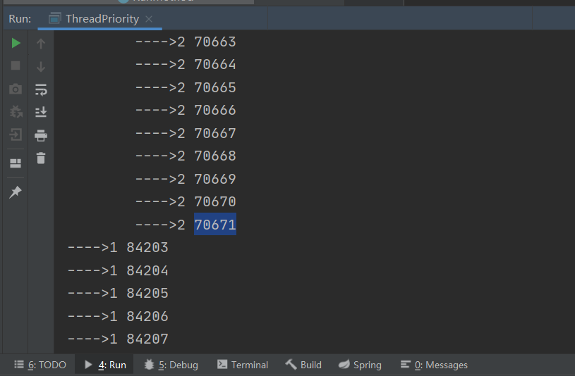

### 调用yield

``` java
/**
 * <p>
 * 设置线程的线程优先级
 * </p>
 *
 * @author wangruiyu
 * @since 2020/7/27
 */
public class ThreadPriority {
    public static void main(String[] args) {
        Runnable task1 = () -> {
            int count = 0;
            for (; ; ) {
                System.out.println("---->1 " + count++);
            }
        };
        Runnable task2 = () -> {
            int count = 0;
            for (; ; ) {
                //调用yield,把CPU执行执行时间交给其他线程
                Thread.yield();
                System.out.println("        ---->2 " + count++);
            }
        };
        Thread t1 = new Thread(task1, "t1");
        Thread t2 = new Thread(task2, "t2");
        t1.start();
        t2.start();
    }
}

```

t1线程打印的数值远远大于 t2 线程打印的数值。

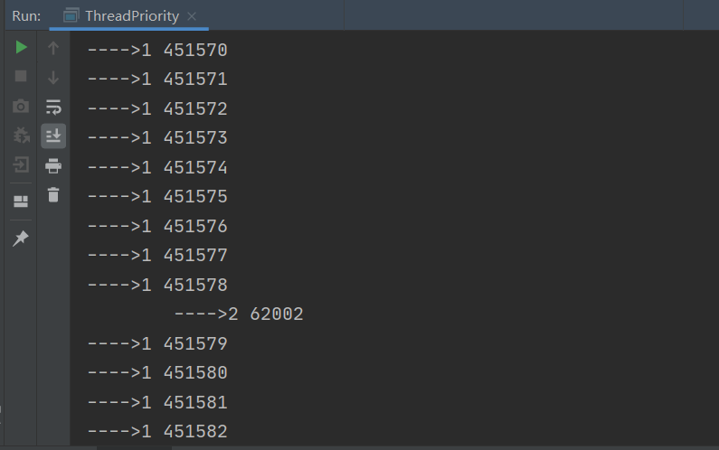

### 设置优先级

``` java
/**
 * <p>
 * 设置线程的线程优先级
 * </p>
 *
 * @author wangruiyu
 * @since 2020/7/27
 */
public class ThreadPriority {
    public static void main(String[] args) {
        Runnable task1 = () -> {
            int count = 0;
            for (; ; ) {
                System.out.println("---->1 " + count++);
            }
        };
        Runnable task2 = () -> {
            int count = 0;
            for (; ; ) {
                System.out.println("        ---->2 " + count++);
            }
        };
        Thread t1 = new Thread(task1, "t1");
        Thread t2 = new Thread(task2, "t2");
        //t1线程设置最小的线程优先级
        t1.setPriority(Thread.MIN_PRIORITY);
        //t2线程设置最大的线程优先级
        t2.setPriority(Thread.MAX_PRIORITY);
        
        t1.start();
        t2.start();
    }
}
```

t2线程打印的数值远远大于 t1 线程打印的数值。

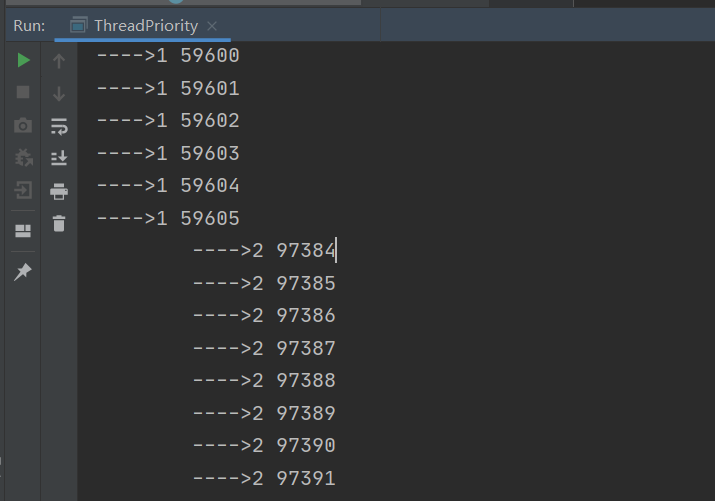

##  案例

### 防止CPU 占用100%

#### sleep 实现

在没有利用cpu来计算时，不要让while(rue)空转浪费cpu,这时可以使用yield或sleep来让出cpu的使用权给其他程序

``` java
Thread t1 = new Thread(() -> {
            try {
                Thread.sleep(500);
            } catch (InterruptedException e) {
                e.printStackTrace();
            }   
        },"t1");
        t1.start();
```


- 可以用wait或条件变量达到类似的效果
- 不同的是，后两种都需要加锁I并且需要相应的唤醒操作,一般适用于要进行同步的场景
- sleep适用于无需锁同步的场景

##  join方法详解

下面的代码执行，打印 r 是什么？

### 案例1 ——为什么需要join

未调用Join方法

``` java
/**
 * <p>
 * 测试线程的常用方法 join
 * </p>
 *
 * @author wangruiyu
 * @since 2020/7/28
 */
@Slf4j
public class JoinMethod {
    private static int r = 0;

    private static void test1() {
        log.debug("开始......");
        Thread t1 = new Thread(() -> {
            log.debug("开始......");
            try {
                TimeUnit.SECONDS.sleep(1);
            } catch (InterruptedException e) {
                e.printStackTrace();
            }
            log.debug("结束......");
            r = 10;
        },"t1");
        t1.start();
        log.debug("结果为:{}", r);
        log.debug("结束......");
    }

    public static void main(String[] args) throws InterruptedException {
        test1();
    }
}
```

可以看到`主线程`在`t1线程`还没有给` r `赋值时就已经支持完毕了。打印的r任然是初始值。

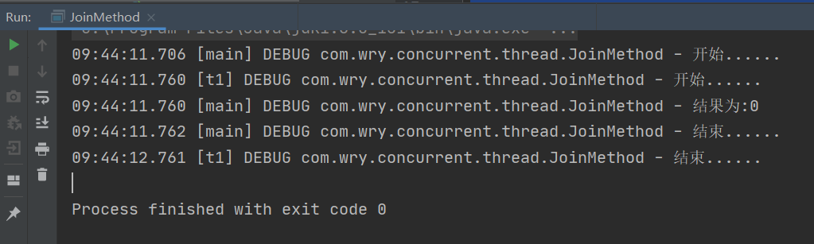

### 分析

- 因为主线程和线程 t1 是并行执行的，t1 线程需要 1 秒之后才能算出` r=10`

- 而主线程一开始就要打印 r 的结果，所以只能打印出 `r=0`

### 解决方法

- 用 sleep 行不行？为什么？

  因为不知道t1程何时运行完毕,所以主线程等待的时间不好设置。

- 用 join，加在 t1.start() 之后即可

  `join()`的作用是：**"等待该线程终止"**，这里需要理解的就是该线程是指的主线程等待子线程的终止。也就是 **在子线程调用了join()方法后面的代码，只有等到子线程结束了才能执行**。

``` java
/**
 * <p>
 * 测试线程的常用方法 join
 * </p>
 *
 * @author wangruiyu
 * @since 2020/7/28
 */
@Slf4j
public class JoinMethod {
    private static int r = 0;

    private static void test1() throws InterruptedException {
        log.debug("开始......");
        Thread t1 = new Thread(() -> {
            log.debug("开始......");
            try {
                TimeUnit.SECONDS.sleep(1);
            } catch (InterruptedException e) {
                e.printStackTrace();
            }
            log.debug("结束......");
            r = 10;
        },"t1");
        t1.start();
        //等待t1线程执行结束
        t1.join();
        log.debug("结果为:{}", r);
        log.debug("结束......");
    }

    public static void main(String[] args) throws InterruptedException {
        test1();
    }
}
```

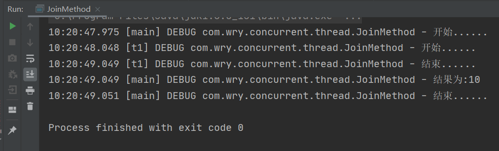

### 案例2 ——同步

以调用方角度来讲，如果

- 需要等待结果返回，才能继续运行就是同步

- 不需要等待结果返回，就能继续运行就是异步

#### 等待多个结果

问，下面代码 cost 大约多少秒？

``` java
/**
 * <p>
 * 测试线程的常用方法 join 等待多个结果
 * </p>
 *
 * @author wangruiyu
 * @since 2020/7/28
 */
@Slf4j
public class JoinMethod2 {
    private static int r1 = 0;
    private static int r2 = 0;

    private static void test1() throws InterruptedException {
        log.debug("开始......");
        Thread t1 = new Thread(() -> {
            log.debug("开始......");
            try {
                TimeUnit.SECONDS.sleep(1);
            } catch (InterruptedException e) {
                e.printStackTrace();
            }
            log.debug("结束......");
            r1 = 10;
        }, "t1");

        Thread t2 = new Thread(() -> {
            log.debug("开始......");
            try {
                TimeUnit.SECONDS.sleep(2);
            } catch (InterruptedException e) {
                e.printStackTrace();
            }
            log.debug("结束......");
            r2 = 20;
        }, "t2");

        //启动线程
        t1.start();
        t2.start();

        //开始时间
        long start = System.currentTimeMillis();
        log.debug("join begin ......");
        t1.join();
        log.debug("t1 join end ......");
        t2.join();
        log.debug("t2 join end ......");
        //结束时间
        long end = System.currentTimeMillis();
        log.debug("t1 结果为:{},t2 结果为:{},总耗时：{}", r1, r2, end - start);
        log.debug("结束......");
    }

    public static void main(String[] args) throws InterruptedException {
        test1();
    }
}
```

分析如下

- 第一个 join：等待 t1 时, t2 并没有停止, 而在运行

- 第二个 join：1s 后, 执行到此, t2 也运行了 1s, 因此也只需再等待 1s

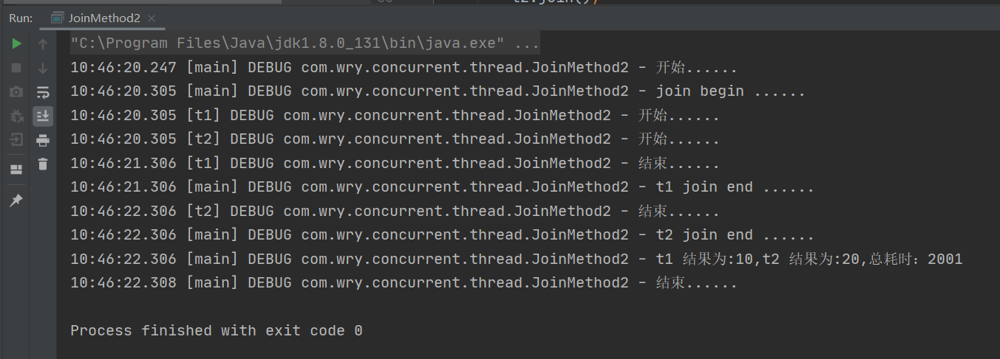

如果颠倒两个 join 呢？

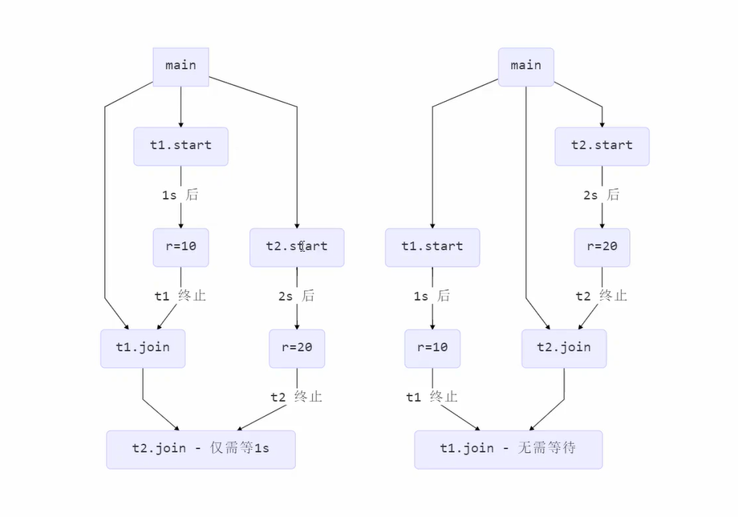

### 案例3 ——有时效的等待

``` java
/**
 * <p>
 * 测试线程的常用方法 join 有时效的等待
 * </p>
 *
 * @author wangruiyu
 * @since 2020/7/28
 */
@Slf4j
public class JoinMethod3 {
    private static int r1 = 0;

    private static void test1() throws InterruptedException {
        log.debug("开始......");
        Thread t1 = new Thread(() -> {
            log.debug("开始......");
            try {
                //睡2000毫秒
                TimeUnit.MILLISECONDS.sleep(2000);
            } catch (InterruptedException e) {
                e.printStackTrace();
            }
            log.debug("结束......");
            r1 = 10;
        }, "t1");

        //启动线程
        t1.start();

        //开始时间
        long start = System.currentTimeMillis();
        log.debug("join begin ......");
        //只等待1500毫秒
        t1.join(1500);
        log.debug("t1 join end ......");
        //结束时间
        long end = System.currentTimeMillis();
        log.debug("t1 结果为:{},总耗时：{}", r1,  end - start);
        log.debug("结束......");
    }

    public static void main(String[] args) throws InterruptedException {
        test1();
    }
}
```

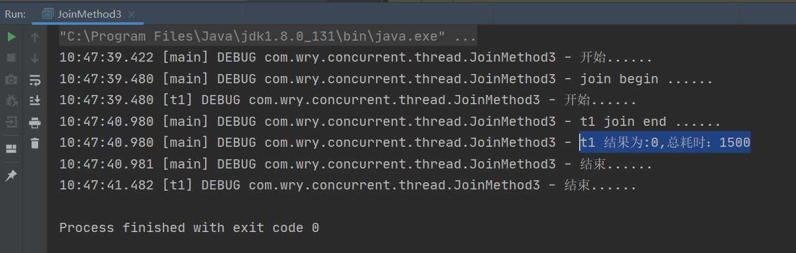

如果线程提前结束，join方法设置的时效就会失效，会以线程实际执行的时间为准。


## interrupt方法详解

### 打断阻塞状态的线程  ：

打断 sleep， wait ， join 的线程 ，这几个方法都会让线程进入阻塞状态

打断 sleep 的线程, 会清空打断状态，以 sleep 为例

``` java
package com.wry.concurrent.thread;

import lombok.extern.slf4j.Slf4j;

import java.util.concurrent.TimeUnit;

/**
 * <p>
 * 测试线程的常用方法  interrupt 打断阻塞线程
 * </p>
 *
 * @author wangruiyu
 * @since 2020/7/28
 */
@Slf4j
public class InterruptMethod {
    private static void test1() throws InterruptedException {
        Thread t1 = new Thread(() -> {
            try {
                TimeUnit.SECONDS.sleep(2);
            } catch (InterruptedException e) {
                e.printStackTrace();
            }
        }, "t1");
        t1.start();
        log.debug("interrupt... ");
        TimeUnit.SECONDS.sleep(1);
        t1.interrupt();
        log.debug(" 打断状态: {}", t1.isInterrupted());
    }

    public static void main(String[] args) throws InterruptedException {
        test1();
    }
}
```

打断阻塞状态线程后，打断标记会被设置未false。

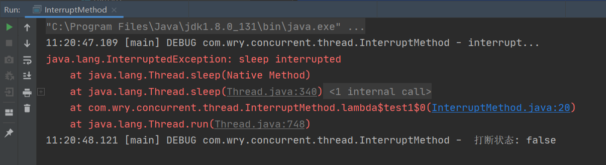

### 打断正常状态的线程  ：

``` java
/**
 * <p>
 * 测试线程的常用方法  interrupt 打断正常状态线程
 * </p>
 *
 * @author wangruiyu
 * @since 2020/7/28
 */
@Slf4j
public class InterruptMethod2 {
    private static void test1() throws InterruptedException {
        Thread t1 = new Thread(() -> {
            while (true) {
               
            }
        }, "t1");

        t1.start();

        log.debug("interrupt... ");
        TimeUnit.SECONDS.sleep(1);
        t1.interrupt();
        log.debug(" 打断状态: {}", t1.isInterrupted());
    }

    public static void main(String[] args) throws InterruptedException {
        test1();
    }
}

```

t1线程被打断之后，任然在运行。
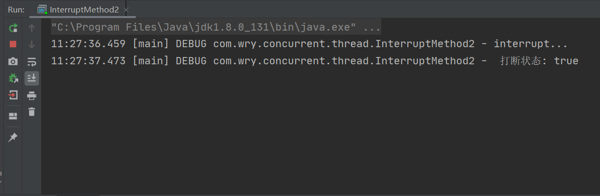

如果想让被打断的线程停止运行。可以利用被打断线程的打断标记来实现。

``` java
/**
 * <p>
 * 测试线程的常用方法  interrupt 打断正常状态线程
 * </p>
 *
 * @author wangruiyu
 * @since 2020/7/28
 */
@Slf4j
public class InterruptMethod2 {
    private static void test1() throws InterruptedException {
        Thread t1 = new Thread(() -> {
            while (true) {
                boolean isInterrupt = Thread.currentThread().isInterrupted();
                if (isInterrupt) {
                    log.debug("被打断了，退出循环");
                    break;
                }
            }
        }, "t1");

        t1.start();

        log.debug("interrupt... ");
        TimeUnit.SECONDS.sleep(1);
        t1.interrupt();
        log.debug(" 打断状态: {}", t1.isInterrupted());
    }

    public static void main(String[] args) throws InterruptedException {
        test1();
    }
}
```


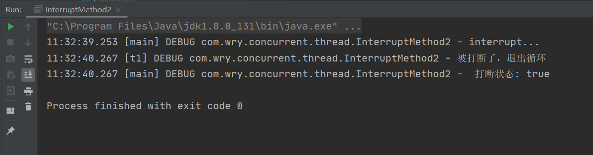

###  打断park线程:

打断 park 线程, 不会清空打断状态

``` java
/**
 * <p>
 * 测试线程的常用方法  interrupt 打断park线程
 * </p>
 *
 * @author wangruiyu
 * @since 2020/7/28
 */
@Slf4j
public class InterruptMethod3 {
    private static void test1() throws InterruptedException {
        Thread t1 = new Thread(() -> {
            log.debug("park...");
            LockSupport.park();
            log.debug("unpark...");
            log.debug("打断状态：{}", Thread.currentThread().isInterrupted());
        }, "t1");
        t1.start();
        TimeUnit.SECONDS.sleep(1);
        t1.interrupt();
    }

    public static void main(String[] args) throws InterruptedException {
        test1();
    }
}
```

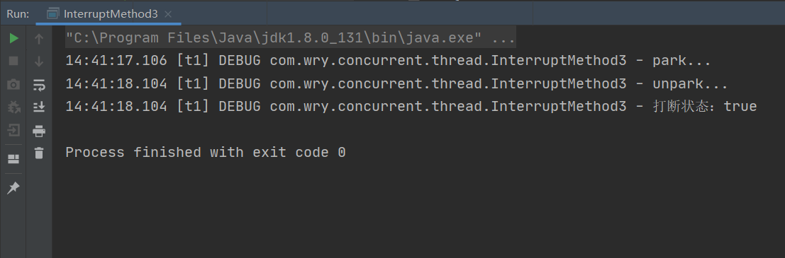

值得注意的是park 线程打断后再次park，线程不会再次停下来。

``` java
/**
 * <p>
 * 测试线程的常用方法  interrupt 打断park线程
 * </p>
 *
 * @author wangruiyu
 * @since 2020/7/28
 */
@Slf4j
public class InterruptMethod3 {
    private static void test1() throws InterruptedException {
        Thread t1 = new Thread(() -> {
            log.debug("park...");
            LockSupport.park();
            log.debug("unpark...");
            log.debug("打断状态：{}", Thread.currentThread().isInterrupted());
            //再次park
            LockSupport.park();
            log.debug("unpark...");

        }, "t1");
        t1.start();
        TimeUnit.SECONDS.sleep(1);
        t1.interrupt();
    }

    public static void main(String[] args) throws InterruptedException {
        test1();
    }
}
```

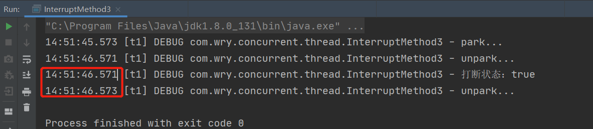

需要使用Thread 的静态方法Thread.interrupted() 来查看当前的是否被打断，会重置打断状态

``` java
package com.wry.concurrent.thread;

import lombok.extern.slf4j.Slf4j;

import java.util.concurrent.TimeUnit;
import java.util.concurrent.locks.LockSupport;

/**
 * <p>
 * 测试线程的常用方法  interrupt 打断park线程
 * </p>
 *
 * @author wangruiyu
 * @since 2020/7/28
 */
@Slf4j
public class InterruptMethod3 {
    private static void test1() throws InterruptedException {
        Thread t1 = new Thread(() -> {
            log.debug("park...");
            LockSupport.park();
            log.debug("unpark...");
            log.debug("打断状态：{}", Thread.interrupted());
            //再次park
            LockSupport.park();
            log.debug("unpark...");
        }, "t1");
        t1.start();
        TimeUnit.SECONDS.sleep(1);
        t1.interrupt();

        TimeUnit.SECONDS.sleep(1);
        t1.interrupt();
    }

    public static void main(String[] args) throws InterruptedException {
        test1();
    }
}

```

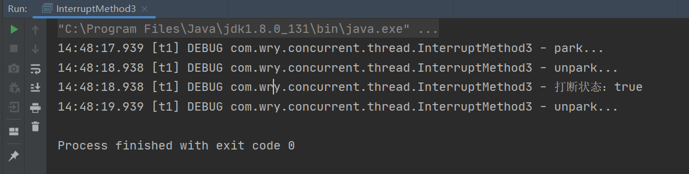

## 模式之两阶段终止

### 两阶段终止模式（Two Phase Termination）

在一个线程T1中如何“优雅”终止线程T2?

这里的【优雅】指的是给T2一个料理后事的机会。

#### 错误思路

- 使用线程对象的stop()方法停止线程:
  - stop 方法会真正杀死线程，如果这时线程锁住了共享资源，那么当它被杀死后就再也没有机会释放锁，其它线程将永远无法获取锁
-  使用System.exit(int)方法停止线程
  - 目的仅是停止一个线程，但这种做法会让整个程序都停止

### 案例

有一个计算监控系统，每隔2s记录一下系统状态，有一个停止功能，可以停止整个监控程序，整个流程如下：

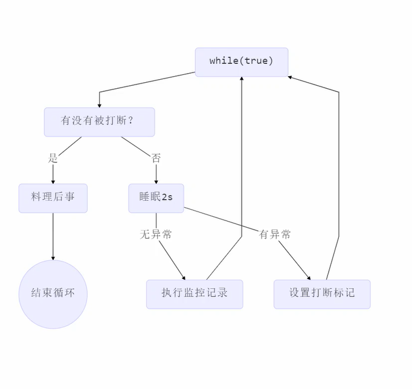

### 实现

``` java
/**
 * <p>
 * 利用interrupt实现两阶段停止。
 * </p>
 *
 * @author wangruiyu
 * @since 2020/7/28
 */
@Slf4j
public class TwoPhaseTermination {
    private Thread monitor;

    /**
     * 启动监控
     */
    private void start() {
        monitor = new Thread(() -> {
            while (true) {
                Thread currentThread = Thread.currentThread();
                if (currentThread.isInterrupted()){
                    log.debug("料理后事。。。。。。");
                    break;
                }
                try {
                    TimeUnit.SECONDS.sleep(1); //打断阻塞的线程  会抛异常，打断标记会被重置
                    log.debug("执行监控记录。。。。。。"); //打断正常的线程
                } catch (InterruptedException e) {
                    e.printStackTrace();
                    //再次打断,重新设置打断标记
                    currentThread.interrupt();
                }
            }
        });

        monitor.start();
    }

    /**
     * 停止监控
     */
    private void stop() {
        monitor.interrupt();
    }

    public static void main(String[] args) throws InterruptedException {
        TwoPhaseTermination termination = new TwoPhaseTermination();
        termination.start();

        TimeUnit.SECONDS.sleep(3);
        termination.stop();
    }
}
```

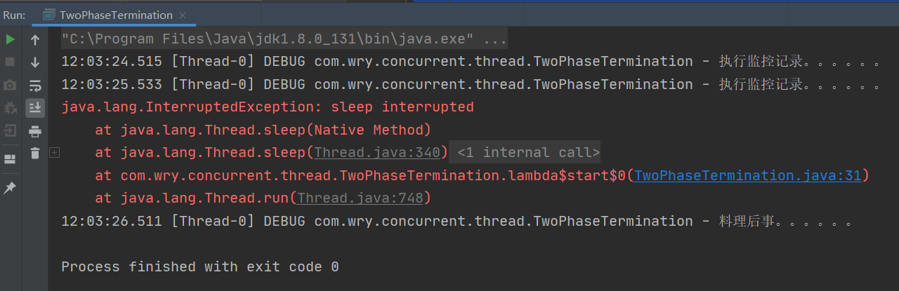


## 不推荐的方法

还有一些不推荐使用的方法，这些方法已过时，容易破坏同步代码块，造成线程死锁。

| 方法名    | 静态 | 功能说明             |
| --------- | ---- | -------------------- |
| stop()    |      | 停止线程运行         |
| suspend() |      | 挂起（暂停）线程运行 |
| resume()  |      | 恢复线程运行         |

## 主线程与守护线程

默认情况下，Java 进程需要等待所有线程都运行结束，才会结束。有一种特殊的线程叫做守护线程，只要其它非守护线程运行结束了，即使守护线程的代码没有执行完，也会强制结束。

``` java

/**
 * <p>
 * 主线程与守护线程
 * </p>
 *
 * @author wangruiyu
 * @since 2020/7/28
 */
@Slf4j
public class DaemonThread {
    private static void test1() throws InterruptedException {
        log.debug("开始运行...");
        Thread t1 = new Thread(() -> {
            log.debug("开始运行...");
            while (true) {
                if (Thread.currentThread().isInterrupted()) {
                    break;
                }
            }
            log.debug("运行结束...");
        }, "t1");
        t1.start();
        TimeUnit.SECONDS.sleep(1);
        log.debug("运行结束...");
    }

    public static void main(String[] args) throws InterruptedException {
        test1();
    }
}

```

可以看到当`main线程`执行完毕后，`t1线程`任然在执行，`java 进程`尚未结束。
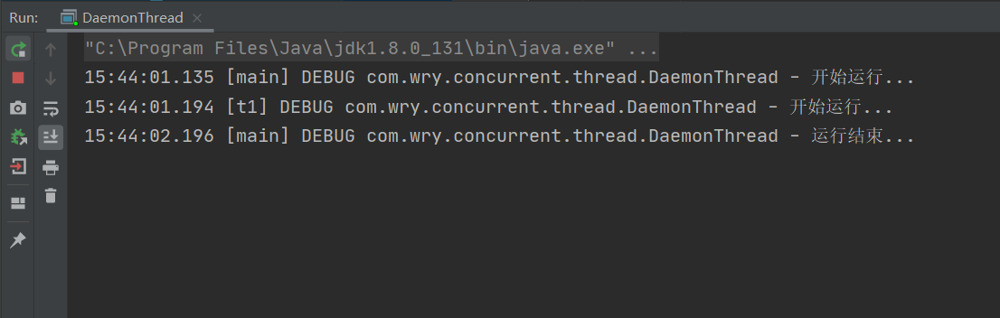

通过`setDaemon(boolean)`方法让t1个线程变为守护线程。

``` java
/**
 * <p>
 * 主线程与守护线程
 * </p>
 *
 * @author wangruiyu
 * @since 2020/7/28
 */
@Slf4j
public class DaemonThread {
    private static void test1() throws InterruptedException {
        log.debug("开始运行...");
        Thread t1 = new Thread(() -> {
            log.debug("开始运行...");
            while (true) {
                if (Thread.currentThread().isInterrupted()) {
                    break;
                }
            }
            log.debug("运行结束...");
        }, "t1");
        // 设置该线程为守护线程
        t1.setDaemon(true);
        t1.start();
        TimeUnit.SECONDS.sleep(1);
        log.debug("运行结束...");
    }

    public static void main(String[] args) throws InterruptedException {
        test1();
    }
}
```

当`main线程`运行完毕，尽管`守护线程t1`的代码还没有执行完，也会强制结束。

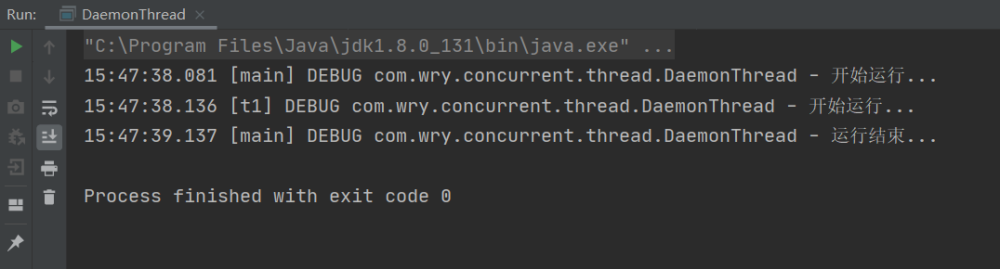

>**注意**
>
>- 垃圾回收器线程就是一种守护线程
>
>- Tomcat 中的` Acceptor `和 `Poller `线程都是守护线程，所以 Tomcat 接收到 shutdown 命令后，不会等待它们处理完当前请求。

## 五种状态

这是从 **操作系统** 层面来描述的

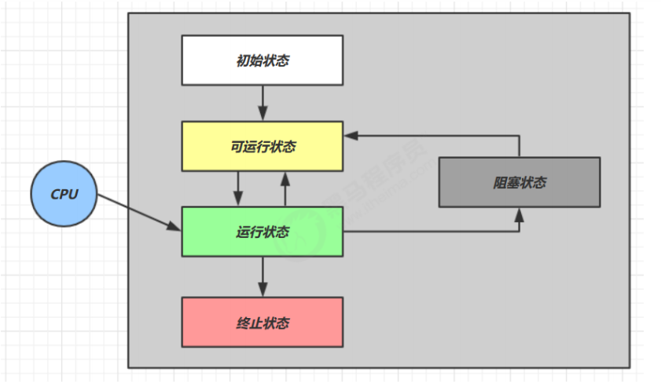

- 【初始状态】仅是在语言层面创建了线程对象，还未与操作系统线程关联

- 【可运行状态】（就绪状态）指该线程已经被创建（与操作系统线程关联），可以由 CPU 调度执行

- 【运行状态】指获取了 CPU 时间片运行中的状态

  - 当 CPU 时间片用完，会从【运行状态】转换至【可运行状态】，会导致线程的上下文切换

- 【阻塞状态】

  - 如果调用了阻塞 API，如 BIO 读写文件，这时该线程实际不会用到 CPU，会导致线程上下文切换，进入【阻塞状态】

  - 等 BIO 操作完毕，会由操作系统唤醒阻塞的线程，转换至【可运行状态】

  - 与【可运行状态】的区别是，对【阻塞状态】的线程来说只要它们一直不唤醒，调度器就一直不会考虑调度它们

- 【终止状态】表示线程已经执行完毕，生命周期已经结束，不会再转换为其它状态

## 六种状态

这是从 **Java API** 层面来描述的

根据 Thread.State 枚举，分为六种状态

``` java
    public enum State {
        /**
         * Thread state for a thread which has not yet started.
         */
        NEW,

        /**
         * Thread state for a runnable thread.  A thread in the runnable
         * state is executing in the Java virtual machine but it may
         * be waiting for other resources from the operating system
         * such as processor.
         */
        RUNNABLE,

        /**
         * Thread state for a thread blocked waiting for a monitor lock.
         * A thread in the blocked state is waiting for a monitor lock
         * to enter a synchronized block/method or
         * reenter a synchronized block/method after calling
         * {@link Object#wait() Object.wait}.
         */
        BLOCKED,

        /**
         * Thread state for a waiting thread.
         * A thread is in the waiting state due to calling one of the
         * following methods:
         * <ul>
         *   <li>{@link Object#wait() Object.wait} with no timeout</li>
         *   <li>{@link #join() Thread.join} with no timeout</li>
         *   <li>{@link LockSupport#park() LockSupport.park}</li>
         * </ul>
         *
         * <p>A thread in the waiting state is waiting for another thread to
         * perform a particular action.
         *
         * For example, a thread that has called <tt>Object.wait()</tt>
         * on an object is waiting for another thread to call
         * <tt>Object.notify()</tt> or <tt>Object.notifyAll()</tt> on
         * that object. A thread that has called <tt>Thread.join()</tt>
         * is waiting for a specified thread to terminate.
         */
        WAITING,

        /**
         * Thread state for a waiting thread with a specified waiting time.
         * A thread is in the timed waiting state due to calling one of
         * the following methods with a specified positive waiting time:
         * <ul>
         *   <li>{@link #sleep Thread.sleep}</li>
         *   <li>{@link Object#wait(long) Object.wait} with timeout</li>
         *   <li>{@link #join(long) Thread.join} with timeout</li>
         *   <li>{@link LockSupport#parkNanos LockSupport.parkNanos}</li>
         *   <li>{@link LockSupport#parkUntil LockSupport.parkUntil}</li>
         * </ul>
         */
        TIMED_WAITING,

        /**
         * Thread state for a terminated thread.
         * The thread has completed execution.
         */
        TERMINATED;
    }
```


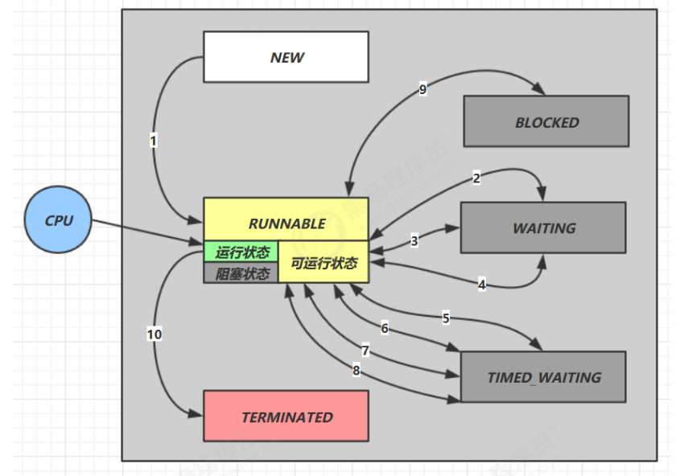

- NEW 线程刚被创建，但是还没有调用 start() 方法

- RUNNABLE 当调用了 start() 方法之后，注意，**Java API** 层面的 RUNNABLE 状态涵盖了 **操作系统** 层面的
  - 【可运行状态】、【运行状态】和【阻塞状态】（由于 BIO 导致的线程阻塞，在 Java 里无法区分，仍然认为是可运行）

- BLOCKED ， WAITING ， TIMED_WAITING 都是 **Java API** 层面对【阻塞状态】的细分，后面会在状态转换一节详述

- TERMINATED 当线程代码运行结束

``` java
/**
 * <p>
 * 线程的六种状态
 * </p>
 *
 * @author wangruiyu
 * @since 2020/7/28
 */
@Slf4j
public class ThreadState {
    private static void test1() {
        Thread t1 = new Thread(() -> {  //new
            log.debug("runing......");
        }, "t1");

        Thread t2 = new Thread(() -> {  //running
           while (true){

           }
        },"t2");
        t2.start();

        Thread t3 = new Thread(() -> {  //terminted
            log.debug("runing......");
        },"t3");
        t3.start();

        Thread t4 = new Thread(() -> {  //timed_waiting
            synchronized (ThreadState.class) {
                try {
                    TimeUnit.SECONDS.sleep(100);
                } catch (InterruptedException e) {
                    e.printStackTrace();
                }
            }
        },"t4");
        t4.start();

        Thread t5 = new Thread(() -> {  //waiting
                try {
                    t2.join();
                } catch (InterruptedException e) {
                    e.printStackTrace();
                }
        },"t5");
        t5.start();

        Thread t6 = new Thread(() -> {  //blocked
            synchronized (ThreadState.class) {
                try {
                    TimeUnit.SECONDS.sleep(100);
                } catch (InterruptedException e) {
                    e.printStackTrace();
                }
            }
        },"t6");
        t6.start();

        log.debug("t1 线程的状态： {}",t1.getState());
        log.debug("t2 线程的状态： {}",t2.getState());
        log.debug("t3 线程的状态： {}",t3.getState());
        log.debug("t4 线程的状态： {}",t4.getState());
        log.debug("t5 线程的状态： {}",t5.getState());
        log.debug("t6 线程的状态： {}",t6.getState());

        
    }

    public static void main(String[] args) {
        test1();
    }
}

```

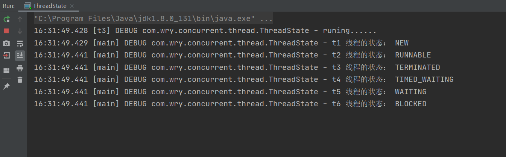

## 习题

### 题目

阅读华罗庚《统筹方法》，给出烧水泡茶的多线程解决方案，提示

- 参考图二，用两个线程（两个人协作）模拟烧水泡茶过程
  - 文中办法乙、丙都相当于任务串行
  - 而图一相当于启动了 4 个线程，有点浪费
- 用 sleep(n) 模拟洗茶壶、洗水壶等耗费的时间

附：华罗庚《统筹方法》

>统筹方法，是一种安排工作进程的数学方法。它的实用范围极广泛，在企业管理和基本建设中，以及关系复
>
>杂的科研项目的组织与管理中，都可以应用。
>
>怎样应用呢？主要是把工序安排好。
>
>洗水壶 1分钟 
>
>烧开水 15分钟
>
>洗茶壶 1分钟
>
>洗茶杯 2分钟
>
>拿茶叶 1分钟
>
>泡茶
>
>比如，想泡壶茶喝。当时的情况是：开水没有；水壶要洗，茶壶、茶杯要洗；火已生了，茶叶也有了。怎么
>
>办？
>
>- 办法甲：洗好水壶，灌上凉水，放在火上；在等待水开的时间里，洗茶壶、洗茶杯、拿茶叶；等水开
>
>了，泡茶喝。
>
>- 办法乙：先做好一些准备工作，洗水壶，洗茶壶茶杯，拿茶叶；一切就绪，灌水烧水；坐待水开了，泡
>
>茶喝。
>
>- 办法丙：洗净水壶，灌上凉水，放在火上，坐待水开；水开了之后，急急忙忙找茶叶，洗茶壶茶杯，泡
>
>茶喝。
>
>哪一种办法省时间？我们能一眼看出，第一种办法好，后两种办法都窝了工。
>
>这是小事，但这是引子，可以引出生产管理等方面有用的方法来。
>
>水壶不洗，不能烧开水，因而洗水壶是烧开水的前提。没开水、没茶叶、不洗茶壶茶杯，就不能泡茶，因而
>
>这些又是泡茶的前提。它们的相互关系，可以用下边的箭头图来表示：
>
>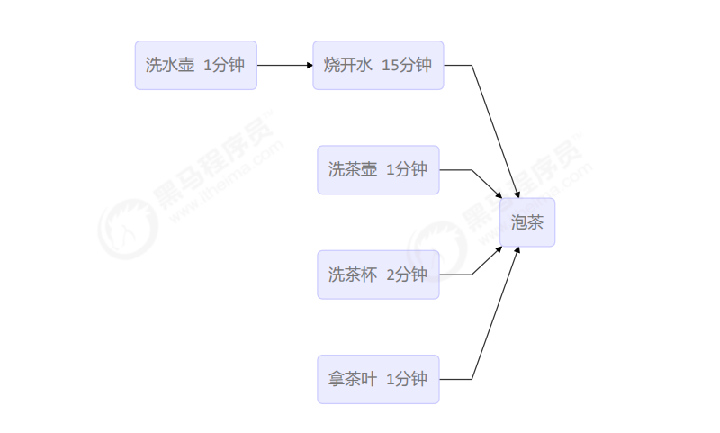
>
>从这个图上可以一眼看出，办法甲总共要16分钟（而办法乙、丙需要20分钟）。如果要缩短工时、提高工作
>
>效率，应当主要抓烧开水这个环节，而不是抓拿茶叶等环节。同时，洗茶壶茶杯、拿茶叶总共不过4分钟，大
>
>可利用“等水开”的时间来做。
>
>是的，这好像是废话，卑之无甚高论。有如走路要用两条腿走，吃饭要一口一口吃，这些道理谁都懂得。但
>
>稍有变化，临事而迷的情况，常常是存在的。在近代工业的错综复杂的工艺过程中，往往就不是像泡茶喝这
>
>么简单了。任务多了，几百几千，甚至有好几万个任务。关系多了，错综复杂，千头万绪，往往出现“万事俱
>
>备，只欠东风”的情况。由于一两个零件没完成，耽误了一台复杂机器的出厂时间。或往往因为抓的不是关
>
>键，连夜三班，急急忙忙，完成这一环节之后，还得等待旁的环节才能装配。
>
>洗茶壶，洗茶杯，拿茶叶，或先或后，关系不大，而且同是一个人的活儿，因而可以合并成为：
>
>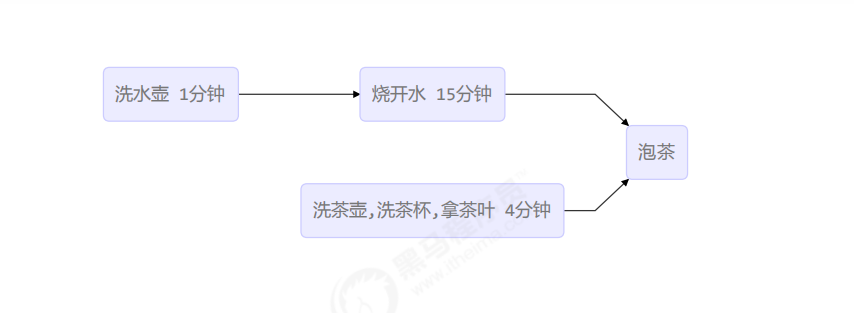
>
>看来这是“小题大做”，但在工作环节太多的时候，这样做就非常必要了。
>
>这里讲的主要是时间方面的事，但在具体生产实践中，还有其他方面的许多事。这种方法虽然不一定能直接
>
>解决所有问题，但是，我们利用这种方法来考虑问题，也是不无裨益的。

### 实现

``` java
/**
 * <p>
 * 洗好水壶，灌上凉水，放在火上,在等待水开的时间里，洗茶壶、洗茶杯、拿茶叶；等水开了，泡茶喝。
 *
 * </p>
 *
 * @author wangruiyu
 * @since 2020/8/6
 */
@Slf4j
public class MakingTea {
    /**
     * t2 等待 t1 执行完毕 进行后续任务
     */
    private static void t1() {
        Thread t1 = new Thread(() -> {
            log.info("洗好水壶，灌上凉水，放在火上");
            try {
                TimeUnit.SECONDS.sleep(1);
            } catch (InterruptedException e) {
                e.printStackTrace();
            }
            log.info("烧开水");
            try {
                TimeUnit.SECONDS.sleep(5);
            } catch (InterruptedException e) {
                e.printStackTrace();
            }
        }, "t1");
        t1.start();

        Thread t2 = new Thread(() -> {
            try {
                log.info("洗茶壶、洗茶杯、拿茶叶");
                TimeUnit.SECONDS.sleep(5);

                //等待t1线程执行完毕
                t1.join();
                log.info("等水开了，泡茶喝。");
            } catch (InterruptedException e) {
                e.printStackTrace();
            }
        }, "t2");
        t2.start();
    }

    public static void main(String[] args) {
        t1();
    }
}

```

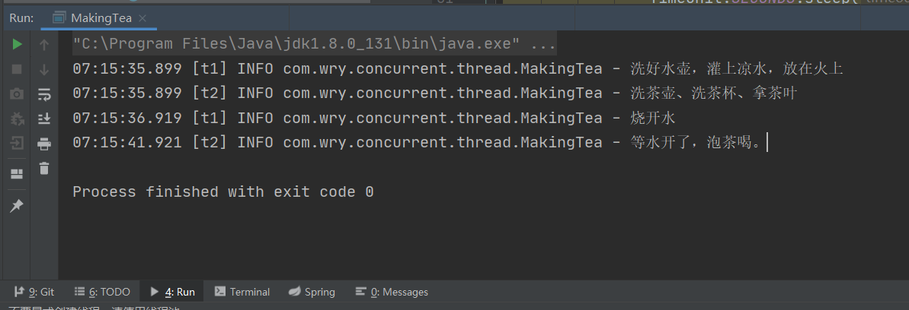

## 本章小结

本章的重点在于掌握

- 线程创建

- 线程重要 api，如 start，run，sleep，join，interrupt 等

- 线程状态

- 应用方面

  - 异步调用：主线程执行期间，其它线程异步执行耗时操作

  - 提高效率：并行计算，缩短运算时间

  - 同步等待：join

  - 统筹规划：合理使用线程，得到最优效果

- 原理方面

  - 线程运行流程：栈、栈帧、上下文切换、程序计数器

  - Thread 两种创建方式 的源码

- 模式方面
  - 终止模式之两阶段终止


# 共享模型之管程

## 共享带来的问题

### 小故事

- 老王（操作系统）有一个功能强大的算盘（CPU），现在想把它租出去，赚一点外快

  

- 小南、小女（线程）来使用这个算盘来进行一些计算，并按照时间给老王支付费用

- 但小南不能一天24小时使用算盘，他经常要小憩一会（sleep），又或是去吃饭上厕所（阻塞 io 操作），有时还需要一根烟，没烟时思路全无（wait）这些情况统称为（阻塞）

  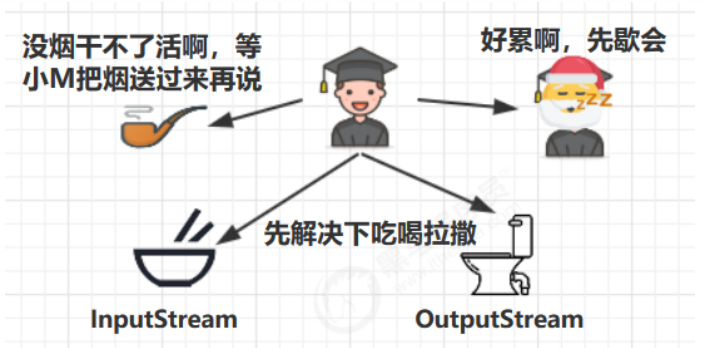

- 在这些时候，算盘没利用起来（不能收钱了），老王觉得有点不划算

- 另外，小女也想用用算盘，如果总是小南占着算盘，让小女觉得不公平

- 于是，老王灵机一动，想了个办法 [ 让他们每人用一会，轮流使用算盘 ]

- 这样，当小南阻塞的时候，算盘可以分给小女使用，不会浪费，反之亦然

- 最近执行的计算比较复杂，需要存储一些中间结果，而学生们的脑容量（工作内存）不够，所以老王申请了

  一个笔记本（主存），把一些中间结果先记在本上。

- 计算流程是这样的：

  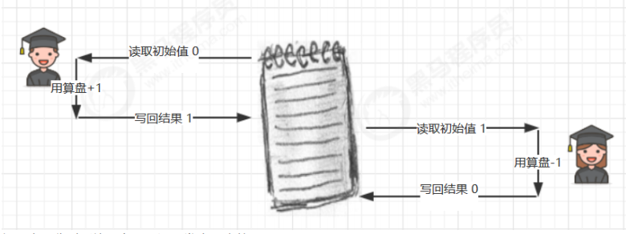

- 但是由于分时系统，有一天还是发生了事故

- 小南刚读取了初始值 0 做了个 +1 运算，还没来得及写回结果

- 老王说 [ 小南，你的时间到了，该别人了，记住结果走吧 ]，于是小南念叨着 [ 结果是1，结果是1...] 不甘心地到一边待着去了（上下文切换）

- 老王说 [ 小女，该你了 ]，小女看到了笔记本上还写着 0 做了一个 -1 运算，将结果 -1 写入笔记本

- 这时小女的时间也用完了，老王又叫醒了小南：[小南，把你上次的题目算完吧]，小南将他脑海中的结果 1 写入了笔记本

  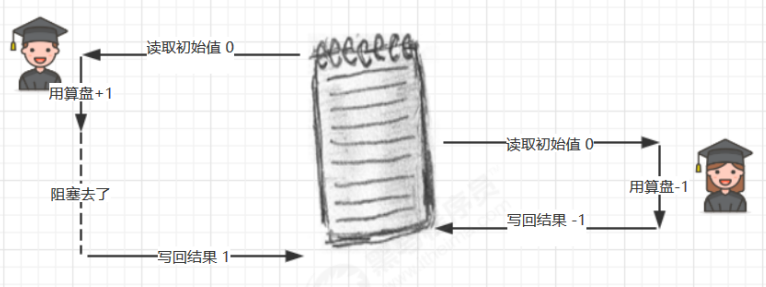

- 小南和小女都觉得自己没做错，但笔记本里的结果是 1 而不是 0

### Java的体现

两个线程对初始值为 0 的静态变量一个做自增，一个做自减，各做 5000 次，结果是 0 吗？

``` java
/**
 * <p>
 * 共享变量问题
 * </p>
 *
 * @author wangruiyu
 * @since 2020/8/6
 */
@Slf4j
public class SharedVariables {
    private static int counter = 0;
    
    /**
     * 当两个线程操作同一个共享变量时，会出现问题
     */
    private static void t1() throws InterruptedException {
        Thread t1 = new Thread(() -> {
            for (int i = 0; i < 5000; i++) {
                counter++;
            }
        }, "t1");
        t1.start();

        Thread t2 = new Thread(() -> {
            for (int i = 0; i < 5000; i++) {
                counter--;
            }
        }, "t2");
        t2.start();

        t1.join();
        t2.join();

        log.info("counter:{}", counter);
    }

    public static void main(String[] args) {
        t1();
    }
}
```


### 问题分析

以上的结果可能是正数、负数、零。为什么呢？因为 Java 中对静态变量的自增，自减并不是原子操作，要彻底理解，必须从字节码来进行分析。

例如对于 i++ 而言（i 为静态变量），实际会产生如下的 JVM 字节码指令：

```
getstatic i // 获取静态变量i的值
iconst_1 // 准备常量1
iadd // 自增
putstatic i // 将修改后的值存入静态变量i
```

而对应 i-- 也是类似:

```
getstatic i // 获取静态变量i的值
iconst_1 // 准备常量1
isub // 自减
putstatic i // 将修改后的值存入静态变量i
```

而 Java 的内存模型如下，完成静态变量的自增，自减需要在主存和工作内存中进行数据交换：

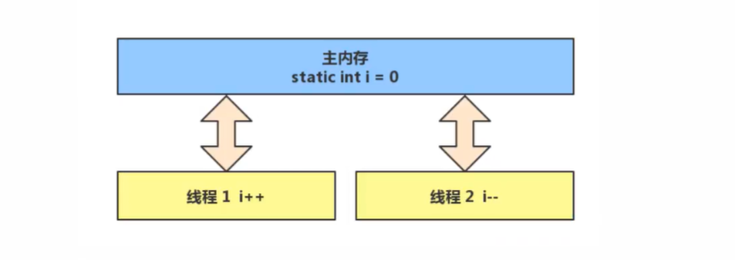

如果是单线程以上 8 行代码是顺序执行（不会交错）没有问题：

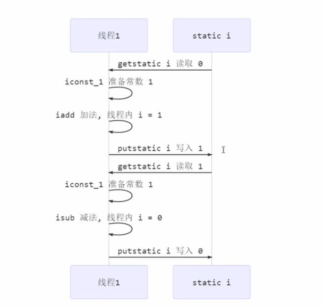

但多线程下这 8 行代码可能交错运行：

出现负数的情况

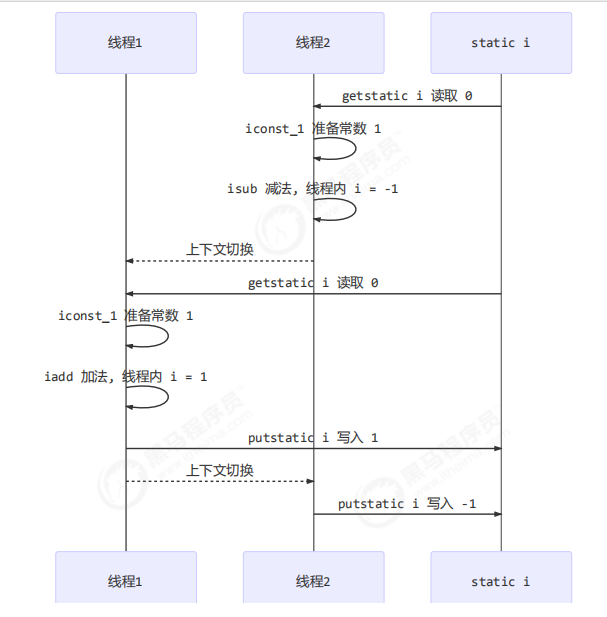

出现正数的情况：

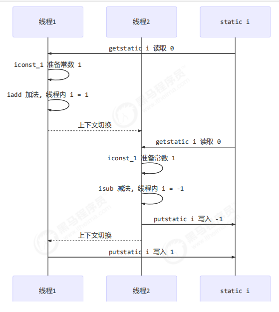

### 临界区(Critical Section)

- 一个程序运行多个线程本身是没有问题的

- 问题出在多个线程访问**共享资源**

  - 多个线程读**共享资源**其实也没有问题

  - 在多个线程对**共享资源**读写操作时发生指令交错，就会出现问题

- 一段代码块内如果存在对**共享资源**的多线程读写操作，称这段代码块为**临界区**

例如，下面代码中的临界区:

``` java
static int counter = 0;
static void increment() 
// 临界区
{ 
 counter++; 
}
static void decrement() 
// 临界区
{ 
 counter--; 
}
```

### 竞态条件(Race Condition)

多个线程在临界区内执行，由于代码的**执行序列不同**而导致结果无法预测，称之为发生了**竞态条件**

##  synchronized解决方案

### ***** **应用之互斥**

为了避免临界区的竞态条件发生，有多种手段可以达到目的。

- 阻塞式的解决方案：synchronized，Lock

- 非阻塞式的解决方案：原子变量

本次课使用阻塞式的解决方案：synchronized，来解决上述问题，即俗称的【对象锁】，它采用互斥的方式让同一

时刻至多只有一个线程能持有【对象锁】，其它线程再想获取这个【对象锁】时就会阻塞住。这样就能保证拥有锁

的线程可以安全的执行临界区内的代码，不用担心线程上下文切换。

>**注意**
>
>虽然 java 中互斥和同步都可以采用 synchronized 关键字来完成，但它们还是有区别的：
>
>互斥是保证临界区的竞态条件发生，同一时刻只能有一个线程执行临界区代码
>
>同步是由于线程执行的先后、顺序不同、需要一个线程等待其它线程运行到某个点

### synchronized

#### 语法

``` java
synchronized(对象) // 线程1， 线程2(blocked)
{
 临界区
}
```

#### 解决

``` java
package com.wry.concurrent.thread;

import lombok.extern.slf4j.Slf4j;

/**
 * <p>
 * 共享变量问题
 * </p>
 *
 * @author wangruiyu
 * @since 2020/8/6
 */
@Slf4j
public class SharedVariables {
    private static int counter = 0;
    private static Object lock = new Object();

    /**
     * 当两个线程操作同一个共享变量时，会出现问题
     * 使用synchronized解决
     */
    private static void t2() throws InterruptedException {
        Thread t1 = new Thread(() -> {
            for (int i = 0; i < 5000; i++) {
                synchronized (lock) {
                    counter++;
                }
            }
        }, "t1");
        t1.start();

        Thread t2 = new Thread(() -> {
            for (int i = 0; i < 5000; i++) {
                synchronized (lock) {
                    counter--;
                }
            }
        }, "t2");
        t2.start();

        t1.join();
        t2.join();
        log.info("counter:{}", counter);
    }

    public static void main(String[] args) throws InterruptedException {
        t2();
    }
}

```

使用面向对象思想解决 ：

``` java
/**
 * <p>
 * 共享变量问题,使用面向对象思想解决
 * </p>
 *
 * @author wangruiyu
 * @since 2020/8/6
 */
@Slf4j
public class Room {
    private int counter = 0;

    public void increment() {
        synchronized (this) {
            counter++;
        }
    }

    public void decrement() {
        synchronized (this) {
            counter--;
        }
    }

    public int getCounter() {
        synchronized (this) {
            return counter;
        }
    }

    public static void main(String[] args) throws InterruptedException {
        Room room = new Room();
        Thread t1 = new Thread(() -> {
            for (int i = 0; i < 5000; i++) {
                room.increment();
            }
        }, "t1");
        t1.start();

        Thread t2 = new Thread(() -> {
            for (int i = 0; i < 5000; i++) {
                room.decrement();
            }
        }, "t2");
        t2.start();

        t1.join();
        t2.join();

        log.info("counter:{}", room.getCounter());
    }
}
```


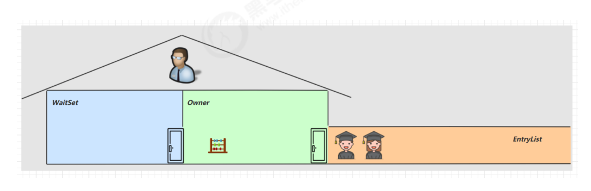

你可以做这样的类比：

- `synchronized(对象)` 中的对象，可以想象为一个房间（room），有唯一入口（门）房间只能一次进入一人进行计算，线程 t1，t2 想象成两个人

- 当线程 t1 执行到 `synchronized(room)` 时就好比 t1 进入了这个房间，并锁住了门拿走了钥匙，在门内执行`count++` 代码

- 这时候如果 t2 也运行到了 `synchronized(room)` 时，它发现门被锁住了，只能在门外等待，发生了上下文切换，阻塞住了

- 这中间即使 t1 的 cpu 时间片不幸用完，被踢出了门外（不要错误理解为锁住了对象就能一直执行下去哦），这时门还是锁住的，t1 仍拿着钥匙，t2 线程还在阻塞状态进不来，只有下次轮到 t1 自己再次获得时间片时才能开门进入。

- 当 t1 执行完 `synchronized{}` 块内的代码，这时候才会从 obj 房间出来并解开门上的锁，唤醒 t2 线程把钥匙给他。t2 线程这时才可以进入 obj 房间，锁住了门拿上钥匙，执行它的 `count--` 代码


用图来表示:

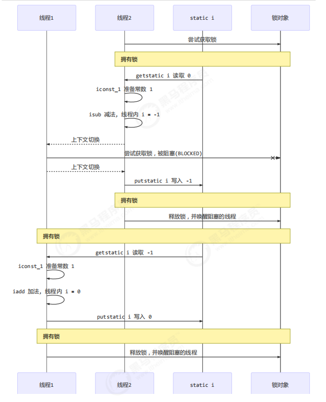

### 思考

`synchronized` 实际是用**对象锁**保证了**临界区内代码的原子性**，临界区内的代码对外是不可分割的，不会被线程切换所打断。

为了加深理解，请思考下面的问题:

- 如果把 synchronized(obj) 放在 for 循环的外面，如何理解？-- 原子性

- 如果 t1 synchronized(obj1) 而 t2 synchronized(obj2) 会怎样运作？-- 锁对象

- 如果 t1 synchronized(obj) 而 t2 没有加会怎么样？如何理解？-- 锁对象


## 方法上的synchronized

`synchronized`修饰成员方法，锁住的是当前类的`实例对象`

``` java
class Test {
    public synchronized void test() {

    }
}

//等价于

class Test {
    public void test() {
        synchronized (this) {

        }
    }
}
```

`synchronized`修饰静态方法，锁住的是当前类的`类对象`

``` java

class Test{
    public synchronized static void test() {
    }
}

//等价于

class Test {
    public static void test() {
        synchronized (Test.class) {

        }
    }
}
```

### 不加synchronized的方法

不加 synchronzied 的方法就好比不遵守规则的人，不去老实排队（好比翻窗户进去的）

### 所谓的“线程八锁”

其实就是考察 synchronized 锁住的是哪个对象

``` java
package com.wry.concurrent.thread;

import lombok.extern.slf4j.Slf4j;

/**
 * <p>
 * 线程 8锁
 * </p>
 * <p>
 * <strong> synchronized </strong>实际是用
 * <strong> 对象锁 </strong>保证了<strong>临界区内代码的原子性</strong>，
 * 临界区内的代码对外是不可分割的，不会被线程切换所打断。
 * </p>
 *
 * @author wangruiyu
 * @since 2020/8/6
 */
@Slf4j
public class Thread8Locks {
    public static void main(String[] args) {
//        t1();
//        t2();
//        t3();
//        t4();
//        t5();
//        t6();
//        t7();
//        t8();
    }

    /**
     * 锁的是当前类的实例对象
     * 如果线程先调用t1,会打印 1 ，2
     * 如果线程先调用t2,会打印 2 ，1
     */
    private static void t1() {
        Number1 n = new Number1();
        new Thread(() -> {
            log.debug("begin....");
            n.a();
        }, "t1").start();
        new Thread(() -> {
            log.debug("begin....");
            n.b();
        }, "t2").start();
    }

    /**
     * 锁的是当前类的实例对象
     * 如果线程先调用t1,会先睡1s后再打印 1 ，2
     * 如果线程先调用t2,会先打印 2 ，再睡1s后再打印 1
     */
    private static void t2() {
        Number2 n = new Number2();
        new Thread(() -> {
            log.debug("begin....");
            try {
                n.a();
            } catch (InterruptedException e) {
                e.printStackTrace();
            }
        }, "t1").start();
        new Thread(() -> {
            log.debug("begin....");
            n.b();
        }, "t2").start();
    }

    /**
     * 锁的是当前类的实例对象
     * 因为c方法没有被锁住，所以不用遵守排队规则
     * 每次t3线程都会打印 3
     * 如果线程先调用t1,再调用t3,t2,会先睡1s后再打印 1 ，2  ; 3,1s,1,2
     * 如果线程先调用t2,再调用t3,t1,会先打印 2 ，再睡1s后再打印 1; 2,3,1s,1
     * 如果线程先调用t3,再调用t1,t2,会先睡1s后再打印2 1; 3,1s,1,2
     * 如果线程先调用t3,再调用t2,t1，会先打印 2 ，再睡1s后再打印 1; 3,2,1s,1
     */
    private static void t3() {
        Number3 n = new Number3();
        new Thread(() -> {
            log.debug("begin....");
            try {
                n.a();
            } catch (InterruptedException e) {
                e.printStackTrace();
            }
        }, "t1").start();
        new Thread(() -> {
            log.debug("begin....");
            n.b();
        }, "t2").start();
        new Thread(() -> {
            log.debug("begin....");
            n.c();
        }, "t3").start();
    }


    /**
     * 锁的是当前类的实例对象
     * t1 线程和 t2 线程锁的不是同一个对象，所以不存在排斥现象
     * 如果线程先调用t1,再调用t2,则会先打印2，睡1s，再打印1; 2,1s,1
     * 如果线程先调用t2,再调用t1,则会先打印2，睡1s，再打印1; 2,1s,1
     */
    private static void t4() {
        Number4 n1 = new Number4();
        Number4 n2 = new Number4();
        new Thread(() -> {
            try {
                n1.a();
            } catch (InterruptedException e) {
                e.printStackTrace();
            }
        }, "t1").start();
        new Thread(() -> {
            n2.b();
        }, "t2").start();
    }


    /**
     * a方法锁的是当前类的类对象
     * b方法锁的是当前类的实例对象
     * t1 线程和 t2 线程锁的不是同一个对象，所以不存在排斥现象
     * 如果线程先调用t1,再调用t2,则会先打印2，睡1s，再打印1; 2,1s,1
     * 如果线程先调用t2,再调用t1,则会先打印2，睡1s，再打印1; 2,1s,1
     */
    private static void t5() {
        Number5 n = new Number5();
        new Thread(() -> {
            log.debug("begin....");
            try {
                Number5.a();
            } catch (InterruptedException e) {
                e.printStackTrace();
            }
        }, "t1").start();
        new Thread(() -> {
            log.debug("begin....");
            n.b();
        }, "t2").start();
    }


    /**
     * 锁的是当前类的类对象
     * 如果线程先调用t1,再调用t2,则会先睡1s，再打印1，再打印2; 1s,1,2
     * 如果线程先调用t2,再调用t1,则会先打印2，睡1s，再打印1; 2,1s,1
     */
    private static void t6() {
        new Thread(() -> {
            log.debug("begin....");
            try {
                Number6.a();
            } catch (InterruptedException e) {
                e.printStackTrace();
            }
        }, "t1").start();
        new Thread(() -> {
            log.debug("begin....");
            Number6.b();
        }, "t2").start();
    }


    /**
     * a方法锁的是当前类的类对象
     * b方法锁的是当前类的实例对象
     * t1 线程和 t2 线程锁的不是同一个对象，所以不存在排斥现象
     * 如果线程先调用t1,再调用t2,则会先打印2，睡1s，再打印1; 2,1s,1
     * 如果线程先调用t2,再调用t1,则会先打印2，睡1s，再打印1; 2,1s,1
     */
    private static void t7() {
        Number7 n1 = new Number7();
        Number7 n2 = new Number7();
        new Thread(() -> {
            log.debug("begin....");
            try {
                n1.a();
            } catch (InterruptedException e) {
                e.printStackTrace();
            }
        }, "t1").start();
        new Thread(() -> {
            log.debug("begin....");
            n2.b();
        }, "t2").start();
    }


    /**
     * 锁的是当前类的类对象
     * 如果线程先调用t1,再调用t2,则会先睡1s，再打印1，再打印2; 1s,1,2
     * 如果线程先调用t2,再调用t1,则会先打印2，睡1s，再打印1; 2,1s,1
     */
    private static void t8() {
        Number8 n = new Number8();
        new Thread(() -> {
            log.debug("begin....");
            try {
                n.a();
            } catch (InterruptedException e) {
                e.printStackTrace();
            }
        }, "t1").start();
        new Thread(() -> {
            log.debug("begin....");
            n.b();
        }, "t2").start();
    }

}

/**
 * 锁的是当前类的实例对象
 */
@Slf4j(topic = "c.Number1")
class Number1 {
    public synchronized void a() {
        log.debug("1");
    }

    public synchronized void b() {
        log.debug("2");
    }
}

/**
 * 锁的是当前类的实例对象
 */
@Slf4j(topic = "c.Number2")
class Number2 {
    public synchronized void a() throws InterruptedException {
        Thread.sleep(1000);
        log.debug("1");
    }

    public synchronized void b() {
        log.debug("2");
    }
}

/**
 * 锁的是当前类的实例对象
 */
@Slf4j(topic = "c.Number3")
class Number3 {
    public synchronized void a() throws InterruptedException {
        Thread.sleep(1000);
        log.debug("1");
    }

    public synchronized void b() {
        log.debug("2");
    }

    public void c() {
        log.debug("3");
    }
}

/**
 * 锁的是当前类的实例对象
 */
@Slf4j(topic = "c.Number4")
class Number4 {
    public synchronized void a() throws InterruptedException {
        Thread.sleep(1000);
        log.debug("1");
    }

    public synchronized void b() {
        log.debug("2");
    }

}

/**
 * a方法锁的是当前类的类对象
 * b方法锁的是当前类的实例对象
 */
@Slf4j(topic = "c.Number5")
class Number5 {
    public static synchronized void a() throws InterruptedException {
        Thread.sleep(1000);
        log.debug("1");
    }

    public synchronized void b() {
        log.debug("2");
    }
}

/**
 * 锁的是当前类的类对象
 */
@Slf4j(topic = "c.Number6")
class Number6 {
    public static synchronized void a() throws InterruptedException {
        Thread.sleep(1000);
        log.debug("1");
    }

    public static synchronized void b() {
        log.debug("2");
    }

}

/**
 * a方法锁的是当前类的类对象
 * b方法锁的是当前类的实例对象
 */
@Slf4j(topic = "c.Number7")
class Number7 {
    public static synchronized void a() throws InterruptedException {
        Thread.sleep(1000);
        log.debug("1");
    }

    public synchronized void b() {
        log.debug("2");
    }
}

/**
 * 锁的是当前类的类对象
 */
@Slf4j(topic = "c.Number8")
class Number8 {
    public static synchronized void a() throws InterruptedException {
        Thread.sleep(1000);
        log.debug("1");
    }

    public static synchronized void b() {
        log.debug("2");
    }

}

```


## 变量的线程安全分析

#### 成员变量和静态变量是否线程安全？

- 如果它们没有共享，则线程安全

- 如果它们被共享了，根据它们的状态是否能够改变，又分两种情况

  - 如果只有读操作，则线程安全

  - 如果有读写操作，则这段代码是临界区，需要考虑线程安全

#### 局部变量是否线程安全？

- 局部变量是线程安全的

- 但局部变量引用的对象则未必

  - 如果该对象没有逃离方法的作用访问，它是线程安全的

  - 如果该对象逃离方法的作用范围，需要考虑线程安全

``` java
public static void test1() {
	int i = 10;
	i++; 
}
```

每个线程调用 test1() 方法时局部变量 i，会在每个线程的栈帧内存中被创建多份，因此不存在共享.

```
public static void test1();
 descriptor: ()V
 flags: ACC_PUBLIC, ACC_STATIC
 Code:
 stack=1, locals=1, args_size=0
 0: bipush 10
 2: istore_0
 3: iinc 0, 1
 6: return
 LineNumberTable:
 line 10: 0
 line 11: 3
 line 12: 6
 LocalVariableTable:
 Start Length Slot Name Signature
 3 4 0 i I
```

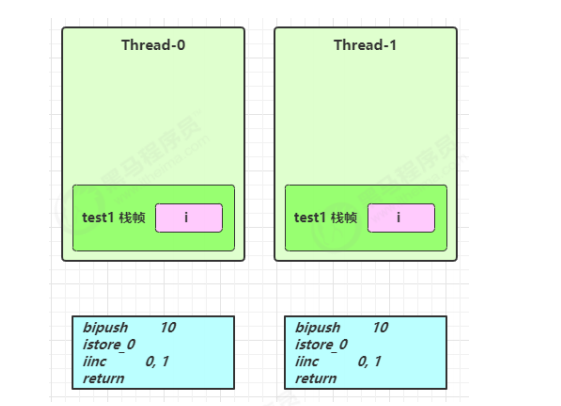


**局部变量的引用稍有不同,先看一个成员变量的例子**

``` java
/**
 * <p>
 *
 * </p>
 *
 * @author wangruiyu
 * @since 2020/8/6
 */
public class ThreadSecurity {
    static final int THREAD_NUMBER = 2;
    static final int LOOP_NUMBER = 200;

    public static void main(String[] args) {
        ThreadUnsafe test = new ThreadUnsafe();
        for (int i = 0; i < THREAD_NUMBER; i++) {
            new Thread(() -> {
                test.method1(LOOP_NUMBER);
            }, "Thread" + i).start();
        }
    }
}
class ThreadUnsafe {
    ArrayList<String> list = new ArrayList<>();
    public void method1(int loopNumber) {
        for (int i = 0; i < loopNumber; i++) {
            // { 临界区, 会产生竞态条件
            method2();
            method3();
            // } 临界区
        }
    }
    private void method2() {
        list.add("1");
    }
    private void method3() {
        list.remove(0);
    }
}
```

**其中一种情况是，如果线程2 还未 add，线程1 remove 就会报错：**

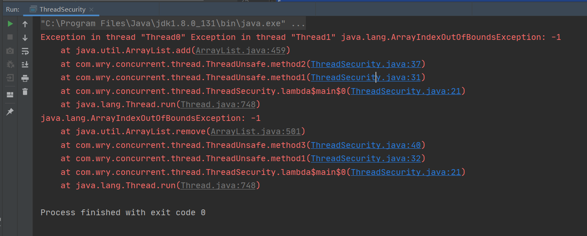

分析：

- 无论哪个线程中的 method2 引用的都是同一个对象中的 list 成员变量

- method3 与 method2 分析相同

  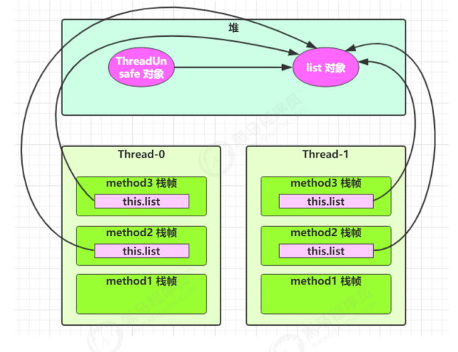

  **将 list 修改为局部变量**

``` java
package com.wry.concurrent.thread;

import java.util.ArrayList;

/**
 * <p>
 *
 * </p>
 *
 * @author wangruiyu
 * @since 2020/8/6
 */
public class ThreadSecurity {
    static final int THREAD_NUMBER = 2;
    static final int LOOP_NUMBER = 200;

    public static void main(String[] args) {
        Threadsafe test = new Threadsafe();
        for (int i = 0; i < THREAD_NUMBER; i++) {
            new Thread(() -> {
                test.method1(LOOP_NUMBER);
            }, "Thread" + i).start();
        }
    }
}
class Threadsafe {

    public void method1(int loopNumber) {
        ArrayList<String> list = new ArrayList<>();
        for (int i = 0; i < loopNumber; i++) {
            // { 临界区, 会产生竞态条件
            method2(list);
            method3(list);
            // } 临界区
        }
    }
    private void method2(ArrayList<String> list) {
        list.add("1");
    }
    private void method3(ArrayList<String> list) {
        list.remove(0);
    }
}
```

那么就不会有上述问题了

分析：

- list 是局部变量，每个线程调用时会创建其不同实例，没有共享

- 而 method2 的参数是从 method1 中传递过来的，与 method1 中引用同一个对象

- method3 的参数分析与 method2 相同

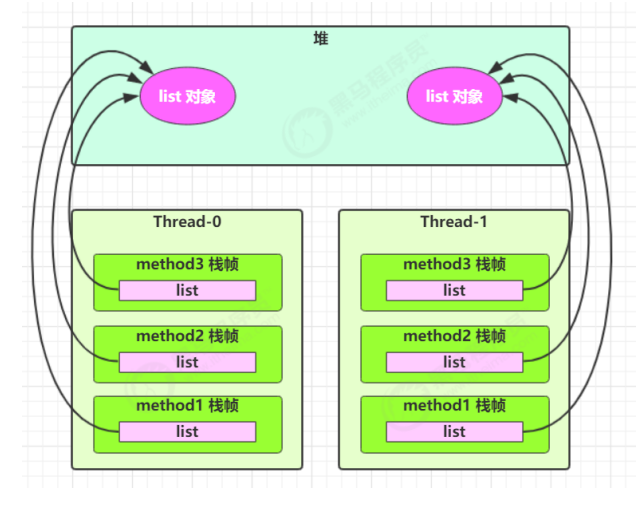

方法访问修饰符带来的思考，如果把 method2 和 method3 的方法修改为 public 会不会代理线程安全问题？

- 情况1：有其它线程调用 method2 和 method3

  ``` java
  /**
   * <p>
   *
   * </p>
   *
   * @author wangruiyu
   * @since 2020/8/6
   */
  public class ThreadSecurity2 {
      static final int THREAD_NUMBER = 2;
      static final int LOOP_NUMBER = 200;
  
      public static void main(String[] args) {
  
          Threadsafe2 test = new Threadsafe2();
          for (int i = 0; i < THREAD_NUMBER; i++) {
              new Thread(() -> {
                  test.method1(LOOP_NUMBER);
              }, "Thread" + i).start();
          }
      }
  }
  
  class Threadsafe2 {
  
      public void method1(int loopNumber) {
          ArrayList<String> list = new ArrayList<>();
          for (int i = 0; i < loopNumber; i++) {
              // { 临界区, 会产生竞态条件
              method2(list);
              method3(list);
              // } 临界区
          }
      }
      public void method2(ArrayList<String> list) {
          list.add("1");
      }
      public void method3(ArrayList<String> list) {
          list.remove(0);
      }
  }
  ```

  其他线程调用`method2`和`method3`方法和`method1`的list 肯定不是一个对象。所以线程安全

- 情况2：在 情况1 的基础上，为 ThreadSafe 类添加子类，子类覆盖 method2 或 method3 方法，即

  ``` java
  
  /**
   * <p>
   *
   * </p>
   *
   * @author wangruiyu
   * @since 2020/8/6
   */
  public class ThreadSecurity2 {
      static final int THREAD_NUMBER = 2;
      static final int LOOP_NUMBER = 200;
  
      public static void main(String[] args) {
  
          ThreadSafeSubClass test = new ThreadSafeSubClass();
          for (int i = 0; i < THREAD_NUMBER; i++) {
              new Thread(() -> {
                  test.method1(LOOP_NUMBER);
              }, "Thread" + i).start();
          }
      }
  }
  
  class Threadsafe2 {
  
      public void method1(int loopNumber) {
          ArrayList<String> list = new ArrayList<>();
          for (int i = 0; i < loopNumber; i++) {
              // { 临界区, 会产生竞态条件
              method2(list);
              method3(list);
              // } 临界区
          }
      }
      public void method2(ArrayList<String> list) {
          list.add("1");
      }
      public void method3(ArrayList<String> list) {
          list.remove(0);
      }
  }
  
  class ThreadSafeSubClass extends Threadsafe2{
      @Override
      public void method3(ArrayList<String> list) {
          new Thread(() -> {
              list.remove(0);
          }).start();
      }
  }
  ```

- 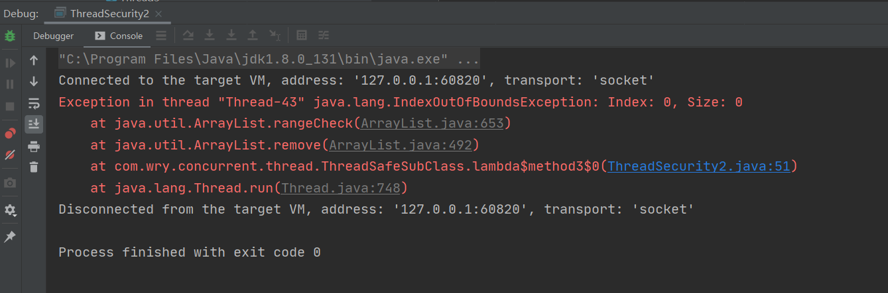


**从这个例子可以看出 private 或 final 提供【安全】的意义所在，请体会开闭原则中的【闭】**

#### 常见线程安全类

- String

- Integer

- StringBuffffer

- Random

- Vector

- Hashtable

- java.util.concurrent 包下的类

这里说它们是线程安全的是指，多个线程调用它们同一个实例的某个方法时，是线程安全的。也可以理解为

``` java
Hashtable table = new Hashtable();

new Thread(()->{
 table.put("key", "value1");
}).start();

new Thread(()->{
 table.put("key", "value2");
}).start()
```

- 它们的每个方法是原子的

- 但**注意**它们多个方法的组合不是原子的，见后面分析

##### 线程安全类方法的组合

分析下面代码是否线程安全？

``` java
Hashtable table = new Hashtable();
// 线程1，线程2
if( table.get("key") == null) {
 table.put("key", value);
}
```

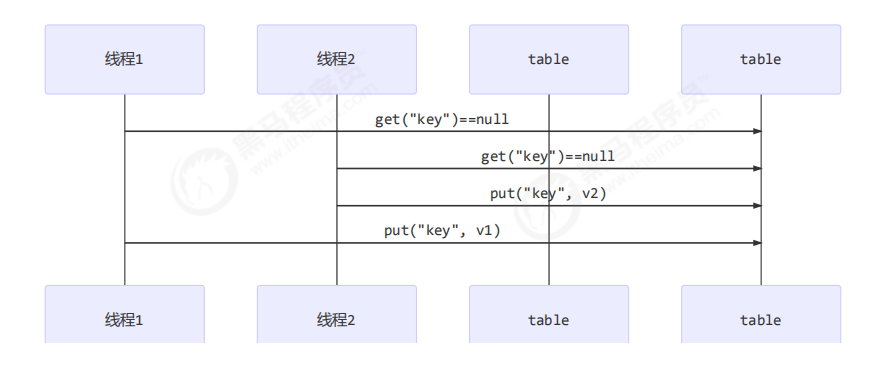

##### 不可变类线程安全性

String、Integer 等都是不可变类，因为其内部的状态不可以改变，因此它们的方法都是线程安全的

有同学或许有疑问，String 有 replace，substring 等方法【可以】改变值啊，那么这些方法又是如何保证线程安

全的呢？

``` java
public class Immutable{
    
 private int value = 0;
    
 public Immutable(int value){
 	this.value = value;
 }
 public int getValue(){
 	return this.value;
 }
}
```

如果想增加一个增加的方法呢？

``` java
public class Immutable{
    
 private int value = 0;
    
 public Immutable(int value){
 	this.value = value;
 }
 public int getValue(){
 	return this.value;
 }
 
 public Immutable add(int v){
 	return new Immutable(this.value + v);
 } 
}
```

#### 习题

##### 卖票练习

测试下面代码是否存在线程安全问题，并尝试改正

``` java
package com.wry.concurrent.thread;

import lombok.extern.slf4j.Slf4j;

import java.util.ArrayList;
import java.util.List;
import java.util.Random;
import java.util.concurrent.CopyOnWriteArrayList;

/**
 * <p>
 *  线程安全测试  -   买票
 * </p>
 *
 * @author wangruiyu
 * @since 2020/8/17
 */
@Slf4j
public class ExerciseSell {
    public static void main(String[] args) {
        //模拟多人买票
        TicketWindows ticketWindows = new TicketWindows(2000);
        //统计卖出的票数
        List<Integer> list = new CopyOnWriteArrayList<>();
        //所有线程的集合
        List<Thread> threadList = new ArrayList<>();
        for (int i = 0; i < 4000; i++) {
            Thread thread = new Thread(() -> {
                //卖出的票数
                int sell = ticketWindows.sell(randomAmount());
                list.add(sell);
            });
            thread.start();
            threadList.add(thread);
        }

        //等待所有线程运行完毕
        threadList.forEach(thread -> {
            try {
                thread.join();
            } catch (InterruptedException e) {
                e.printStackTrace();
            }
        });
        //统计卖出的票和剩余的票
        log.info("余票：{}", ticketWindows.getCount());
        log.info("已售：{}", list.stream().mapToInt(Integer::intValue).sum());
    }

    //Random 线程安全
    static Random random = new Random();

    //生成1到5的随机数
    private static int randomAmount() {
        return random.nextInt(5) + 1;
    }
}

/**
 * <p>
 * 卖票窗口类
 * </p>
 *
 * @author wangruiyu
 * @since 2020/8/17
 */
class TicketWindows {
    private int count;

    public TicketWindows(int count) {
        this.count = count;
    }

    public int getCount() {
        return count;
    }

    public int sell(int amount) {

        if (count >= amount) {
            synchronized (this) {
                count -= amount;
            }
            return amount;
        }
        return 0;

    }
}

```

##### 转账练习

测试下面代码是否存在线程安全问题，并尝试改正

``` java
package com.wry.concurrent.thread;

import lombok.extern.slf4j.Slf4j;

import java.util.Random;

/**
 * <p>
 * 线程安全测试  -   转账
 * </p>
 *
 * @author wangruiyu
 * @since 2020/8/17
 */
@Slf4j
public class ExceriseTransfer {
    public static void main(String[] args) throws InterruptedException {
        Account a = new Account(1000);
        Account b = new Account(1000);
        Thread threadA = new Thread(() -> {
            for (int i = 0; i < 1000; i++) {
                a.transfer(b, randomAmount());
            }
        });
        Thread threadB = new Thread(() -> {
            for (int i = 0; i < 1000; i++) {
                b.transfer(a, randomAmount());
            }
        });
        threadA.start();
        threadB.start();
        threadA.join();
        threadB.join();
        //转账后的金额
        log.info("A 账户的金额：{}", a.getMoney());
        log.info("B 账户的金额：{}", b.getMoney());
    }


    //Random 线程安全
    static Random random = new Random();

    //生成1到100的随机数
    private static int randomAmount() {
        return random.nextInt(100) + 1;
    }
}

/**
 * <p>
 * 账户类
 * </p>
 *
 * @author wangruiyu
 * @since 2020/8/17
 */
class Account {
    private int money;

    public Account(int money) {
        this.money = money;
    }

    public int getMoney() {
        return money;
    }

    public void setMoney(int money) {
        this.money = money;
    }

    /**
     * 转账
     *
     * @param account 账户
     * @param money   金额
     */
    public void transfer(Account account, int money) {
        synchronized (Account.class) {
            if (this.money >= money) {
                account.setMoney(account.getMoney() + money);
                this.setMoney(this.getMoney() - money);
            }
        }
    }
//    //多个对象使用synchronized 加锁 是两个不同的对象，所以无法实现加速的效果
//    public synchronized  void transfer(Account account, int money) {
//          if (this.money >= money) {
//              account.setMoney(account.getMoney() + money);
//              this.setMoney(this.getMoney() - money);
//          }
//    }
}

```

## Monitor概念

### Java对象头

以 32 位虚拟机为例

#### 普通对象

```ruby
|--------------------------------------------------------------| 
| 					Object Header (64 bits)		 		       |
|------------------------------------|-------------------------| 
|		 Mark Word (32 bits) 	     | Klass Word (32 bits)    |
|------------------------------------|-------------------------|
```

#### 数组对象

```ruby
|---------------------------------------------------------------------------------|
| 								Object Header (96 bits)			 				  |
|--------------------------------|-----------------------|------------------------|
| 			Mark Word(32bits) 	 | 	Klass Word(32bits)   | array length(32bits)   |
|--------------------------------|-----------------------|------------------------|
```

其中 Mark Word 结构为

```ruby
|-------------------------------------------------------|--------------------|
| 					Mark Word (32 bits)					| 		State		 |
|-------------------------------------------------------|--------------------|
| 		  hashcode:25 | age:4 | biased_lock:0 	| 01	| 		Normal		 |
|-------------------------------------------------------|--------------------|
| thread:23 | epoch:2 | age:4 | biased_lock:1 	| 01	| 		Biased		 |
|-------------------------------------------------------|--------------------|
| 		ptr_to_lock_record:30 					| 00 	| Lightweight Locked |
|-------------------------------------------------------|--------------------|
| 		ptr_to_heavyweight_monitor:30 			| 10 	| Heavyweight Locked |
|-------------------------------------------------------|--------------------|
| 												| 11	|	 Marked for GC	 |
|-------------------------------------------------------|--------------------|
```


64 位虚拟机 Mark Word

```ruby
|--------------------------------------------------------------------|--------------------|
| 							Mark Word (64 bits) 					 | 		  State  	  |
|--------------------------------------------------------------------|--------------------|
|  unused:25 | hashcode:31 | unused:1 | age:4 | biased_lock:0 |  01  | 		  Normal	  |
|--------------------------------------------------------------------|--------------------|
|  thread:54 | epoch:2     | unused:1 | age:4 | biased_lock:1 |  01  | 		  Biased	  |
|--------------------------------------------------------------------|--------------------|
| 		ptr_to_lock_record:62								  |  00  | Lightweight Locked |
|--------------------------------------------------------------------|--------------------|
| 		ptr_to_heavyweight_monitor:62 						  |  10  | Heavyweight Locked |
|--------------------------------------------------------------------|--------------------|
| 															  |  11  | 	Marked for GC	  |
|--------------------------------------------------------------------|--------------------|
```

**参考资料**

https://stackoverflflow.com/questions/26357186/what-is-in-java-object-header

## 原理之Monitor(锁)

### Monitor原理

Monitor 被翻译为**监视器**或**管程**

每个 Java 对象都可以关联一个 Monitor 对象，如果使用 synchronized 给对象上锁（重量级）之后，该对象头的Mark Word 中就被设置指向 Monitor 对象的指针Monitor 结构如下

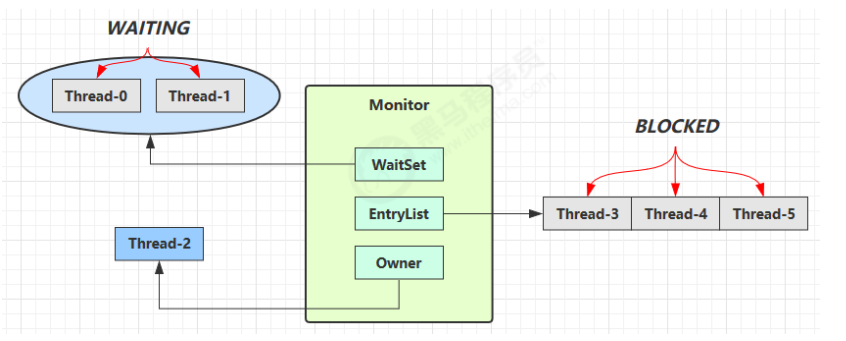


- 刚开始 Monitor 中 Owner 为 null

- 当 Thread-2 执行 synchronized(obj) 就会将 Monitor 的所有者 Owner 置为 Thread-2，Monitor中只能有一个 Owner

- 在 Thread-2 上锁的过程中，如果 Thread-3，Thread-4，Thread-5 也来执行 synchronized(obj)，就会进入EntryList BLOCKED

- Thread-2 执行完同步代码块的内容，然后唤醒 EntryList 中等待的线程来竞争锁，竞争的时是非公平的

- 图中 WaitSet 中的 Thread-0，Thread-1 是之前获得过锁，但条件不满足进入 WAITING 状态的线程，后面讲wait-notify 时会分析

>**注意：**
>
>synchronized 必须是进入同一个对象的 monitor 才有上述的效果
>
>不加 synchronized 的对象不会关联监视器，不遵从以上规则

##  原理之synchronized

**小故事**

故事角色

- 老王 - JVM

- 小南 - 线程

- 小女 - 线程

- 房间 - 对象

- 房间门上 - 防盗锁 - Monitor

- 房间门上 - 小南书包 - 轻量级锁

- 房间门上 - 刻上小南大名 - 偏向锁

- 批量重刻名 - 一个类的偏向锁撤销到达 20 阈值

- 不能刻名字 - 批量撤销该类对象的偏向锁，设置该类不可偏向

小南要使用房间保证计算不被其它人干扰（原子性），最初，他用的是防盗锁，当上下文切换时，锁住门。这样，即使他离开了，别人也进不了门，他的工作就是安全的。

但是，很多情况下没人跟他来竞争房间的使用权。小女是要用房间，但使用的时间上是错开的，小南白天用，小女晚上用。每次上锁太麻烦了，有没有更简单的办法呢？

小南和小女商量了一下，约定不锁门了，而是谁用房间，谁把自己的书包挂在门口，但他们的书包样式都一样，因此每次进门前得翻翻书包，看课本是谁的，如果是自己的，那么就可以进门，这样省的上锁解锁了。万一书包不是自己的，那么就在门外等，并通知对方下次用锁门的方式。

后来，小女回老家了，很长一段时间都不会用这个房间。小南每次还是挂书包，翻书包，虽然比锁门省事了，但仍然觉得麻烦。

于是，小南干脆在门上刻上了自己的名字：【小南专属房间，其它人勿用】，下次来用房间时，只要名字还在，那么说明没人打扰，还是可以安全地使用房间。如果这期间有其它人要用这个房间，那么由使用者将小南刻的名字擦掉，升级为挂书包的方式。

同学们都放假回老家了，小南就膨胀了，在 20 个房间刻上了自己的名字，想进哪个进哪个。后来他自己放假回老家了，这时小女回来了（她也要用这些房间），结果就是得一个个地擦掉小南刻的名字，升级为挂书包的方式。老王觉得这成本有点高，提出了一种批量重刻名的方法，他让小女不用挂书包了，可以直接在门上刻上自己的名字后来，刻名的现象越来越频繁，老王受不了了：算了，这些房间都不能刻名了，只能挂书包。

### synchronized原理

``` java
static final Object lock = new Object();

static int counter = 0;

public static void main(String[] args) {
 synchronized (lock) {
 	counter++;
 }
}
```

对应的字节码为

``` java
public static void main(java.lang.String[]);
 descriptor: ([Ljava/lang/String;)V
 flags: ACC_PUBLIC, ACC_STATIC
 Code:
 stack=2, locals=3, args_size=1
 0: getstatic #2 // <- lock引用 （synchronized开始）
 3: dup
 4: astore_1 // lock引用 -> slot 1
 5: monitorenter // 将 lock对象 MarkWord 置为 Monitor 指针
 6: getstatic #3 // <- i
 9: iconst_1 // 准备常数 1
 10: iadd // +1
 11: putstatic #3 // -> i
 14: aload_1 // <- lock引用
 15: monitorexit // 将 lock对象 MarkWord 重置, 唤醒 EntryList
 16: goto 24
 19: astore_2 // e -> slot 2 
 20: aload_1 // <- lock引用
 21: monitorexit // 将 lock对象 MarkWord 重置, 唤醒 EntryList
 22: aload_2 // <- slot 2 (e)
 23: athrow // throw e
 24: return
 Exception table:
 from to target type
 6 16 19 any
 19 22 19 any
 LineNumberTable:
 line 8: 0
 line 9: 6
 line 10: 14
 line 11: 24
 LocalVariableTable:
 Start Length Slot Name Signature
 0 25 0 args [Ljava/lang/String;
 StackMapTable: number_of_entries = 2
 frame_type = 255 /* full_frame */
 offset_delta = 19
 locals = [ class "[Ljava/lang/String;", class java/lang/Object ]
 stack = [ class java/lang/Throwable ]
 frame_type = 250 /* chop */
 offset_delta = 4              
```


>**注意**
>
>方法级别的 synchronized 不会在字节码指令中有所体现

### synchronized原理进阶

#### 1.轻量级锁

轻量级锁的使用场景：如果一个对象虽然有多线程要加锁，但加锁的时间是错开的（也就是没有竞争），那么可以使用轻量级锁来优化。

轻量级锁对使用者是透明的，即语法仍然是 `synchronized`

假设有两个方法同步块，利用同一个对象加锁

``` java
static final Object obj = new Object();

public static void method1() {
 synchronized( obj ) {
 // 同步块 A
 method2();
 }
}
public static void method2() {
 synchronized( obj ) {
 // 同步块 B
 }
}
```

- 创建锁记录（Lock Record）对象，每个线程都的栈帧都会包含一个锁记录的结构，内部可以存储锁定对象的Mark Word

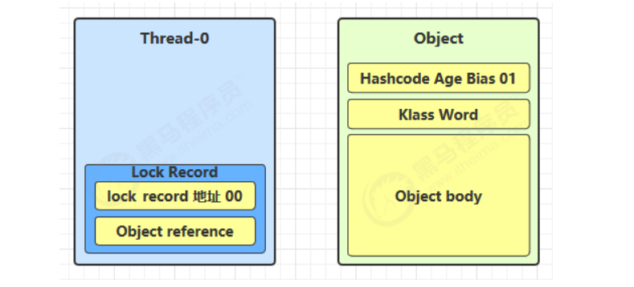

- 让锁记录中 Object reference 指向锁对象，并尝试用 cas 替换 Object 的 Mark Word，将 Mark Word 的值存入锁记录

  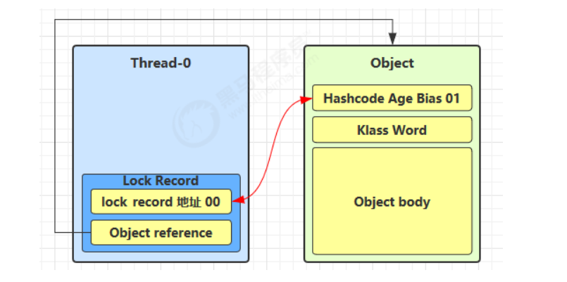

 - 如果 cas 替换成功，对象头中存储了 锁记录地址和状态 00 ，表示由该线程给对象加锁，这时图示如下

   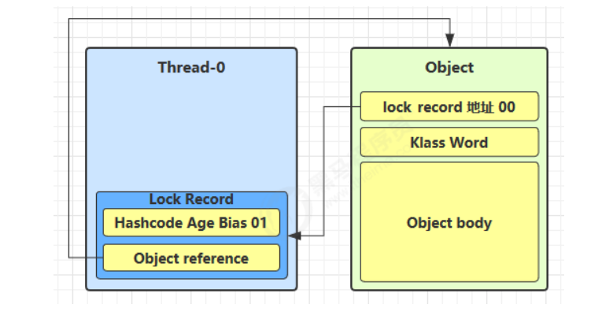

- 如果 cas 失败，有两种情况

  - 如果是其它线程已经持有了该 Object 的轻量级锁，这时表明有竞争，进入锁膨胀过程
  - 如果是自己执行了 synchronized 锁重入，那么再添加一条 Lock Record 作为重入的计数

  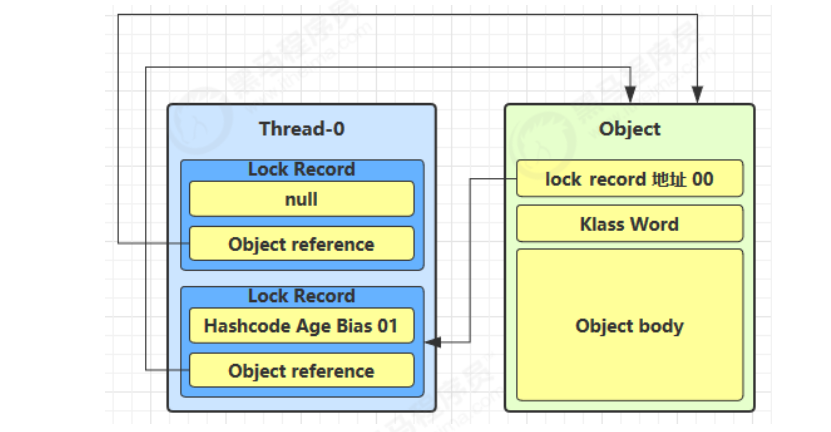

- 当退出 synchronized 代码块（解锁时）如果有取值为 null 的锁记录，表示有重入，这时重置锁记录，表示重入计数减一

  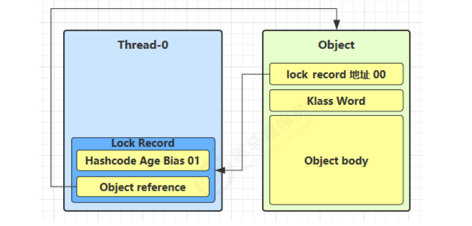

- 当退出 synchronized 代码块（解锁时）锁记录的值不为 null，这时使用 cas 将 Mark Word 的值恢复给对象头

  - 成功，则解锁成功
  - 失败，说明轻量级锁进行了锁膨胀或已经升级为重量级锁，进入重量级锁解锁流程

#### 2.锁膨胀

如果在尝试加轻量级锁的过程中，CAS 操作无法成功，这时一种情况就是有其它线程为此对象加上了轻量级锁（有竞争），这时需要进行锁膨胀，将轻量级锁变为重量级锁。

``` java
static Object obj = new Object();

public static void method1() {
 synchronized( obj ) {
 // 同步块
 }
}
```

- 当 Thread-1 进行轻量级加锁时，Thread-0 已经对该对象加了轻量级锁

  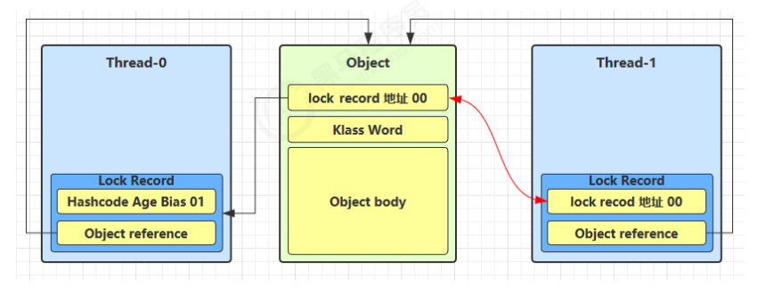

- 这时 Thread-1 加轻量级锁失败，进入锁膨胀流程

  - 即为 Object 对象申请 `Monitor` 锁，让 Object 指向重量级锁地址
  - 然后自己进入 `Monitor` 的 `EntryList` BLOCKED

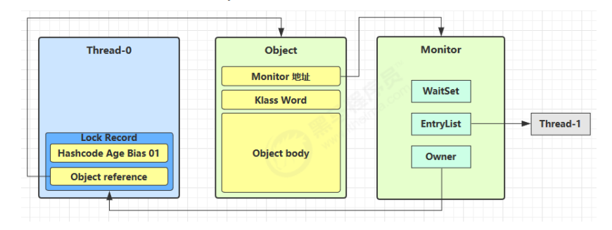

- 当 Thread-0 退出同步块解锁时，使用 cas 将 Mark Word 的值恢复给对象头，失败。这时会进入重量级解锁流程，即按照 Monitor 地址找到 Monitor 对象，设置 Owner 为 null，唤醒 EntryList 中 BLOCKED 线程

#### 3.自旋优化

重量级锁竞争的时候，还可以使用自旋来进行优化，如果当前线程自旋成功（即这时候持锁线程已经退出了同步块，释放了锁），这时当前线程就可以避免阻塞。

自旋重试成功的情况

| **线程** **1** **（****core 1** **上）** | **对象** **Mark**      | **线程** **2** **（****core 2** **上）** |
| ---------------------------------------- | ---------------------- | ---------------------------------------- |
| -                                        | 10（重量锁）           | -                                        |
| 访问同步块，获取 monitor                 | 10（重量锁）重量锁指针 | -                                        |
| 成功（加锁）                             | 10（重量锁）重量锁指针 | -                                        |
| 执行同步块                               | 10（重量锁）重量锁指针 |                                          |
| 执行同步块                               | 10（重量锁）重量锁指针 | 访问同步块，获取 monitor                 |
| 执行同步块                               | 10（重量锁）重量锁指针 | 自旋重试                                 |
| 执行完毕                                 | 10（重量锁）重量锁指针 | 自旋重试                                 |
| 成功（解锁）                             | 01（无锁）             | 自旋重试                                 |
| -                                        | 10（重量锁）重量锁指针 | 成功（加锁）                             |
| -                                        | 10（重量锁）重量锁指针 | 执行同步块                               |
| -                                        | 10（重量锁）重量锁指针 | 执行同步块                               |
| ...                                      | ....                   | ....                                     |

自旋重试失败的情况

| **线程** **1** **（****core 1** **上）** | **对象** **Mark**        | **线程** **2** **（****core 2** **上）** |
| ---------------------------------------- | ------------------------ | ---------------------------------------- |
| -                                        | 10（重量锁）             | -                                        |
| 访问同步块，获取 monitor                 | 10（重量锁）重量锁指针   | -                                        |
| 成功（加锁）                             | 10（重量锁）重量锁指针   | -                                        |
| 执行同步块                               | 10（重量锁）重量锁指针   |                                          |
| 执行同步块                               | 10（重量锁）重量锁指针   | 访问同步块，获取 monitor                 |
| 执行同步块                               | 10（重量锁）重量锁指针   | 自旋重试                                 |
| 执行同步块                               | 10（重量锁）重量锁指针   | 自旋重试                                 |
| 执行同步块                               | 10（重量锁）重量锁指针） | 自旋重试                                 |
| 执行同步块                               | 10（重量锁）重量锁指针） | 自旋重试                                 |
| 执行同步块                               | 10（重量锁）重量锁指针） | 自旋重试                                 |
| 执行同步块                               | 10（重量锁）重量锁指针） | 阻塞                                     |
| ...                                      | ...                      | ...                                      |

- 自旋会占用 CPU 时间，单核 CPU 自旋就是浪费，多核 CPU 自旋才能发挥优势。

- 在 Java 6 之后**自旋锁是自适应的**，比如对象刚刚的一次自旋操作成功过，那么认为这次自旋成功的可能性会高，就多自旋几次；反之，就少自旋甚至不自旋，总之，比较智能。

- Java 7 之后不能控制是否开启自旋功能

#### 4.偏向锁

轻量级锁在没有竞争时（就自己这个线程），每次重入仍然需要执行 CAS 操作。

Java 6 中引入了偏向锁来做进一步优化：只有第一次使用 CAS 将线程 ID 设置到对象的 Mark Word 头，之后发现这个线程 ID 是自己的就表示没有竞争，不用重新 CAS。以后只要不发生竞争，这个对象就归该线程所有

例如：

``` java
static final Object obj = new Object();

public static void m1() {
 synchronized( obj ) {
 	// 同步块 A
 	m2();
 }
}
public static void m2() {
 synchronized( obj ) {
 	// 同步块 B
 	m3();
 }
}
public static void m3() {
 synchronized( obj ) {
 	// 同步块 C
 }
}
```

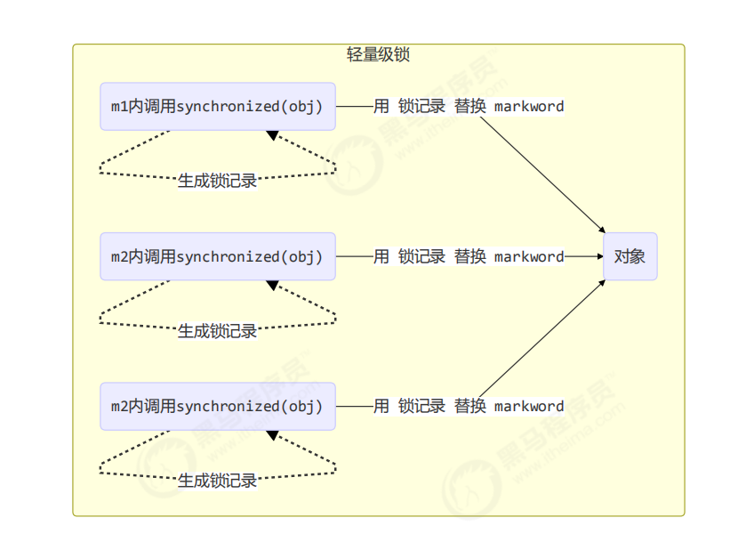

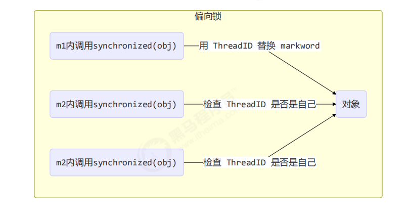

**偏向状态**

回忆一下对象头格式

```ruby
|--------------------------------------------------------------------|--------------------|
| 							Mark Word (64 bits) 					 | 		  State  	  |
|--------------------------------------------------------------------|--------------------|
|  unused:25 | hashcode:31 | unused:1 | age:4 | biased_lock:0 |  01  | 		  Normal	  |
|--------------------------------------------------------------------|--------------------|
|  thread:54 | epoch:2     | unused:1 | age:4 | biased_lock:1 |  01  | 		  Biased	  |
|--------------------------------------------------------------------|--------------------|
| 		ptr_to_lock_record:62								  |  00  | Lightweight Locked |
|--------------------------------------------------------------------|--------------------|
| 		ptr_to_heavyweight_monitor:62 						  |  10  | Heavyweight Locked |
|--------------------------------------------------------------------|--------------------|
| 															  |  11  | 	Marked for GC	  |
|--------------------------------------------------------------------|--------------------|
```

一个对象创建时：

- 如果开启了偏向锁（默认开启），那么对象创建后，markword 值为 0x05 即最后 3 位为 101，这时它的thread、epoch、age 都为 0

- 偏向锁是默认是延迟的，不会在程序启动时立即生效，如果想避免延迟，可以加 VM 参数

   `-XX:BiasedLockingStartupDelay=0` 来禁用延迟

- 如果没有开启偏向锁，那么对象创建后，markword 值为 0x01 即最后 3 位为 001，这时它的 hashcode、age 都为 0，第一次用到 hashcode 时才会赋值

1） 测试延迟特性

2） 测试偏向锁

``` java
class Dog {
    
}
```

利用 jol 第三方工具来查看对象头信息（注意这里我扩展了 jol 让它输出更为简洁）

``` java
// 添加虚拟机参数 -XX:BiasedLockingStartupDelay=0 
public static void main(String[] args) throws IOException {
 	Dog d = new Dog();
 	ClassLayout classLayout = ClassLayout.parseInstance(d);
 	new Thread(() -> {
 		log.debug("synchronized 前");
 		System.out.println(classLayout.toPrintableSimple(true));
 		synchronized (d) {
 			log.debug("synchronized 中");
 			System.out.println(classLayout.toPrintableSimple(true));
 		}
 		log.debug("synchronized 后");
 		System.out.println(classLayout.toPrintableSimple(true));
 	}, "t1").start();
}
```

输出

```
11:08:58.117 c.TestBiased [t1] - synchronized 前
00000000 00000000 00000000 00000000 00000000 00000000 00000000 00000101 
11:08:58.121 c.TestBiased [t1] - synchronized 中
00000000 00000000 00000000 00000000 00011111 11101011 11010000 00000101 
11:08:58.121 c.TestBiased [t1] - synchronized 后
00000000 00000000 00000000 00000000 00011111 11101011 11010000 00000101
```

>**注意**
>
>处于偏向锁的对象解锁后，线程 id 仍存储于对象头中

3）测试禁用

在上面测试代码运行时在添加 VM 参数 `-XX:-UseBiasedLocking` 禁用偏向锁

输出

```
11:13:10.018 c.TestBiased [t1] - synchronized 前
00000000 00000000 00000000 00000000 00000000 00000000 00000000 00000001 
11:13:10.021 c.TestBiased [t1] - synchronized 中
00000000 00000000 00000000 00000000 00100000 00010100 11110011 10001000 
11:13:10.021 c.TestBiased [t1] - synchronized 后
00000000 00000000 00000000 00000000 00000000 00000000 00000000 00000001
```

4) 测试 hashCode

正常状态对象一开始是没有 hashCode 的，第一次调用才生成

#### 撤销 **-** 调用对象hashCode

调用了对象的 hashCode，但偏向锁的对象 MarkWord 中存储的是线程 id，如果调用 hashCode 会导致偏向锁被撤销

- 轻量级锁会在锁记录中记录 hashCode

- 重量级锁会在 Monitor 中记录 hashCode

在调用 hashCode 后使用偏向锁，记得去掉 `-XX:-UseBiasedLocking`

输出

```
11:22:10.386 c.TestBiased [main] - 调用 hashCode:1778535015 
11:22:10.391 c.TestBiased [t1] - synchronized 前
00000000 00000000 00000000 01101010 00000010 01001010 01100111 00000001 
11:22:10.393 c.TestBiased [t1] - synchronized 中
00000000 00000000 00000000 00000000 00100000 11000011 11110011 01101000 
11:22:10.393 c.TestBiased [t1] - synchronized 后
00000000 00000000 00000000 01101010 00000010 01001010 01100111 00000001
```

#### 撤销 **-** 其它线程使用对象

当有其它线程使用偏向锁对象时，会将偏向锁升级为轻量级锁

``` java
private static void test2() throws InterruptedException {
 	Dog d = new Dog();
 	Thread t1 = new Thread(() -> {
		 synchronized (d) {
 			log.debug(ClassLayout.parseInstance(d).toPrintableSimple(true));
 		}
 		synchronized (TestBiased.class) {
 			TestBiased.class.notify();
 		}
 		// 如果不用 wait/notify 使用 join 必须打开下面的注释
 		// 因为：t1 线程不能结束，否则底层线程可能被 jvm 重用作为 t2 线程，底层线程 id 是一样的
         /*try {
         System.in.read();
         } catch (IOException e) {
         e.printStackTrace();
         }*/
 	}, "t1");
 	t1.start();
    
 	Thread t2 = new Thread(() -> {
 		synchronized (TestBiased.class) {
 			try {
 				TestBiased.class.wait();
 			} catch (InterruptedException e) {
 				e.printStackTrace();
 			}
 		}
 		log.debug(ClassLayout.parseInstance(d).toPrintableSimple(true));
 		synchronized (d) {
 			log.debug(ClassLayout.parseInstance(d).toPrintableSimple(true));
 		}
 		log.debug(ClassLayout.parseInstance(d).toPrintableSimple(true));
 	}, "t2");
 	t2.start();
}
```

输出

```
[t1] - 00000000 00000000 00000000 00000000 00011111 01000001 00010000 00000101 

[t2] - 00000000 00000000 00000000 00000000 00011111 01000001 00010000 00000101 

[t2] - 00000000 00000000 00000000 00000000 00011111 10110101 11110000 01000000 

[t2] - 00000000 00000000 00000000 00000000 00000000 00000000 00000000 00000001 
```

#### 撤销 - 调用 wait/notify 

``` java
public static void main(String[] args) throws InterruptedException {
 	Dog d = new Dog();
 	Thread t1 = new Thread(() -> {
 		log.debug(ClassLayout.parseInstance(d).toPrintableSimple(true));
 		synchronized (d) {
 			log.debug(ClassLayout.parseInstance(d).toPrintableSimple(true));
 			try {
 				d.wait();
 			} catch (InterruptedException e) {
 				e.printStackTrace();
 			}
 			log.debug(ClassLayout.parseInstance(d).toPrintableSimple(true));
 		}
 	}, "t1");
 	t1.start();
    
 	new Thread(() -> {
 		try {
 			Thread.sleep(6000);
 		} catch (InterruptedException e) {
 			e.printStackTrace();
 		}
		synchronized (d) {
 			log.debug("notify");
 			d.notify();
 		}
 	}, "t2").start();
}
```

输出

```
[t1] - 00000000 00000000 00000000 00000000 00000000 00000000 00000000 00000101 
[t1] - 00000000 00000000 00000000 00000000 00011111 10110011 11111000 00000101 
[t2] - notify 
[t1] - 00000000 00000000 00000000 00000000 00011100 11010100 00001101 11001010
```

#### 批量重偏向

如果对象虽然被多个线程访问，但没有竞争，这时偏向了线程 T1 的对象仍有机会重新偏向 T2，重偏向会重置对象的 Thread ID

当撤销偏向锁阈值超过 20 次后，jvm 会这样觉得，我是不是偏向错了呢，于是会在给这些对象加锁时重新偏向至加锁线程

``` java
private static void test3() throws InterruptedException {
 	Vector<Dog> list = new Vector<>();
 	Thread t1 = new Thread(() -> {
 		for (int i = 0; i < 30; i++) {
 			Dog d = new Dog();
 			list.add(d);
 			synchronized (d) {
 				log.debug(i + "\t" + ClassLayout.parseInstance(d).toPrintableSimple(true));
 			}
 		}
 		synchronized (list) {
 			list.notify();
 		} 
 	}, "t1");
 	t1.start();
 
 	Thread t2 = new Thread(() -> {
 		synchronized (list) {
 			try {
				list.wait();
 			} catch (InterruptedException e) {
				e.printStackTrace();
 			}
 		}
 		log.debug("===============> ");
 		for (int i = 0; i < 30; i++) {
 			Dog d = list.get(i);
 			log.debug(i + "\t" + ClassLayout.parseInstance(d).toPrintableSimple(true));
 			synchronized (d) {
 				log.debug(i + "\t" + ClassLayout.parseInstance(d).toPrintableSimple(true));
 			}
 			log.debug(i + "\t" + ClassLayout.parseInstance(d).toPrintableSimple(true));
 		}
 	}, "t2");
 	t2.start();
}
```

输出

```
[t1] - 0 00000000 00000000 00000000 00000000 00011111 11110011 11100000 00000101 
[t1] - 1 00000000 00000000 00000000 00000000 00011111 11110011 11100000 00000101 
[t1] - 2 00000000 00000000 00000000 00000000 00011111 11110011 11100000 00000101 
[t1] - 3 00000000 00000000 00000000 00000000 00011111 11110011 11100000 00000101 
[t1] - 4 00000000 00000000 00000000 00000000 00011111 11110011 11100000 00000101 
[t1] - 5 00000000 00000000 00000000 00000000 00011111 11110011 11100000 00000101 
[t1] - 6 00000000 00000000 00000000 00000000 00011111 11110011 11100000 00000101 
[t1] - 7 00000000 00000000 00000000 00000000 00011111 11110011 11100000 00000101 
[t1] - 8 00000000 00000000 00000000 00000000 00011111 11110011 11100000 00000101 
[t1] - 9 00000000 00000000 00000000 00000000 00011111 11110011 11100000 00000101 
[t1] - 10 00000000 00000000 00000000 00000000 00011111 11110011 11100000 00000101 
[t1] - 11 00000000 00000000 00000000 00000000 00011111 11110011 11100000 00000101 
[t1] - 12 00000000 00000000 00000000 00000000 00011111 11110011 11100000 00000101 
[t1] - 13 00000000 00000000 00000000 00000000 00011111 11110011 11100000 00000101 
[t1] - 14 00000000 00000000 00000000 00000000 00011111 11110011 11100000 00000101 
[t1] - 15 00000000 00000000 00000000 00000000 00011111 11110011 11100000 00000101 
[t1] - 16 00000000 00000000 00000000 00000000 00011111 11110011 11100000 00000101 
[t1] - 17 00000000 00000000 00000000 00000000 00011111 11110011 11100000 00000101 
[t1] - 18 00000000 00000000 00000000 00000000 00011111 11110011 11100000 00000101 
[t1] - 19 00000000 00000000 00000000 00000000 00011111 11110011 11100000 00000101 
[t1] - 20 00000000 00000000 00000000 00000000 00011111 11110011 11100000 00000101 
[t1] - 21 00000000 00000000 00000000 00000000 00011111 11110011 11100000 00000101 
[t1] - 22 00000000 00000000 00000000 00000000 00011111 11110011 11100000 00000101 
[t1] - 23 00000000 00000000 00000000 00000000 00011111 11110011 11100000 00000101 
[t1] - 24 00000000 00000000 00000000 00000000 00011111 11110011 11100000 00000101 
[t1] - 25 00000000 00000000 00000000 00000000 00011111 11110011 11100000 00000101 
[t1] - 26 00000000 00000000 00000000 00000000 00011111 11110011 11100000 00000101 
[t1] - 27 00000000 00000000 00000000 00000000 00011111 11110011 11100000 00000101 
[t1] - 28 00000000 00000000 00000000 00000000 00011111 11110011 11100000 00000101 
[t1] - 29 00000000 00000000 00000000 00000000 00011111 11110011 11100000 00000101 
[t2] - ===============> 
[t2] - 0 00000000 00000000 00000000 00000000 00011111 11110011 11100000 00000101 
[t2] - 0 00000000 00000000 00000000 00000000 00100000 01011000 11110111 00000000 
[t2] - 0 00000000 00000000 00000000 00000000 00000000 00000000 00000000 00000001 
[t2] - 1 00000000 00000000 00000000 00000000 00011111 11110011 11100000 00000101 
[t2] - 1 00000000 00000000 00000000 00000000 00100000 01011000 11110111 00000000 
[t2] - 1 00000000 00000000 00000000 00000000 00000000 00000000 00000000 00000001 
[t2] - 2 00000000 00000000 00000000 00000000 00011111 11110011 11100000 00000101 
[t2] - 2 00000000 00000000 00000000 00000000 00100000 01011000 11110111 00000000 
[t2] - 2 00000000 00000000 00000000 00000000 00000000 00000000 00000000 00000001 
[t2] - 3 00000000 00000000 00000000 00000000 00011111 11110011 11100000 00000101 
[t2] - 3 00000000 00000000 00000000 00000000 00100000 01011000 11110111 00000000 
[t2] - 3 00000000 00000000 00000000 00000000 00000000 00000000 00000000 00000001 
[t2] - 4 00000000 00000000 00000000 00000000 00011111 11110011 11100000 00000101 
[t2] - 4 00000000 00000000 00000000 00000000 00100000 01011000 11110111 00000000 
[t2] - 4 00000000 00000000 00000000 00000000 00000000 00000000 00000000 00000001 
[t2] - 5 00000000 00000000 00000000 00000000 00011111 11110011 11100000 00000101 
[t2] - 5 00000000 00000000 00000000 00000000 00100000 01011000 11110111 00000000 
[t2] - 5 00000000 00000000 00000000 00000000 00000000 00000000 00000000 00000001 
[t2] - 6 00000000 00000000 00000000 00000000 00011111 11110011 11100000 00000101 
[t2] - 6 00000000 00000000 00000000 00000000 00100000 01011000 11110111 00000000 
[t2] - 6 00000000 00000000 00000000 00000000 00000000 00000000 00000000 00000001 
[t2] - 7 00000000 00000000 00000000 00000000 00011111 11110011 11100000 00000101 
[t2] - 7 00000000 00000000 00000000 00000000 00100000 01011000 11110111 00000000 
[t2] - 7 00000000 00000000 00000000 00000000 00000000 00000000 00000000 00000001 
[t2] - 8 00000000 00000000 00000000 00000000 00011111 11110011 11100000 00000101 
[t2] - 8 00000000 00000000 00000000 00000000 00100000 01011000 11110111 00000000 
[t2] - 8 00000000 00000000 00000000 00000000 00000000 00000000 00000000 00000001 
[t2] - 9 00000000 00000000 00000000 00000000 00011111 11110011 11100000 00000101 
[t2] - 9 00000000 00000000 00000000 00000000 00100000 01011000 11110111 00000000 
[t2] - 9 00000000 00000000 00000000 00000000 00000000 00000000 00000000 00000001 
[t2] - 10 00000000 00000000 00000000 00000000 00011111 11110011 11100000 00000101 
[t2] - 10 00000000 00000000 00000000 00000000 00100000 01011000 11110111 00000000 
[t2] - 10 00000000 00000000 00000000 00000000 00000000 00000000 00000000 00000001 
[t2] - 11 00000000 00000000 00000000 00000000 00011111 11110011 11100000 00000101 
[t2] - 11 00000000 00000000 00000000 00000000 00100000 01011000 11110111 00000000 
[t2] - 11 00000000 00000000 00000000 00000000 00000000 00000000 00000000 00000001 
[t2] - 12 00000000 00000000 00000000 00000000 00011111 11110011 11100000 00000101 
[t2] - 12 00000000 00000000 00000000 00000000 00100000 01011000 11110111 00000000 
[t2] - 12 00000000 00000000 00000000 00000000 00000000 00000000 00000000 00000001 
[t2] - 13 00000000 00000000 00000000 00000000 00011111 11110011 11100000 00000101 
[t2] - 13 00000000 00000000 00000000 00000000 00100000 01011000 11110111 00000000 
[t2] - 13 00000000 00000000 00000000 00000000 00000000 00000000 00000000 00000001 
[t2] - 14 00000000 00000000 00000000 00000000 00011111 11110011 11100000 00000101 
[t2] - 14 00000000 00000000 00000000 00000000 00100000 01011000 11110111 00000000 
[t2] - 14 00000000 00000000 00000000 00000000 00000000 00000000 00000000 00000001 
[t2] - 15 00000000 00000000 00000000 00000000 00011111 11110011 11100000 00000101 
[t2] - 15 00000000 00000000 00000000 00000000 00100000 01011000 11110111 00000000 
[t2] - 15 00000000 00000000 00000000 00000000 00000000 00000000 00000000 00000001 
[t2] - 16 00000000 00000000 00000000 00000000 00011111 11110011 11100000 00000101 
[t2] - 16 00000000 00000000 00000000 00000000 00100000 01011000 11110111 00000000 
[t2] - 16 00000000 00000000 00000000 00000000 00000000 00000000 00000000 00000001 
[t2] - 17 00000000 00000000 00000000 00000000 00011111 11110011 11100000 00000101 
[t2] - 17 00000000 00000000 00000000 00000000 00100000 01011000 11110111 00000000 
[t2] - 17 00000000 00000000 00000000 00000000 00000000 00000000 00000000 00000001 
[t2] - 18 00000000 00000000 00000000 00000000 00011111 11110011 11100000 00000101 
[t2] - 18 00000000 00000000 00000000 00000000 00100000 01011000 11110111 00000000 
[t2] - 18 00000000 00000000 00000000 00000000 00000000 00000000 00000000 00000001 
[t2] - 19 00000000 00000000 00000000 00000000 00011111 11110011 11100000 00000101 
[t2] - 19 00000000 00000000 00000000 00000000 00011111 11110011 11110001 00000101 
[t2] - 19 00000000 00000000 00000000 00000000 00011111 11110011 11110001 00000101 
[t2] - 20 00000000 00000000 00000000 00000000 00011111 11110011 11100000 00000101 
[t2] - 20 00000000 00000000 00000000 00000000 00011111 11110011 11110001 00000101 
[t2] - 20 00000000 00000000 00000000 00000000 00011111 11110011 11110001 00000101 
[t2] - 21 00000000 00000000 00000000 00000000 00011111 11110011 11100000 00000101 
[t2] - 21 00000000 00000000 00000000 00000000 00011111 11110011 11110001 00000101 
[t2] - 21 00000000 00000000 00000000 00000000 00011111 11110011 11110001 00000101 
[t2] - 22 00000000 00000000 00000000 00000000 00011111 11110011 11100000 00000101 
[t2] - 22 00000000 00000000 00000000 00000000 00011111 11110011 11110001 00000101 
[t2] - 22 00000000 00000000 00000000 00000000 00011111 11110011 11110001 00000101 
[t2] - 23 00000000 00000000 00000000 00000000 00011111 11110011 11100000 00000101 
[t2] - 23 00000000 00000000 00000000 00000000 00011111 11110011 11110001 00000101 
[t2] - 23 00000000 00000000 00000000 00000000 00011111 11110011 11110001 00000101 
[t2] - 24 00000000 00000000 00000000 00000000 00011111 11110011 11100000 00000101 
[t2] - 24 00000000 00000000 00000000 00000000 00011111 11110011 11110001 00000101 
[t2] - 24 00000000 00000000 00000000 00000000 00011111 11110011 11110001 00000101 
[t2] - 25 00000000 00000000 00000000 00000000 00011111 11110011 11100000 00000101 
[t2] - 25 00000000 00000000 00000000 00000000 00011111 11110011 11110001 00000101 
[t2] - 25 00000000 00000000 00000000 00000000 00011111 11110011 11110001 00000101 
[t2] - 26 00000000 00000000 00000000 00000000 00011111 11110011 11100000 00000101 
[t2] - 26 00000000 00000000 00000000 00000000 00011111 11110011 11110001 00000101 
[t2] - 26 00000000 00000000 00000000 00000000 00011111 11110011 11110001 00000101 
[t2] - 27 00000000 00000000 00000000 00000000 00011111 11110011 11100000 00000101 
[t2] - 27 00000000 00000000 00000000 00000000 00011111 11110011 11110001 00000101 
[t2] - 27 00000000 00000000 00000000 00000000 00011111 11110011 11110001 00000101 
[t2] - 28 00000000 00000000 00000000 00000000 00011111 11110011 11100000 00000101 
[t2] - 28 00000000 00000000 00000000 00000000 00011111 11110011 11110001 00000101 
[t2] - 28 00000000 00000000 00000000 00000000 00011111 11110011 11110001 00000101 
[t2] - 29 00000000 00000000 00000000 00000000 00011111 11110011 11100000 00000101 
[t2] - 29 00000000 00000000 00000000 00000000 00011111 11110011 11110001 00000101 
[t2] - 29 00000000 00000000 00000000 00000000 00011111 11110011 11110001 00000101
```

#### 批量撤销

当撤销偏向锁阈值超过 40 次后，jvm 会这样觉得，自己确实偏向错了，根本就不该偏向。于是整个类的所有对象都会变为不可偏向的，新建的对象也是不可偏向的

``` java

    static Thread t1, t2, t3;

    private static void test4() throws InterruptedException {
        Vector<Dog> list = new Vector<>();
        int loopNumber = 39;
        t1 = new Thread(() -> {
            for (int i = 0; i < loopNumber; i++) {
                Dog d = new Dog();
                list.add(d);
                synchronized (d) {
                    log.debug(i + "\t" + ClassLayout.parseInstance(d).toPrintableSimple(true));
                }
            }
            LockSupport.unpark(t2);
        }, "t1");
        t1.start();
        t2 = new Thread(() -> {
            LockSupport.park();
            log.debug("===============> ");
            for (int i = 0; i < loopNumber; i++) {
                Dog d = list.get(i);
                log.debug(i + "\t" + ClassLayout.parseInstance(d).toPrintableSimple(true));
                synchronized (d) {
                    log.debug(i + "\t" + ClassLayout.parseInstance(d).toPrintableSimple(true));
                }
                log.debug(i + "\t" + ClassLayout.parseInstance(d).toPrintableSimple(true));
            }
            LockSupport.unpark(t3);
        }, "t2");
    }
```

>**参考资料**
>
>https://github.com/farmerjohngit/myblog/issues/12
>
>https://www.cnblogs.com/LemonFive/p/11246086.html
>
>https://www.cnblogs.com/LemonFive/p/11248248.html
>
>偏向锁论文

#### 5.锁消除

锁消除

``` java
@Fork(1)
@BenchmarkMode(Mode.AverageTime)
@Warmup(iterations=3)
@Measurement(iterations=5)
@OutputTimeUnit(TimeUnit.NANOSECONDS)
public class MyBenchmark {
    static int x = 0;
    @Benchmark
    public void a() throws Exception {
        x++;
    }
    @Benchmark
    public void b() throws Exception {
        Object o = new Object();
        synchronized (o) {
            x++;
        }
    }
}
```

`java -jar benchmarks.jar`

```
Benchmark			Mode	 Samples 	Score	 Score error 	Units 
c.i.MyBenchmark.a 	avgt 		5 		1.542 		0.056 		ns/op 
c.i.MyBenchmark.b 	avgt 		5 		1.518 		0.091 		ns/op
```

`java -XX:-EliminateLocks -jar benchmarks.jar`

```
Benchmark 			Mode 	Samples 	Score 	Score error 	Units 
c.i.MyBenchmark.a 	avgt 		5 		1.507 		0.108 		ns/op 
c.i.MyBenchmark.b 	avgt 		5 		16.976 		1.572 		ns/op
```

**锁粗化**

对相同对象多次加锁，导致线程发生多次重入，可以使用锁粗化方式来优化，这不同于之前讲的细分锁的粒度。
