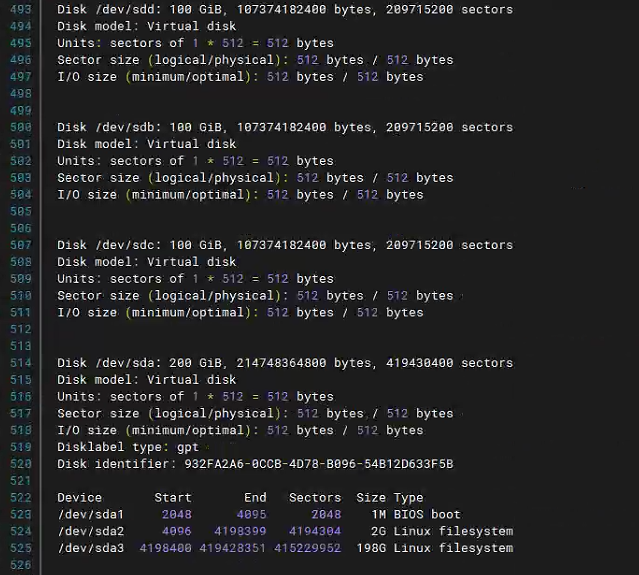
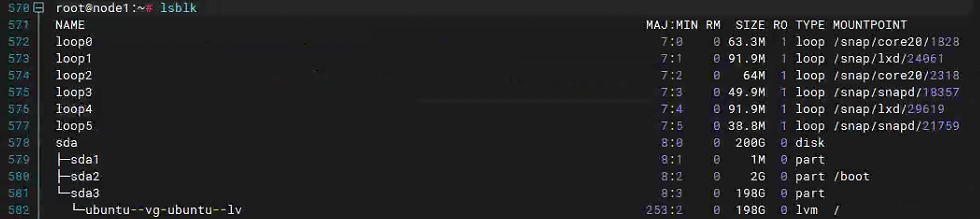
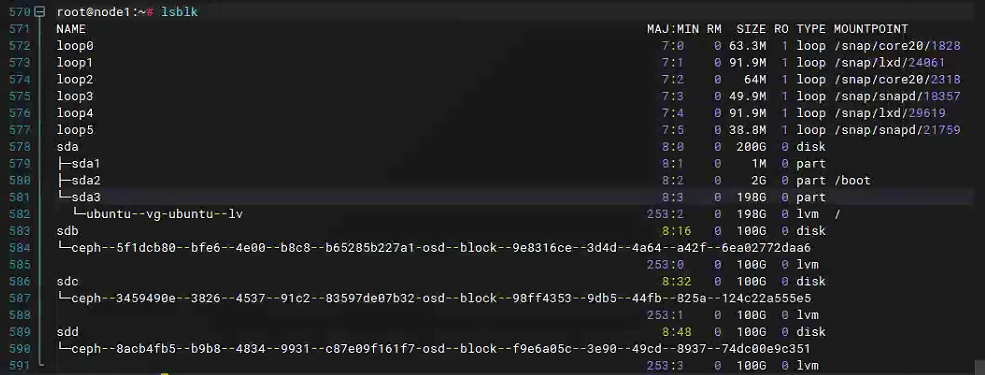
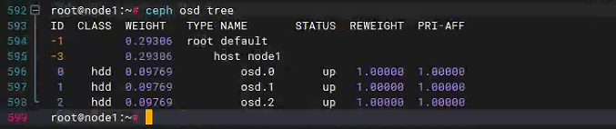

# Ceph 存储引擎—OSD 类型

> Ceph 是一个分布式存储系统，它可以提供多种存储服务，包括块存储 (RBD), 对象存储 (RADOS Gateway) 和文件系统 (CephFS)。Ceph
> 的存储后端使用 RADOS (Reliable Autonomic Distributed Object Store) 来管理数据。在 RADOS 层面，有两种不同的存储引擎可以用来存储数据：FileStore
> 和 BlueStore。

## FileStore

FileStore 是 Ceph 较早版本中默认的存储引擎。在 FileStore 中，每个对象存储设备 (OSD) 使用一个标准的文件系统（通常是
XFS）来保存数据。这意味着每个对象都被存储为一个文件，而元数据和日志则存储在单独的文件中。这种实现方式简单并且易于理解，但有一些局限性，比如写入放大问题（因为数据首先需要写入日志文件再写入数据文件），以及依赖于文件系统的性能。

## BlueStore

BlueStore 是 Ceph 从 Luminous 版本开始引入的新存储引擎，旨在解决 FileStore 的一些限制。BlueStore 直接在裸设备上运行，不依赖于外部文件系统。这意味着
BlueStore 可以更好地控制底层存储，从而优化性能并减少写入放大。BlueStore 提供了一些关键特性，如：

- **直接在裸设备上运行**：这允许 BlueStore 更高效地利用存储资源，并能更精细地控制 I/O 调度。
- **内存映射缓存**：BlueStore 使用内存映射缓存来加速读取操作。
- **更快的写入性能**：通过避免额外的日志文件写入，减少了写入放大。
- **更好的延迟特性**：BlueStore 通过减少 I/O 操作的复杂性和开销来降低延迟。
- **支持多种存储介质**：例如，它可以将 SSD 用作缓存层，而将 HDD 用作容量层。

## 总结

- **FileStore** 依赖于传统的文件系统，数据和元数据都存储在文件中。
- **BlueStore** 不依赖于外部文件系统，而是直接管理裸设备，这使得它可以更好地控制存储资源和 I/O 操作，从而提供更高的性能和更低的延迟。

在 Ceph 集群中选择使用 BlueStore 还是 FileStore 主要取决于您的具体需求和环境。对于大多数现代工作负载，BlueStore
由于其更高的性能和更低的延迟而成为首选。

## 创建OSD

#### 查看磁盘信息

```
 fdisk -l 
```



### 查看挂载情况

```
lsblk
```



#### 挂载

```
ceph orch daemon add osd node1:/dev/sdb
```

#### 再次查看挂载



#### 查看OSD

```
ceph osd tree
```



#### 删除磁盘签名，分区表等所有信息

> 将磁盘变成生磁盘、全新磁盘

```
wipefs -a -f /dev/sdd
```

####  

## 其他创建OSD方法

> 创建 FileStore 和 BlueStore 存储引擎的过程有所不同，因为它们分别采用了不同的存储机制。

### FileStore 存储引擎

FileStore 是 Ceph 较早版本中默认的存储引擎。在 FileStore 中，每个对象存储设备 (OSD) 使用一个标准的文件系统（通常是
XFS）来保存数据。这意味着每个对象都被存储为一个文件，而元数据和日志则存储在单独的文件中。

#### 创建步骤

1. ##### **准备磁盘**：

    - 确保磁盘没有被使用，并且没有分区表。

    - 如果磁盘上有分区表，需要先删除分区表。

      ```
      sudo parted -s /dev/sdc mklabel gpt
      ```

2. **创建文件系统**：

    - 使用`mkfs.xfs`创建 XFS 文件系统。

      ```
      sudo mkfs.xfs -f /dev/sdc
      ```

3. **挂载文件系统**：

    - 挂载文件系统到一个临时目录。

      ```
      sudo mkdir -p /mnt/sdc1
      sudo mount /dev/sdc /mnt/sdc1
      ```

4. **初始化 FileStore OSD**：

    - 使用`ceph-volume`来初始化 FileStore。

      ```
      sudo ceph-volume lvm create --filestore --data /mnt/sdc1
      ```

5. **卸载文件系统**：

    - 卸载文件系统。

      ```
      sudo umount /mnt/tmp-sdc
      sudo rmdir /mnt/tmp-sdc
      ```

### BlueStore 存储引擎

> BlueStore 是 Ceph 从 Luminous 版本开始引入的新存储引擎，旨在解决 FileStore 的一些限制。BlueStore 直接在裸设备上运行，不依赖于外部文件系统。

#### 创建步骤

1. **准备磁盘**：

    - 确保磁盘没有被使用，并且没有分区表。

    - 如果磁盘上有分区表，需要先删除分区表。

      ```
      sudo parted -s /dev/sdc mklabel gpt
      ```

2. **创建分区**：

    - 如果需要使用单独的设备来存放 WAL 和 DB，则创建相应的分区。

      ```
      sudo parted -s /dev/sdc mkpart primary 0% 100%
      sudo parted -s /dev/sdd mkpart primary 0% 100%
      sudo parted -s /dev/sde mkpart primary 0% 100%
      ```

3. **格式化分区**：

    - 如果需要使用单独的设备来存放 WAL 和 DB，则需要格式化这些分区。

      ```
      sudo mkfs.ext4 /dev/sdd1
      sudo mkfs.ext4 /dev/sde1
      ```

4. **初始化 BlueStore OSD**：

    - 使用`ceph-volume`来初始化 BlueStore。

      ```
      sudo ceph-volume lvm create --bluestore --data /dev/sdc1 --wal /dev/sdd1 --db /dev/sde1
      ```

    - 如果您只需要一个设备来存放数据，则可以省略 `--wal` 和 `--db` 参数。

5. **激活 OSD**：

    - 初始化完成后，您需要激活新创建的 OSD。

      ```
      sudo systemctl start ceph-osd@<osd_id>
      ```

## 实际操作

### 步骤 1: 准备磁盘

#### 对于 `/dev/sdb`:

1. **删除现有的分区表**（如果有的话）:

   ```shell
   sudo parted -s /dev/sdb mklabel gpt
   ```

2. **创建分区**:

    - 我们将创建两个分区，一个用于 WAL，另一个用于 DB。

   ```
   sudo parted -s /dev/sdb mkpart primary 0% 50%
   sudo parted -s /dev/sdb mkpart primary 50% 100%
   ```

3. **查看分区表**:

    - 查看分区是否已正确创建。

   ```
   sudo parted -l /dev/sdb
   ```

### 步骤 2: 格式化分区

1. **格式化第一个分区**:

    - 我们将使用 ext4 文件系统来格式化第一个分区用于 WAL。

   ```
   sudo mkfs.ext4 /dev/sdb1
   ```

2. **格式化第二个分区**:

    - 我们将使用 ext4 文件系统来格式化第二个分区用于 DB。

   ```
   sudo mkfs.ext4 /dev/sdb2
   ```

### 步骤 3: 挂载分区

1. 挂载分区:

    - 挂载分区到临时目录。

   ```
   sudo mkdir -p /mnt/osd-wal /mnt/osd-db
   sudo mount /dev/sdb1 /mnt/osd-wal
   sudo mount /dev/sdb2 /mnt/osd-db
   ```

### 步骤 4: 初始化 BlueStore OSD

1. 使用 `ceph-volume` 初始化 BlueStore:

    - 现在我们可以使用 `ceph-volume` 来初始化 BlueStore，其中 `/dev/sdc1` 作为数据分区，而 `/dev/sdb1` 和 `/dev/sdb2` 作为
      WAL 和 DB 分区。

   ```
   sudo ceph-volume lvm create --bluestore --data /dev/sdc --wal /mnt/osd-wal --db /mnt/osd-db
   ```

### 步骤 5: 清理临时目录

1. **卸载分区**:

    - 卸载分区以便我们可以使用它们。

   ```
   sudo umount /mnt/tmp-sdb1
   sudo umount /mnt/tmp-sdb2
   ```

2. **清理临时目录**:

    - 清理之前创建的临时目录。

   ```
   sudo rm -rf /mnt/tmp-sdb1 /mnt/tmp-sdb2
   ```

### 步骤 6: 激活和验证

1. **激活 OSD**:

    - 初始化完成后，您需要激活新创建的 OSD：

   ```
   sudo systemctl start ceph-osd@<osd_id>
   ```

    - 其中 `<osd_id>` 是由 `ceph-volume` 在初始化时分配给新 OSD 的 ID。

2. **验证 OSD**:

    - 您可以使用 `ceph osd tree` 或 `ceph osd stat` 命令来验证新添加的 OSD 是否已经被集群识别并处于正常状态：

   ```
   sudo ceph osd tree
   ```

以上步骤应该能够帮助您成功配置使用 `/dev/sdb` 的两个分区来分别存放 WAL 和 DB，同时使用 `/dev/sdc`
作为数据分区。如果您在操作过程中遇到任何问题，请随时告诉我。